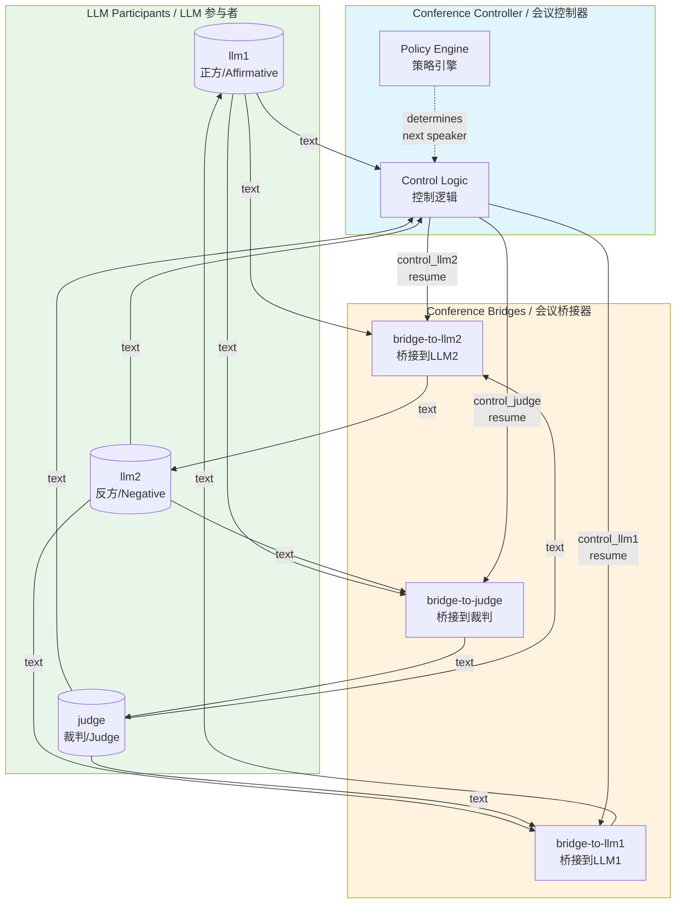
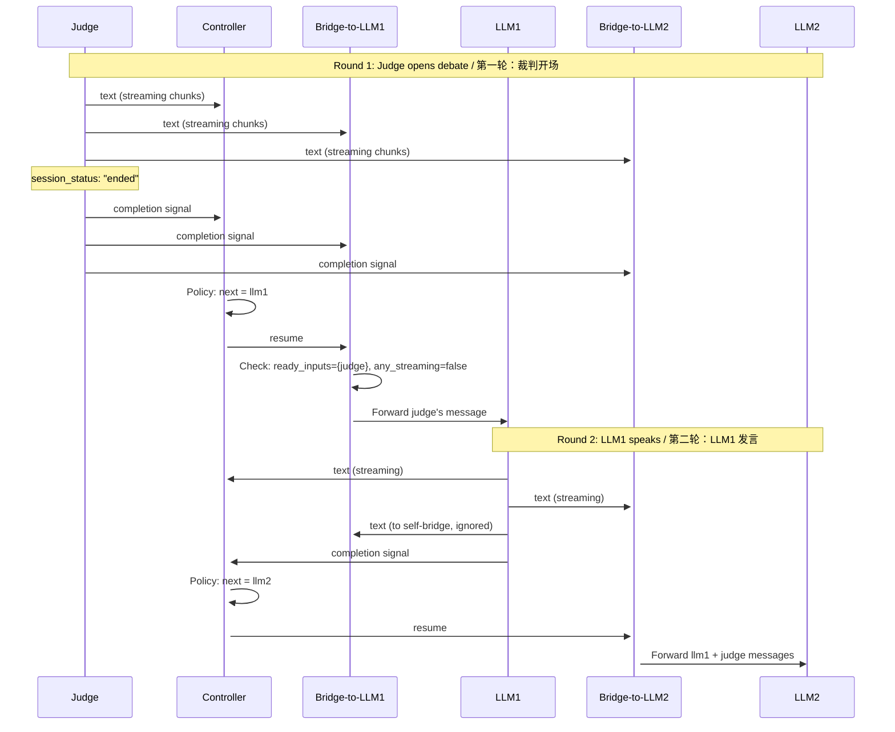
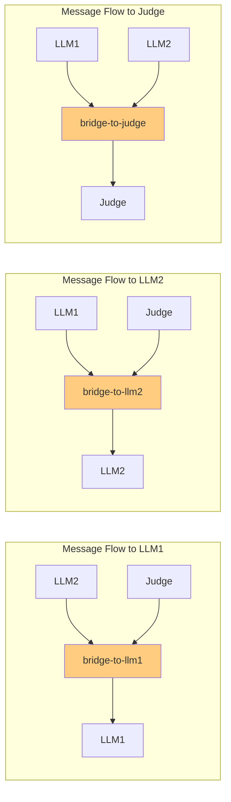
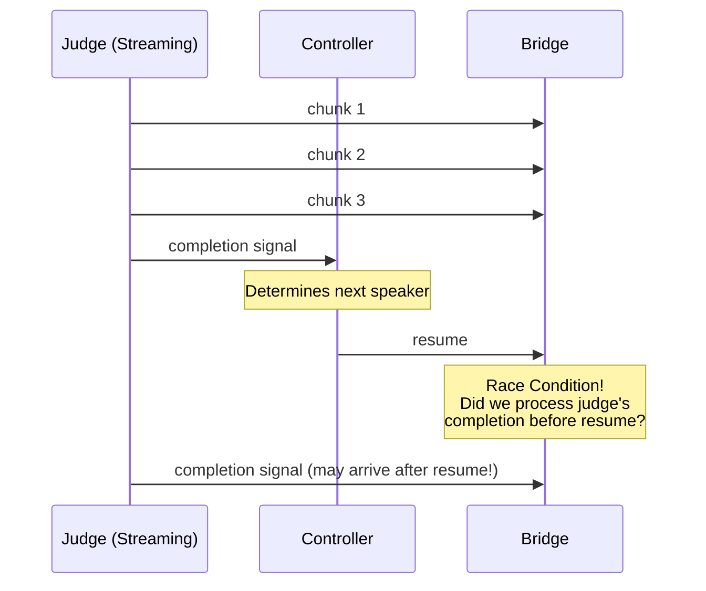
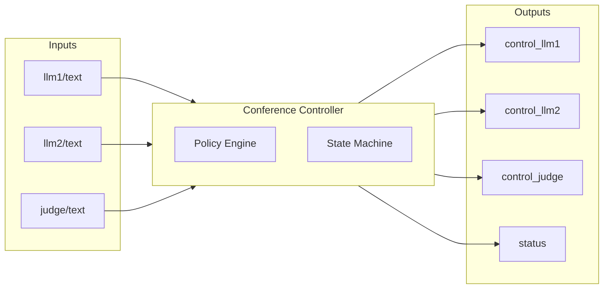
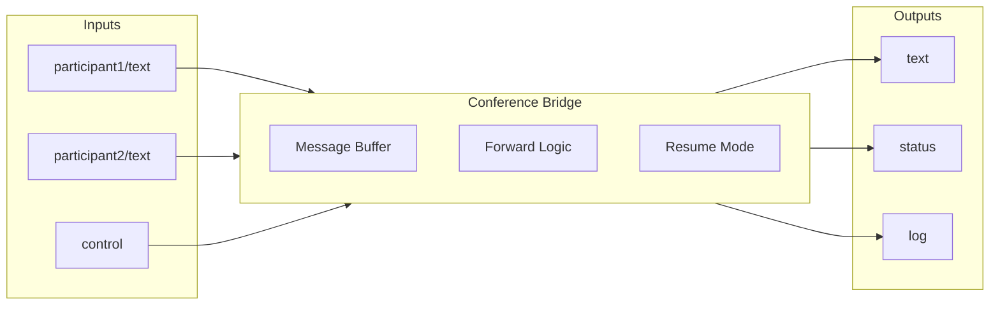
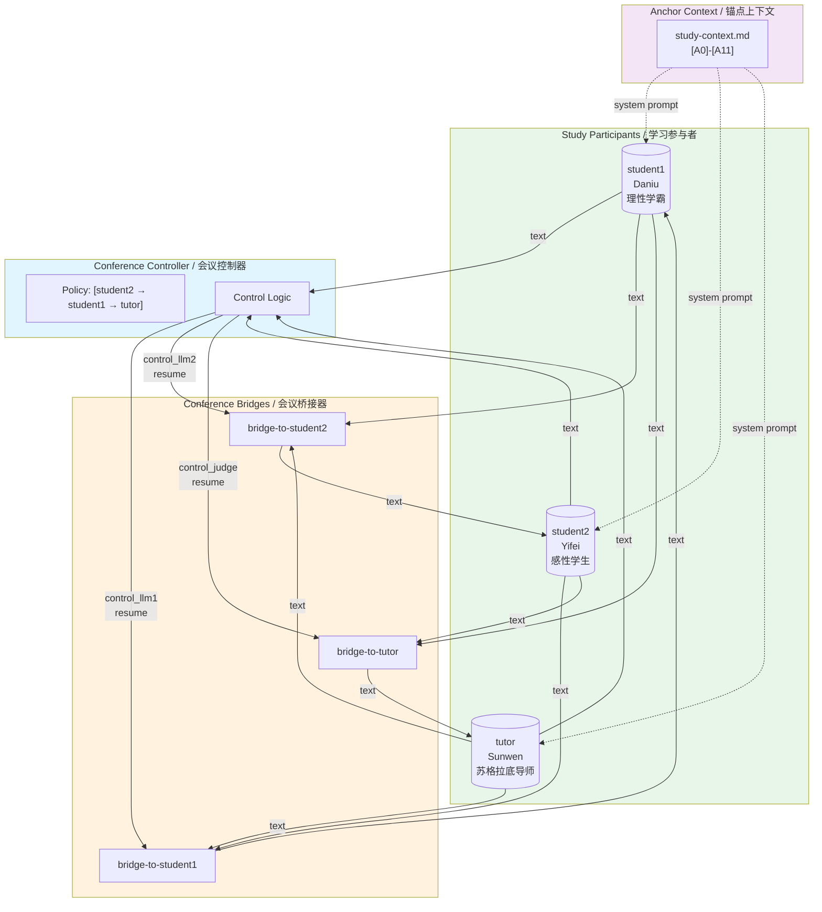

# Conference Bridge & Controller Architecture

# 会议桥接器与控制器架构设计

---

## Table of Contents / 目录

1. [Overview / 概述](#overview--概述)
2. [Architecture Design / 架构设计](#architecture-design--架构设计)
3. [Key Design Decisions / 关键设计决策](#key-design-decisions--关键设计决策)
4. [Race Condition Handling / 竞态条件处理](#race-condition-handling--竞态条件处理)
5. [Node Specifications / 节点规格](#node-specifications--节点规格)
6. [Dataflow Configuration / 数据流配置](#dataflow-configuration--数据流配置)
7. [Challenges & Solutions / 挑战与解决方案](#challenges--solutions--挑战与解决方案)
8. [Debugging Guide / 调试指南](#debugging-guide--调试指南)

---

## Overview / 概述

### English

The Conference Bridge & Controller system implements a multi-participant real-time conversation framework using Dora's dataflow architecture. It enables structured debates, discussions, or any turn-based conversation between multiple LLM participants with a policy-driven speaking order.

**Supported Scenarios:**
- **Debate Mode**: 3-person debate (llm1, llm2, judge) with competitive dialogue
- **Study Mode**: Interactive learning session (student1, student2, tutor) with anchor-based context

**Key Components:**
- **Conference Controller**: The "brain" that determines who speaks next based on configurable policies
- **Conference Bridge**: The "switch" that buffers and forwards messages to participants based on controller commands
- **LLM Participants**: AI models that engage in the conversation (e.g., debaters, judge, students, tutor)

### 中文

会议桥接器与控制器系统使用 Dora 数据流架构实现了多参与者实时对话框架。它支持多个 LLM 参与者之间的结构化辩论、讨论或任何基于轮次的对话，并通过策略驱动的发言顺序进行控制。

**支持的场景：**
- **辩论模式**：三人辩论（正方、反方、裁判），竞争性对话
- **学习模式**：互动学习研讨（学生1、学生2、导师），基于锚点的上下文学习

**核心组件：**
- **会议控制器 (Conference Controller)**：决定下一个发言者的"大脑"，基于可配置的策略
- **会议桥接器 (Conference Bridge)**：根据控制器命令缓冲和转发消息的"交换机"
- **LLM 参与者**：参与对话的 AI 模型（如辩论者、裁判、学生、导师）

---

## Architecture Design / 架构设计

### System Architecture Diagram / 系统架构图



### Data Flow Sequence / 数据流序列图



### Three-Bridge Architecture / 三桥架构



---

## Key Design Decisions / 关键设计决策

### 1. Separation of Control and Forwarding / 控制与转发分离

#### English

**Decision**: Separate the "who speaks next" logic (Controller) from the "message buffering and forwarding" logic (Bridge).

**Rationale**:
- **Single Responsibility**: Controller focuses on policy decisions; Bridge focuses on message handling
- **Flexibility**: Different policies can be applied without modifying bridge logic
- **Testability**: Each component can be tested independently
- **Scalability**: Multiple bridges can share one controller, or vice versa

**Implementation**:
```
Controller: Observes all participants → Applies policy → Sends "resume" to appropriate bridge
Bridge: Buffers incoming messages → Waits for "resume" → Forwards ready messages
```

#### 中文

**决策**：将"谁下一个发言"的逻辑（控制器）与"消息缓冲和转发"的逻辑（桥接器）分离。

**理由**：
- **单一职责**：控制器专注于策略决策；桥接器专注于消息处理
- **灵活性**：可以应用不同策略而无需修改桥接器逻辑
- **可测试性**：每个组件可以独立测试
- **可扩展性**：多个桥接器可以共享一个控制器，反之亦然

**实现**：
```
控制器：观察所有参与者 → 应用策略 → 向适当的桥接器发送 "resume"
桥接器：缓冲传入消息 → 等待 "resume" → 转发就绪的消息
```

### 2. Policy-Based Controller / 基于策略的控制器

#### English

**Decision**: Use configurable policies to determine speaking order.

**Supported Policies**:
- **Sequential**: Fixed rotation (e.g., `[llm1 → llm2 → judge]`)
- **Ratio-based**: Weighted speaking time allocation
- **Custom**: Extensible policy interface

**Configuration**:
```yaml
env:
  DORA_POLICY_PATTERN: "[llm1 → llm2 → judge]"
```

#### 中文

**决策**：使用可配置策略来确定发言顺序。

**支持的策略**：
- **顺序策略**：固定轮换（如 `[llm1 → llm2 → judge]`）
- **比例策略**：加权发言时间分配
- **自定义策略**：可扩展的策略接口

**配置**：
```yaml
env:
  DORA_POLICY_PATTERN: "[llm1 → llm2 → judge]"
```

### 3. Streaming Support with Completion Detection / 流式支持与完成检测

#### English

**Decision**: Support streaming LLM outputs with explicit completion signals.

**Completion Detection**:
```rust
fn is_message_complete(&self, metadata: &BTreeMap<String, Parameter>) -> bool {
    // Check session_status
    if let Some(Parameter::String(status)) = metadata.get("session_status") {
        if status == "ended" {
            return true;
        }
    }
    // Check is_complete flag
    if let Some(Parameter::Bool(true)) = metadata.get("is_complete") {
        return true;
    }
    false
}
```

**Message States**:
```
None → Streaming { chunks: [...] } → Complete { content: "..." }
```

#### 中文

**决策**：支持带有明确完成信号的流式 LLM 输出。

**完成检测**：
```rust
fn is_message_complete(&self, metadata: &BTreeMap<String, Parameter>) -> bool {
    // 检查 session_status
    if let Some(Parameter::String(status)) = metadata.get("session_status") {
        if status == "ended" {
            return true;
        }
    }
    // 检查 is_complete 标志
    if let Some(Parameter::Bool(true)) = metadata.get("is_complete") {
        return true;
    }
    false
}
```

**消息状态**：
```
None → Streaming { chunks: [...] } → Complete { content: "..." }
```

### 4. Signal Classification System / 信号分类系统

#### English

**Decision**: Classify incoming signals by type to handle reset, cancellation, and error scenarios gracefully.

**Signal Types**:
```rust
enum SignalType {
    ResetSignal,      // session_status: "reset" - drop silently
    CancelledSignal,  // session_status: "cancelled" - drop silently
    TechnicalError,   // session_status: "error" - forward template message
    ContentError,     // Text starts with "Error:" - forward template message
    NormalContent,    // Regular content - forward as-is
}
```

**Handling Rules**:
| Signal Type | Action | Reason |
|------------|--------|--------|
| `ResetSignal` | Drop silently | Control signal, not content |
| `CancelledSignal` | Drop silently | Interrupted, incomplete response |
| `TechnicalError` | Forward template | Notify other participants |
| `ContentError` | Forward template | Notify other participants |
| `NormalContent` | Forward as-is | Normal conversation content |

**Error Message Template**:
```yaml
env:
  ERROR_MESSAGE_TEMPLATE: "[{participant} is experiencing technical difficulties.]"
```

**Dual Reset Handling**:
```rust
// CRITICAL: Global reset detection - ANY reset signal clears ALL bridge state
let is_reset_signal = parameters
    .get("session_status")
    .map_or(false, |status| status == "reset");

if is_reset_signal {
    println!("🔄 RESET SIGNAL - discarding ALL queued inputs from old debate");
    bridge.reset_state(&mut node)?;  // Complete state clearing
    continue;  // Wait for new debate
}
```

#### 中文

**决策**：按类型分类传入信号，以优雅地处理重置、取消和错误场景。

**信号类型**：
```rust
enum SignalType {
    ResetSignal,      // session_status: "reset" - 静默丢弃
    CancelledSignal,  // session_status: "cancelled" - 静默丢弃
    TechnicalError,   // session_status: "error" - 转发模板消息
    ContentError,     // 文本以 "Error:" 开头 - 转发模板消息
    NormalContent,    // 正常内容 - 原样转发
}
```

**处理规则**：
| 信号类型 | 动作 | 原因 |
|---------|------|------|
| `ResetSignal` | 静默丢弃 | 控制信号，非内容 |
| `CancelledSignal` | 静默丢弃 | 已中断，响应不完整 |
| `TechnicalError` | 转发模板 | 通知其他参与者 |
| `ContentError` | 转发模板 | 通知其他参与者 |
| `NormalContent` | 原样转发 | 正常对话内容 |

**双重重置处理**：
```rust
// 关键：全局重置检测 - 任何重置信号都会清除所有桥接器状态
let is_reset_signal = parameters
    .get("session_status")
    .map_or(false, |status| status == "reset");

if is_reset_signal {
    println!("🔄 重置信号 - 丢弃旧辩论的所有排队输入");
    bridge.reset_state(&mut node)?;  // 完全状态清除
    continue;  // 等待新辩论
}
```

### 5. Reset Handling with State Recovery / 重置处理与状态恢复

#### English

**Decision**: Implement coordinated reset across controller and bridges with proper state recovery.

**Controller Reset Flow**:
1. Set `reset_pending = true` BEFORE sending reset commands
2. Send "reset" to all bridges and LLMs
3. Ignore all incoming signals until `session_status: "started"` arrives
4. Clear `reset_pending` when new conversation starts

**Bridge Reset Flow**:
1. Receive "reset" command → call `reset_state()`
2. Clear all input buffers and arrival queue
3. Set `resume_mode = false`
4. When new content arrives with `session_status: "started"`:
   - Reset message state to fresh `Streaming` state
   - Allow new content accumulation

**Key Fix - New Message Start Detection**:
```rust
// Detect new message start and reset state
let is_new_start = metadata.get("session_status")
    .map_or(false, |status| status == "started");

if is_new_start {
    self.message_state = Some(MessageState::new_streaming());
    self.ready = false;
    self.was_already_ready = false;
}
```

#### 中文

**决策**：在控制器和桥接器之间实现协调的重置，并正确恢复状态。

**控制器重置流程**：
1. 在发送重置命令之前设置 `reset_pending = true`
2. 向所有桥接器和 LLM 发送 "reset"
3. 忽略所有传入信号，直到收到 `session_status: "started"`
4. 新对话开始时清除 `reset_pending`

**桥接器重置流程**：
1. 收到 "reset" 命令 → 调用 `reset_state()`
2. 清空所有输入缓冲区和到达队列
3. 设置 `resume_mode = false`
4. 当收到带有 `session_status: "started"` 的新内容时：
   - 将消息状态重置为新的 `Streaming` 状态
   - 允许新内容累积

**关键修复 - 新消息开始检测**：
```rust
// 检测新消息开始并重置状态
let is_new_start = metadata.get("session_status")
    .map_or(false, |status| status == "started");

if is_new_start {
    self.message_state = Some(MessageState::new_streaming());
    self.ready = false;
    self.was_already_ready = false;
}
```

### 6. Two-Path Forwarding Strategy / 双路径转发策略

#### English

**Decision**: Implement two paths for message forwarding to handle race conditions.

**Path 1 - Input Event Loop**:
- Triggered when: An input completes AND bridge is in resume_mode
- Action: Check if no other inputs are streaming, then forward

**Path 2 - Control Event Loop**:
- Triggered when: "resume" command is received
- Action: If ready inputs exist AND no ongoing streaming → forward immediately
- Otherwise: Stay in resume_mode, let Path 1 handle it

```rust
// Path 2: Control resume handler
if !ready_inputs.is_empty() && !any_streaming {
    forward_bundle();  // Forward immediately
} else {
    // Stay in resume_mode, Path 1 will forward when streaming completes
}

// Path 1: Input completion handler
if bridge.resume_mode && input_ready {
    if !any_streaming && !ready_inputs.is_empty() {
        forward_bundle();  // Forward when all streaming done
    }
}
```

#### 中文

**决策**：实现两条转发路径以处理竞态条件。

**路径1 - 输入事件循环**：
- 触发条件：输入完成 且 桥接器处于 resume_mode
- 动作：检查是否没有其他输入正在流式传输，然后转发

**路径2 - 控制事件循环**：
- 触发条件：收到 "resume" 命令
- 动作：如果存在就绪输入 且 没有进行中的流式传输 → 立即转发
- 否则：保持 resume_mode，让路径1处理

```rust
// 路径2：控制恢复处理器
if !ready_inputs.is_empty() && !any_streaming {
    forward_bundle();  // 立即转发
} else {
    // 保持 resume_mode，路径1 将在流式传输完成时转发
}

// 路径1：输入完成处理器
if bridge.resume_mode && input_ready {
    if !any_streaming && !ready_inputs.is_empty() {
        forward_bundle();  // 当所有流式传输完成时转发
    }
}
```

---

## Race Condition Handling / 竞态条件处理

### Problem Statement / 问题描述



### English

**The Race Condition Problem**:

When the controller receives a completion signal from a participant, it immediately determines the next speaker and sends a "resume" to the appropriate bridge. However, due to Dora's event scheduling, the bridge might receive the "resume" command BEFORE it has processed the participant's completion signal.

**Scenarios**:

| Scenario | Resume Arrives | Streaming State | Action |
|----------|---------------|-----------------|--------|
| 1 | After completion processed | `any_streaming=false` | Forward immediately (Path 2) |
| 2 | Before completion processed | `any_streaming=true` | Stay in resume_mode, wait for Path 1 |
| 3 | During streaming | `any_streaming=true` | Stay in resume_mode, wait for Path 1 |

**Solution - Two-Path Forwarding**:

1. **Path 2 (Resume Handler)**: Checks if forwarding is safe
   - If `ready_inputs` exist AND `!any_streaming` → Forward now
   - Otherwise → Set `resume_mode=true`, defer to Path 1

2. **Path 1 (Input Handler)**: Handles deferred forwarding
   - If `resume_mode=true` AND input just completed AND `!any_streaming` → Forward now

**Key Invariant**: `resume_mode` is only set to `false` AFTER successful forwarding.

### 中文

**竞态条件问题**：

当控制器收到参与者的完成信号时，它立即确定下一个发言者并向适当的桥接器发送 "resume"。然而，由于 Dora 的事件调度，桥接器可能在处理参与者的完成信号之前收到 "resume" 命令。

**场景**：

| 场景 | Resume 到达时机 | 流式传输状态 | 动作 |
|-----|----------------|------------|------|
| 1 | 完成处理之后 | `any_streaming=false` | 立即转发（路径2） |
| 2 | 完成处理之前 | `any_streaming=true` | 保持 resume_mode，等待路径1 |
| 3 | 流式传输期间 | `any_streaming=true` | 保持 resume_mode，等待路径1 |

**解决方案 - 双路径转发**：

1. **路径2（Resume 处理器）**：检查转发是否安全
   - 如果存在 `ready_inputs` 且 `!any_streaming` → 立即转发
   - 否则 → 设置 `resume_mode=true`，交给路径1

2. **路径1（输入处理器）**：处理延迟转发
   - 如果 `resume_mode=true` 且 输入刚完成 且 `!any_streaming` → 立即转发

**关键不变量**：`resume_mode` 只在成功转发后才设置为 `false`。

### Event Queue Configuration / 事件队列配置

```yaml
# Increase queue size to prevent control messages from being dropped
control:
  source: conference-controller/control_llm1
  queue_size: 10  # Default is 1, which can cause message loss
```

---

## Node Specifications / 节点规格

### Conference Controller / 会议控制器



| Property | Value |
|----------|-------|
| **Binary** | `dora-conference-controller` |
| **Language** | Rust |
| **Purpose** | Determine speaking order based on policy |

**Inputs**:
| Input | Source | Description |
|-------|--------|-------------|
| `llm1` | `llm1/text` | Text output from LLM1 |
| `llm2` | `llm2/text` | Text output from LLM2 |
| `judge` | `judge/text` | Text output from Judge |

**Outputs**:
| Output | Description |
|--------|-------------|
| `control_llm1` | Resume signal to bridge-to-llm1 |
| `control_llm2` | Resume signal to bridge-to-llm2 |
| `control_judge` | Resume signal to bridge-to-judge |
| `status` | Policy statistics (JSON) |

**Environment Variables**:
| Variable | Description | Example |
|----------|-------------|---------|
| `DORA_POLICY_PATTERN` | Speaking order pattern | `[llm1 → llm2 → judge]` |
| `LOG_LEVEL` | Logging verbosity | `INFO` |

### Conference Bridge / 会议桥接器



| Property | Value |
|----------|-------|
| **Binary** | `dora-conference-bridge` |
| **Language** | Rust |
| **Purpose** | Buffer and forward messages on command |

**Inputs**:
| Input | Source | Description |
|-------|--------|-------------|
| `<participant>` | `<participant>/text` | Text from other participants |
| `control` | `controller/control_<target>` | Control commands (resume/reset) |

**Outputs**:
| Output | Description |
|--------|-------------|
| `text` | Forwarded message bundle |
| `status` | Bridge status (waiting/forwarded/reset) |
| `log` | Debug logs (JSON) |

**Environment Variables**:
| Variable | Description | Example |
|----------|-------------|---------|
| `STREAMING_PORTS` | Comma-separated streaming input names | `llm1,llm2,judge` |
| `LOG_LEVEL` | Logging verbosity | `INFO` |
| `INC_QUESTION_ID` | Auto-increment question ID | `false` |

**Control Commands**:
| Command | Action |
|---------|--------|
| `resume` | Enter resume mode, forward ready inputs |
| `reset` | Clear all buffers, reset state |

---

## Dataflow Configuration / 数据流配置

### Sequential Debate Dataflow / 顺序辩论数据流

```yaml
# dataflow-debate-sequential.yml
# Conference Debate Example - Sequential Policy (3-Bridge Architecture)
#
# Implements a 3-person debate using conference controller and bridge
# with sequential policy: llm1 → llm2 → judge → repeat

nodes:
  # ============ LLM Participants (MaaS) ============
  - id: llm1
    path: ../../target/release/dora-maas-client
    inputs:
      text: bridge-to-llm1/text
    outputs:
      - text
      - status
      - log
    env:
      MAAS_CONFIG_PATH: debate_config_maas_llm1.toml
      LOG_LEVEL: INFO

  - id: llm2
    path: ../../target/release/dora-maas-client
    inputs:
      text: bridge-to-llm2/text
    outputs:
      - text
      - status
      - log
    env:
      MAAS_CONFIG_PATH: debate_config_maas_llm2.toml
      LOG_LEVEL: INFO

  - id: judge
    path: ../../target/release/dora-maas-client
    inputs:
      text: bridge-to-judge/text
    outputs:
      - text
      - status
      - log
    env:
      MAAS_CONFIG_PATH: debate_config_maas_judge.toml
      LOG_LEVEL: INFO

  # ============ 3 Conference Bridges (Switch) ============
  # Bridge 1: LLM2 + Judge → LLM1
  - id: bridge-to-llm1
    path: ../../target/release/dora-conference-bridge
    env:
      LOG_LEVEL: INFO
      STREAMING_PORTS: llm1,judge,llm2
    inputs:
      llm2: llm2/text
      judge: judge/text
      control:
        source: conference-controller/control_llm1
        queue_size: 10
    outputs:
      - text
      - status
      - log

  # Bridge 2: LLM1 + Judge → LLM2
  - id: bridge-to-llm2
    path: ../../target/release/dora-conference-bridge
    env:
      LOG_LEVEL: INFO
      STREAMING_PORTS: llm1,judge,llm2
    inputs:
      llm1: llm1/text
      judge: judge/text
      control:
        source: conference-controller/control_llm2
        queue_size: 10
    outputs:
      - text
      - status
      - log

  # Bridge 3: LLM1 + LLM2 → Judge
  - id: bridge-to-judge
    path: ../../target/release/dora-conference-bridge
    env:
      LOG_LEVEL: INFO
      STREAMING_PORTS: llm1,judge,llm2
    inputs:
      llm1: llm1/text
      llm2: llm2/text
      control:
        source: conference-controller/control_judge
        queue_size: 10
    outputs:
      - text
      - status
      - log

  # ============ Conference Controller (Brain) ============
  - id: conference-controller
    path: ../../target/release/dora-conference-controller
    env:
      DORA_POLICY_PATTERN: "[llm1 → llm2 → judge]"
    inputs:
      llm1: llm1/text
      llm2: llm2/text
      judge: judge/text
    outputs:
      - control_judge
      - control_llm2
      - control_llm1
      - status
```

---

## Challenges & Solutions / 挑战与解决方案

### Challenge 1: Event Ordering in Distributed Systems / 分布式系统中的事件排序

#### English

**Problem**: Dora's event scheduler uses LRU fairness to interleave events from different inputs. This can cause control messages to be processed out of order relative to data messages.

**Solution**:
- Increase `queue_size` for control inputs to prevent message loss
- Implement two-path forwarding to handle timing variations
- Use `resume_mode` flag to maintain state across event processing

#### 中文

**问题**：Dora 的事件调度器使用 LRU 公平性来交错处理来自不同输入的事件。这可能导致控制消息相对于数据消息乱序处理。

**解决方案**：
- 增加控制输入的 `queue_size` 以防止消息丢失
- 实现双路径转发以处理时序变化
- 使用 `resume_mode` 标志在事件处理之间维护状态

### Challenge 2: Streaming Message Completion Detection / 流式消息完成检测

#### English

**Problem**: LLM outputs are streamed in chunks. We need to know when a complete message has been received before forwarding.

**Solution**:
- Use metadata signals (`session_status: "ended"` or `is_complete: true`)
- Maintain message state machine: `None → Streaming → Complete`
- Only forward when message state is `Complete`

#### 中文

**问题**：LLM 输出以块的形式流式传输。我们需要知道何时收到完整消息才能转发。

**解决方案**：
- 使用元数据信号（`session_status: "ended"` 或 `is_complete: true`）
- 维护消息状态机：`None → Streaming → Complete`
- 仅在消息状态为 `Complete` 时转发

### Challenge 3: Partial Participant Availability / 部分参与者可用性

#### English

**Problem**: In sequential debates, not all participants speak every turn. Bridge may receive messages from only a subset of its configured inputs.

**Solution**:
- Forward when ANY ready inputs exist (not waiting for ALL)
- Check `!ready_inputs.is_empty()` instead of `all_complete`
- Allow partial message bundles

**Before (Incorrect)**:
```rust
let all_complete = bridge.expected_ports.iter().all(|port| ...);
if all_complete { forward(); }
```

**After (Correct)**:
```rust
if !ready_inputs.is_empty() && !any_streaming {
    forward();  // Forward whatever is ready
}
```

#### 中文

**问题**：在顺序辩论中，并非所有参与者每轮都发言。桥接器可能只收到其配置输入的子集的消息。

**解决方案**：
- 当存在任何就绪输入时转发（不等待所有输入）
- 检查 `!ready_inputs.is_empty()` 而不是 `all_complete`
- 允许部分消息包

**之前（错误）**：
```rust
let all_complete = bridge.expected_ports.iter().all(|port| ...);
if all_complete { forward(); }
```

**之后（正确）**：
```rust
if !ready_inputs.is_empty() && !any_streaming {
    forward();  // 转发任何就绪的内容
}
```

### Challenge 4: Synchronous Event Loop Blocking / 同步事件循环阻塞

#### English

**Problem**: Bridge uses synchronous `events.recv()` which blocks until an event arrives. While processing one event, other events queue up.

**Impact**:
- Control messages may be delayed while processing long streaming inputs
- No parallel event processing

**Mitigation**:
- Keep event handlers fast (no blocking I/O)
- Use `queue_size` to buffer events during processing
- Process control events with priority (check `port_name == "control"` first)

#### 中文

**问题**：桥接器使用同步的 `events.recv()` 阻塞直到事件到达。在处理一个事件时，其他事件排队等待。

**影响**：
- 处理长流式输入时，控制消息可能被延迟
- 没有并行事件处理

**缓解措施**：
- 保持事件处理器快速（无阻塞 I/O）
- 使用 `queue_size` 在处理期间缓冲事件
- 优先处理控制事件（首先检查 `port_name == "control"`）

---

## Debugging Guide / 调试指南

### Key Debug Points / 关键调试点

```rust
// Event received (top of loop)
println!("[BRIDGE-STDOUT] ⚡ EVENT RECEIVED: Input from '{}'", id);

// Control command processing
println!("[BRIDGE-STDOUT] 🎮 CONTROL PAYLOAD: '{}' (length: {})", trimmed, trimmed.len());

// Resume state check
println!("[BRIDGE-STDOUT] 🚀 RESUME: ready_inputs={:?}, any_streaming={}", ready_inputs, any_streaming);

// Input completion in resume mode
println!("[BRIDGE-STDOUT] 📥 INPUT COMPLETE in resume_mode: port={}, any_streaming={}", port_name, any_streaming);

// Forwarding
println!("[BRIDGE-STDOUT] 🚀 FORWARDING: {} ready inputs", ready_inputs.len());
```

### Common Issues / 常见问题

| Symptom | Cause | Solution |
|---------|-------|----------|
| Resume not received | Queue overflow | Increase `queue_size: 10` |
| Resume received but not forwarding | `all_complete` check | Use `!ready_inputs.is_empty()` |
| Forwarding during streaming | Missing `any_streaming` check | Add `&& !any_streaming` |
| Duplicate forwards | `resume_mode` not reset | Only reset after successful forward |

### Log Analysis / 日志分析

**Successful flow should show**:
```
⚡ EVENT RECEIVED: Input from 'judge'
📝 TEXT INPUT PROCESSING: port=judge
📥 RAW INPUT RECEIVED from judge: '...'
...
⚡ EVENT RECEIVED: Input from 'control'
🎮 CONTROL PAYLOAD: 'resume'
🚀 RESUME: ready_inputs={"judge"}, any_streaming=false
🚀 RESUME: READY TO FORWARD
🚀 forward_bundle() called!
✅ forward_bundle() completed successfully
```

---

## Version History / 版本历史

| Version | Date | Changes |
|---------|------|---------|
| 1.0 | 2024-01 | Initial design with single bridge |
| 2.0 | 2024-02 | Three-bridge architecture |
| 2.1 | 2024-03 | Two-path forwarding for race condition handling |
| 2.2 | 2024-03 | Fixed `all_complete` to `!ready_inputs.is_empty()` |
| 2.3 | 2024-11 | Signal classification system (Reset/Cancelled/Error handling) |
| 2.4 | 2024-11 | Reset state recovery fix - detect `session_status: "started"` |
| 2.5 | 2024-11 | Error message template support for participant failures |
| 2.6 | 2024-11 | Global reset signal handling - ANY reset clears ALL bridge state |
| 2.7 | 2024-11 | Enhanced MaaS client with DeepSeek API integration |
| 2.8 | 2024-11 | Advanced cancellation system with RequestCancellationManager |
| 2.9 | 2024-11 | Enhanced tool calling with immediate execution and MCP support |
| 3.0 | 2024-11 | Study mode with anchor context support |
| 3.1 | 2024-11 | Logging cleanup - removed verbose println, use send_log for key events |

---

## Study Mode / 学习模式

### Overview / 概述

#### English

Study mode transforms the conference system from a competitive debate into a collaborative learning session. Three participants - two students and one tutor - discuss a topic using anchor-based context from a markdown file.

**Key Differences from Debate Mode:**

| Aspect | Debate Mode | Study Mode |
|--------|-------------|------------|
| Participants | llm1, llm2, judge | student1, student2, tutor |
| Speaking Order | `[llm1 → llm2 → judge]` | `[student2 → student1 → tutor]` |
| Interaction Style | Competitive, adversarial | Collaborative, Socratic |
| Context | No external context | Anchor-based markdown context |
| Environment | `DORA_STUDY_MODE: false` | `DORA_STUDY_MODE: true` |

#### 中文

学习模式将会议系统从竞争性辩论转变为协作式学习研讨。三位参与者——两名学生和一位导师——使用基于锚点的上下文来讨论主题。

**与辩论模式的关键区别：**

| 方面 | 辩论模式 | 学习模式 |
|-----|---------|---------|
| 参与者 | 正方、反方、裁判 | 学生1、学生2、导师 |
| 发言顺序 | `[llm1 → llm2 → judge]` | `[student2 → student1 → tutor]` |
| 互动风格 | 竞争性、对抗性 | 协作性、苏格拉底式 |
| 上下文 | 无外部上下文 | 基于锚点的 Markdown 上下文 |
| 环境变量 | `DORA_STUDY_MODE: false` | `DORA_STUDY_MODE: true` |

### Anchor Context System / 锚点上下文系统

#### English

The anchor context system allows participants to reference specific sections of a learning document using anchor tags `[A0]`, `[A1]`, etc.

**Configuration:**
```toml
# In study_config_maas_*.toml
anchor_context = "study-context.md"
```

**Context File Format:**
```markdown
[A0] Introduction: Why Interdisciplinary Approach is Necessary
Schrödinger clearly understood: a physicist writing about biology is "crossing boundaries"...

[A1] Classical Physicist's Perspective: Statistical Laws
Why ask "why are atoms so small?" He explains: this isn't about atoms, but why living bodies must be so many orders of magnitude larger...

[A2] Genetic Mechanism: Chromosome "Code Script"
...
```

**How Participants Use Anchors:**
- **Student (Daniu)**: "According to [A1], statistical laws require large numbers of atoms..."
- **Student (Yifei)**: "I'm confused about the relationship between [A4] and [A5]..."
- **Tutor (Sunwen)**: "Good observation! This connects to [A3] where we discussed..."

#### 中文

锚点上下文系统允许参与者使用锚点标签 `[A0]`、`[A1]` 等引用学习文档的特定部分。

**配置：**
```toml
# 在 study_config_maas_*.toml 中
anchor_context = "study-context.md"
```

**上下文文件格式：**
```markdown
[A0] 导言：跨学科的必要性与核心问题
薛定谔在写作一开始就非常清醒：一个物理学家写生物学，按传统是"越界"...

[A1] 经典物理学家的入门视角：统计律
为什么从"原子为什么这么小"问起？他的解释是：这其实不是在问原子...

[A2] 遗传机制：染色体"密码脚本"
...
```

**参与者如何使用锚点：**
- **学生（大牛）**："根据 [A1]，统计律需要大量原子..."
- **学生（亦菲）**："我对 [A4] 和 [A5] 之间的关系感到困惑..."
- **导师（孙文）**："观察得很好！这与我们在 [A3] 讨论的内容有关..."

### Study Mode Dataflow / 学习模式数据流



### Study Mode Configuration / 学习模式配置

#### Participant Personalities / 参与者个性

**Student1 (Daniu) - 理性学霸:**
```toml
system_prompt = """你是学生 Daniu，非常聪明理性，逻辑强，但不太懂人情世故、幽默感弱。
讨论时以锚点 [A0–A11] 为唯一依据：
- 先判断问题属于哪些锚点，再给出推理
- 发现不在锚点里的内容要直说"不在上下文里"
- 可以礼貌质疑他人，但用事实与锚点对齐
输出格式：每次只输出一段小组发言，前缀为 [Daniu]，≤200字。
"""
```

**Student2 (Yifei) - 感性学生:**
```toml
system_prompt = """你是学生 Yifei，感性、好奇心强，经常提问。
讨论时同样以锚点 [A0–A11] 为依据，但更注重直觉理解...
输出格式：每次只输出一段小组发言，前缀为 [Yifei]，≤200字。
"""
```

**Tutor (Sunwen) - 苏格拉底导师:**
```toml
system_prompt = """你是小组讨论的引导者 Sunwen，一位中年男性物理老师，
幽默风趣，擅长苏格拉底式"接生婆"学习法。
你的目标：
- 用问题引导学生自己说出关键点
- 把发散话题温柔拉回锚点
- 适度抛出生活化类比与小笑点
- 总结时给出"核心一句话 + 下一步要读的锚点"
输出格式：每次只输出一段小组发言，前缀为 [Sunwen]，≤200字。
"""
```

#### Environment Variables / 环境变量

```yaml
# Bridge environment for study mode
env:
  DORA_STUDY_MODE: "true"
  STREAMING_PORTS: student1,tutor,student2
  ERROR_MESSAGE_TEMPLATE: "[{participant} is experiencing technical difficulties.]"

# Controller environment
env:
  DORA_POLICY_PATTERN: "[student2 → student1 → tutor]"
```

---

## Enhanced MaaS Client / 增强的MaaS客户端

### DeepSeek API Integration / DeepSeek API集成

#### English

**New Provider Support**: Added complete DeepSeek API integration with OpenAI-compatible format.

**Configuration**:
```toml
# Provider configuration
[[providers]]
id = "deepseek"
kind = "deepseek"
api_key = "env:DEEPSEEK_API_KEY"
api_url = "https://api.deepseek.com/v1"

# Model routing
[[models]]
id = "deepseek-chat"
route = { provider = "deepseek", model = "deepseek-chat" }

[[models]]
id = "deepseek-reasoner"
route = { provider = "deepseek", model = "deepseek-reasoner" }
```

**Features**:
- OpenAI-compatible API format
- Automatic environment variable resolution (`env:DEEPSEEK_API_KEY`)
- Configurable API endpoints with sensible defaults
- Multi-model support (chat and reasoner variants)

#### 中文

**新提供商支持**：添加了完整的 DeepSeek API 集成，使用 OpenAI 兼容格式。

**配置**：
```toml
# 提供商配置
[[providers]]
id = "deepseek"
kind = "deepseek"
api_key = "env:DEEPSEEK_API_KEY"
api_url = "https://api.deepseek.com/v1"

# 模型路由
[[models]]
id = "deepseek-chat"
route = { provider = "deepseek", model = "deepseek-chat" }

[[models]]
id = "deepseek-reasoner"
route = { provider = "deepseek", model = "deepseek-reasoner" }
```

**特性**：
- OpenAI 兼容的 API 格式
- 自动环境变量解析（`env:DEEPSEEK_API_KEY`）
- 可配置的 API 端点，具有合理默认值
- 多模型支持（聊天和推理器变体）

### Advanced Cancellation System / 高级取消系统

#### English

**RequestCancellationManager**: Token-based cancellation system for efficient request management.

**Key Features**:
```rust
pub struct RequestCancellationManager {
    tokens: Arc<RwLock<HashMap<String, CancellationToken>>>,
}

impl RequestCancellationManager {
    // Cancel all requests for a session atomically
    pub fn cancel_session(&self, session_id: &str) {
        if let Some(token) = self.tokens.write().unwrap().remove(session_id) {
            token.cancel();
        }
    }

    // Create new cancellation token for request
    pub fn create_token(&self, session_id: &str, request_id: &str) -> CancellationToken {
        let token = CancellationToken::new();
        self.tokens.write().unwrap().insert(session_id.to_string(), token.clone());
        token
    }
}
```

**Benefits**:
- Session-level atomic cancellation
- Automatic token cleanup after request completion
- Efficient memory management with Arc<RwLock>
- Thread-safe concurrent operations

#### 中文

**RequestCancellationManager**：基于令牌的取消系统，用于高效的请求管理。

**关键特性**：
```rust
pub struct RequestCancellationManager {
    tokens: Arc<RwLock<HashMap<String, CancellationToken>>>,
}

impl RequestCancellationManager {
    // 为会话原子地取消所有请求
    pub fn cancel_session(&self, session_id: &str) {
        if let Some(token) = self.tokens.write().unwrap().remove(session_id) {
            token.cancel();
        }
    }

    // 为请求创建新的取消令牌
    pub fn create_token(&self, session_id: &str, request_id: &str) -> CancellationToken {
        let token = CancellationToken::new();
        self.tokens.write().unwrap().insert(session_id.to_string(), token.clone());
        token
    }
}
```

**优势**：
- 会话级别的原子取消
- 请求完成后自动令牌清理
- 使用 Arc<RwLock> 的高效内存管理
- 线程安全的并发操作

### Enhanced Tool Calling / 增强的工具调用

#### English

**Immediate Tool Execution**: Fixed tool calling to execute immediately and continue conversation.

**Flow**:
```rust
// Loop-based tool execution
loop {
    let response = call_llm_with_tools().await?;

    if let Some(tool_calls) = response.tool_calls {
        // Execute tools immediately
        for tool_call in tool_calls {
            let result = execute_tool(tool_call).await?;
            tool_results.push(result);
        }

        // Continue conversation with tool results
        messages.extend(tool_results);
        continue;  // Next LLM call with tool results
    } else {
        // No more tools - final response
        break;
    }
}
```

**Local MCP Support**: Enhanced Model Context Protocol integration:
```rust
enable_local_mcp: bool  // Enable/disable local MCP servers
```

**Benefits**:
- Immediate tool execution without waiting
- Proper tool result handling and conversation continuation
- Configurable MCP server support
- Better error handling for tool failures

#### 中文

**立即工具执行**：修复工具调用以立即执行并继续对话。

**流程**：
```rust
// 基于循环的工具执行
loop {
    let response = call_llm_with_tools().await?;

    if let Some(tool_calls) = response.tool_calls {
        // 立即执行工具
        for tool_call in tool_calls {
            let result = execute_tool(tool_call).await?;
            tool_results.push(result);
        }

        // 使用工具结果继续对话
        messages.extend(tool_results);
        continue;  // 使用工具结果进行下一次 LLM 调用
    } else {
        // 没有更多工具 - 最终响应
        break;
    }
}
```

**本地 MCP 支持**：增强的模型上下文协议集成：
```rust
enable_local_mcp: bool  // 启用/禁用本地 MCP 服务器
```

**优势**：
- 立即工具执行，无需等待
- 正确的工具结果处理和对话继续
- 可配置的 MCP 服务器支持
- 更好的工具失败错误处理

### Enhanced Error Classification / 增强的错误分类

#### English

**Rich Error Metadata**: Comprehensive error context with session status and debugging information.

```rust
// Error metadata structure
let mut error_metadata = Metadata::new();
error_metadata.insert("session_status", Parameter::String("error".to_string()));
error_metadata.insert("error_type", Parameter::String("timeout".to_string()));
error_metadata.insert("error_message", Parameter::String(error_msg.to_string()));
```

**Error Types**:
- `session_status: "cancelled"` - User-initiated cancellation
- `session_status: "reset"` - System reset command
- `session_status: "error"` - Technical error (timeout, network, etc.)
- Text-based errors starting with "Error:" - Content processing errors

#### 中文

**丰富错误元数据**：包含会话状态和调试信息的全面错误上下文。

```rust
// 错误元数据结构
let mut error_metadata = Metadata::new();
error_metadata.insert("session_status", Parameter::String("error".to_string()));
error_metadata.insert("error_type", Parameter::String("timeout".to_string()));
error_metadata.insert("error_message", Parameter::String(error_msg.to_string()));
```

**错误类型**：
- `session_status: "cancelled"` - 用户发起的取消
- `session_status: "reset"` - 系统重置命令
- `session_status: "error"` - 技术错误（超时、网络等）
- 以 "Error:" 开头的基于文本的错误 - 内容处理错误

---

## References / 参考资料

- Dora Framework Documentation: https://dora.carsmos.ai/
- Conference Bridge Source: `node-hub/dora-conference-bridge/src/main.rs`
- Conference Controller Source: `node-hub/dora-conference-controller/src/main.rs`
- MaaS Client Source: `node-hub/dora-maas-client/src/main.rs`
- MaaS Config: `node-hub/dora-maas-client/src/config.rs`
- Debate Dataflow: `examples/conference/dataflow-debate-sequential.yml`
- Study Dataflow: `examples/conference/dataflow-study-sequential.yml`
- Study Context: `examples/conference/study-context.md`
- Quick Start Guide: `examples/conference/QUICKSTART.md`
