# 会议桥接器与控制器架构设计文档

---

## 目录

1. [系统概述](#系统概述)
2. [架构设计](#架构设计)
3. [核心设计决策](#核心设计决策)
4. [竞态条件处理](#竞态条件处理)
5. [节点规格说明](#节点规格说明)
6. [数据流配置](#数据流配置)
7. [开发挑战与解决方案](#开发挑战与解决方案)
8. [调试指南](#调试指南)

---

## 系统概述

### 背景

会议桥接器与控制器系统是基于 Dora 数据流架构实现的多参与者实时对话框架。该系统支持多个 LLM（大语言模型）参与者之间进行结构化的辩论、讨论或任何基于轮次的对话，通过策略驱动的方式控制发言顺序。

### 应用场景

- **AI 辩论赛**：正方、反方、裁判三方参与的结构化辩论
- **多角色对话**：多个 AI 角色参与的情景对话
- **专家讨论会**：模拟多位专家就特定话题进行讨论
- **互动学习研讨**：导师与学生基于锚点上下文的苏格拉底式学习

### 支持的模式

| 模式 | 参与者 | 发言顺序 | 特点 |
|-----|-------|---------|-----|
| **辩论模式** | llm1 (正方), llm2 (反方), judge (裁判) | `[llm1 → llm2 → judge]` | 竞争性对话 |
| **学习模式** | student1 (大牛), student2 (亦菲), tutor (孙文) | `[student2 → student1 → tutor]` | 协作式学习 |

### 核心组件

| 组件 | 角色 | 职责 |
|-----|------|-----|
| **会议控制器** | 大脑 | 根据策略决定下一个发言者 |
| **会议桥接器** | 交换机 | 缓冲消息，根据控制命令转发 |
| **LLM 参与者** | 参与者 | 生成对话内容 |

---

## 架构设计

### 系统架构图

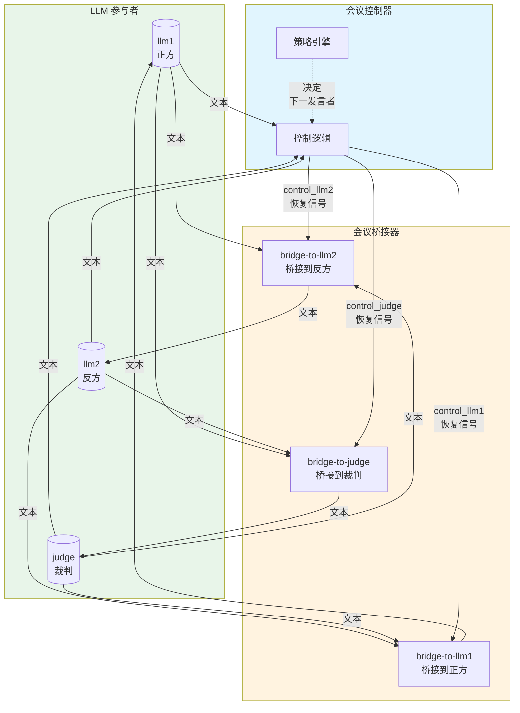

### 数据流时序图

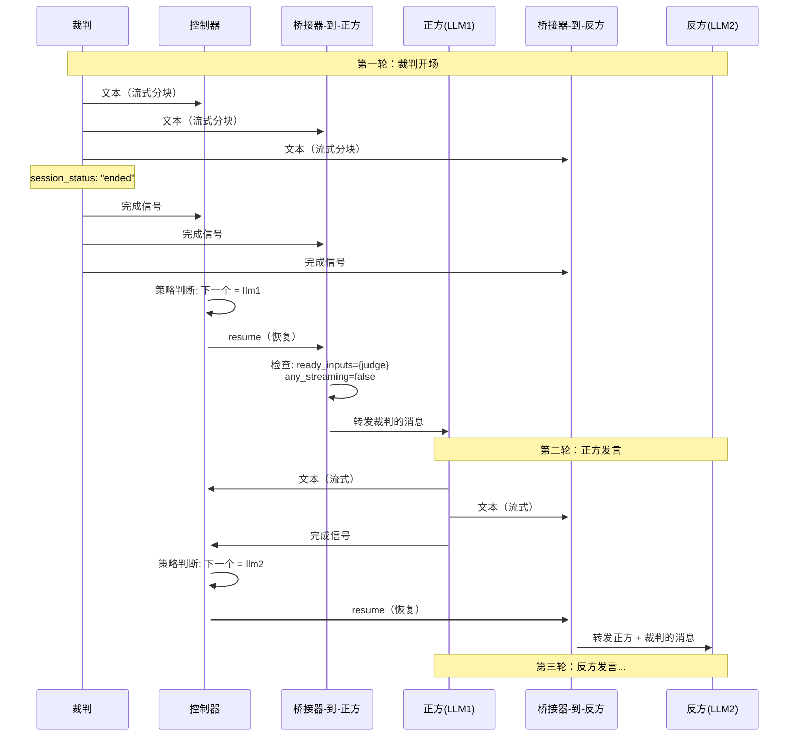

### 三桥架构详解

在三人辩论场景中，每个参与者需要接收其他两位参与者的消息。因此我们设计了三个独立的桥接器：

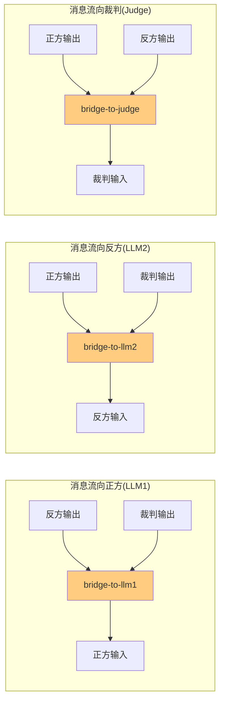

**设计原理**：
- 每个桥接器负责向一个特定的 LLM 转发消息
- 桥接器接收来自其他参与者的输出
- 控制器决定何时触发哪个桥接器进行转发

---

## 核心设计决策

### 决策1：控制与转发分离

#### 问题

如何在多参与者对话中协调发言顺序，同时保持系统的灵活性和可维护性？

#### 决策

将"谁下一个发言"的决策逻辑（控制器）与"消息缓冲和转发"的执行逻辑（桥接器）完全分离。

#### 理由

| 优势 | 说明 |
|-----|------|
| **单一职责** | 控制器专注策略决策，桥接器专注消息处理 |
| **灵活性** | 可更换策略而不修改转发逻辑 |
| **可测试性** | 各组件可独立单元测试 |
| **可扩展性** | 易于添加新参与者或新策略 |

#### 实现模式

```
控制器工作流程：
1. 监听所有参与者的输出
2. 检测到某参与者完成发言
3. 根据策略确定下一个发言者
4. 向对应的桥接器发送 "resume" 命令

桥接器工作流程：
1. 持续接收并缓冲来自参与者的消息
2. 等待控制器的 "resume" 命令
3. 收到命令后，转发所有就绪的消息
4. 重置状态，等待下一轮
```

### 决策2：基于策略的控制器

#### 问题

不同场景需要不同的发言顺序规则，如何支持多种策略？

#### 决策

实现可配置的策略引擎，通过环境变量指定发言顺序。

#### 支持的策略类型

| 策略类型 | 描述 | 配置示例 |
|---------|------|---------|
| **顺序策略** | 固定轮换顺序 | `[llm1 → llm2 → judge]` |
| **比例策略** | 按权重分配发言时间 | `{llm1: 40%, llm2: 40%, judge: 20%}` |
| **自定义策略** | 可扩展的策略接口 | 实现 `Policy` trait |

#### 配置方式

```yaml
env:
  DORA_POLICY_PATTERN: "[llm1 → llm2 → judge]"
```

### 决策3：流式消息支持与完成检测

#### 问题

LLM 的输出是流式的（逐块生成），如何判断一条完整消息何时结束？

#### 决策

使用元数据信号明确标识消息完成状态。

#### 完成信号检测逻辑

```rust
fn is_message_complete(&self, metadata: &BTreeMap<String, Parameter>) -> bool {
    // 方式1：检查 session_status
    if let Some(Parameter::String(status)) = metadata.get("session_status") {
        if status == "ended" {
            return true;
        }
    }

    // 方式2：检查 is_complete 标志
    if let Some(Parameter::Bool(true)) = metadata.get("is_complete") {
        return true;
    }

    false
}
```

#### 消息状态机

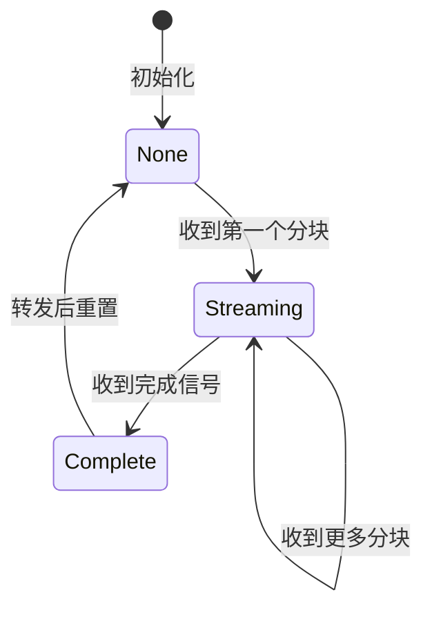

### 决策4：信号分类系统

#### 问题

如何优雅地处理重置、取消和错误等特殊场景？

#### 决策

按类型分类传入信号，针对不同类型采取不同的处理策略。

#### 信号类型定义

```rust
enum SignalType {
    ResetSignal,      // session_status: "reset" - 静默丢弃
    CancelledSignal,  // session_status: "cancelled" - 静默丢弃
    TechnicalError,   // session_status: "error" - 转发模板消息
    ContentError,     // 文本以 "Error:" 开头 - 转发模板消息
    NormalContent,    // 正常内容 - 原样转发
}
```

#### 处理规则

| 信号类型 | 动作 | 原因 |
|---------|------|------|
| `ResetSignal` | 静默丢弃 | 控制信号，非对话内容 |
| `CancelledSignal` | 静默丢弃 | 已中断的响应，内容不完整 |
| `TechnicalError` | 转发模板消息 | 通知其他参与者出现故障 |
| `ContentError` | 转发模板消息 | 通知其他参与者出现故障 |
| `NormalContent` | 原样转发 | 正常的对话内容 |

#### 错误消息模板配置

```yaml
env:
  ERROR_MESSAGE_TEMPLATE: "[{participant} 遇到技术问题，暂时无法响应。]"
```

### 决策5：重置处理与状态恢复

#### 问题

用户按下重置按钮后，如何确保系统能够正确恢复到初始状态，并能够开始新的对话？

#### 决策

在控制器和桥接器之间实现协调的重置机制，确保状态正确恢复。

#### 控制器重置流程

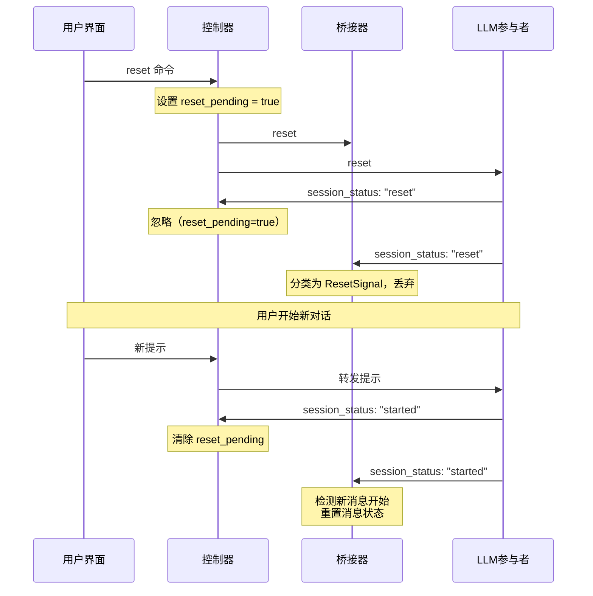

#### 桥接器关键修复

当收到带有 `session_status: "started"` 的新内容时，必须重置消息状态：

```rust
// 检测新消息开始并重置状态
let is_new_start = metadata.get("session_status")
    .map_or(false, |status| status == "started");

if is_new_start {
    // 重置为新的流式状态，允许新内容累积
    self.message_state = Some(MessageState::new_streaming());
    self.ready = false;
    self.was_already_ready = false;
}
```

**为什么需要这个修复？**

问题场景：
1. 重置信号到达桥接器的输入端口
2. 消息状态变为 `Complete`（因为重置是完成信号）
3. 新对话开始，新内容到达
4. **旧代码bug**：`message_state.is_none()` 为 `false`（是 Complete，不是 None）
5. 新的流式状态没有创建，`add_chunk()` 对 Complete 状态不生效
6. 新内容被静默丢弃！

修复后：
- 检测 `session_status: "started"`
- 强制重置消息状态为新的 `Streaming`
- 新内容正常累积

### 决策6：双路径转发策略

#### 问题

由于 Dora 事件调度的特性，"resume" 命令和消息完成信号可能以不确定的顺序到达桥接器。如何确保正确转发？

#### 决策

实现两条转发路径，相互配合处理各种时序情况。

#### 路径说明

**路径1 - 输入事件处理中转发**：
- 触发条件：`resume_mode=true` 且 当前输入刚完成 且 没有其他输入正在流式传输
- 场景：resume 先到达，消息完成后触发转发

**路径2 - 控制命令处理中转发**：
- 触发条件：收到 "resume" 且 存在就绪输入 且 没有进行中的流式传输
- 场景：消息已完成，resume 到达后立即转发

#### 代码实现

```rust
// 路径2：处理 resume 命令
Some("resume") => {
    bridge.resume_mode = true;

    let any_streaming = bridge.inputs.values()
        .any(|input| input.is_streaming_active());
    let ready_inputs = bridge.get_ready_inputs();

    // 如果有就绪输入且没有进行中的流式传输，立即转发
    if !ready_inputs.is_empty() && !any_streaming {
        bridge.forward_bundle(&mut node)?;
        bridge.resume_mode = false;
    }
    // 否则保持 resume_mode=true，等待路径1处理
}

// 路径1：处理输入完成
if bridge.resume_mode && input_ready {
    let any_streaming = bridge.inputs.values()
        .any(|input| input.is_streaming_active());

    // 当前输入完成，检查是否可以转发
    if !any_streaming && !ready_inputs.is_empty() {
        bridge.forward_bundle(&mut node)?;
        bridge.resume_mode = false;
    }
}
```

---

## 竞态条件处理

### 问题描述

在分布式数据流系统中，事件的到达顺序是不确定的。考虑以下场景：

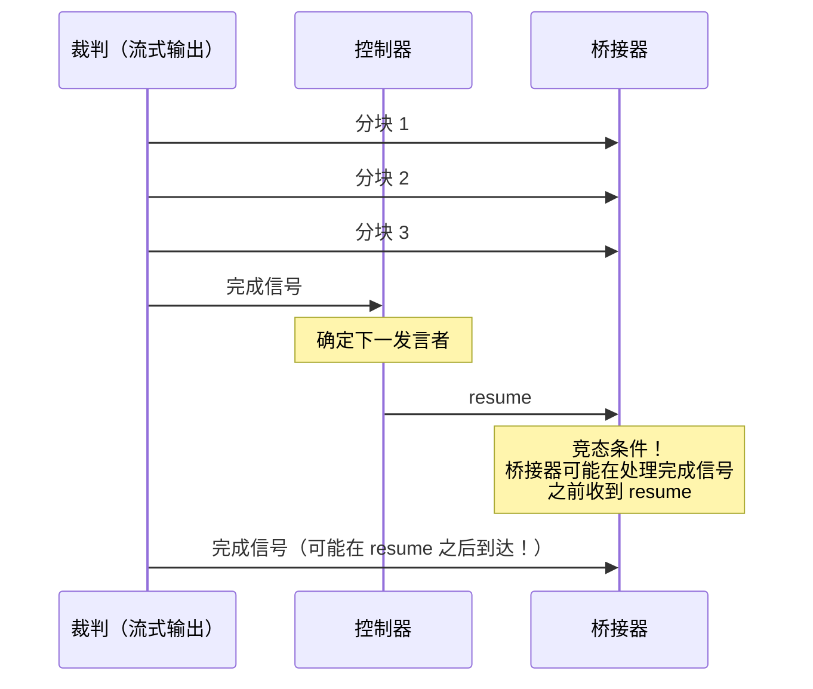

### 场景分析

| 场景 | Resume 到达时机 | 流式状态 | 处理方式 |
|-----|----------------|---------|---------|
| 场景1 | 完成信号处理之后 | `any_streaming=false` | 路径2立即转发 |
| 场景2 | 完成信号处理之前 | `any_streaming=true` | 保持 resume_mode，路径1延迟转发 |
| 场景3 | 流式传输进行中 | `any_streaming=true` | 保持 resume_mode，路径1延迟转发 |

### 解决方案：双路径转发

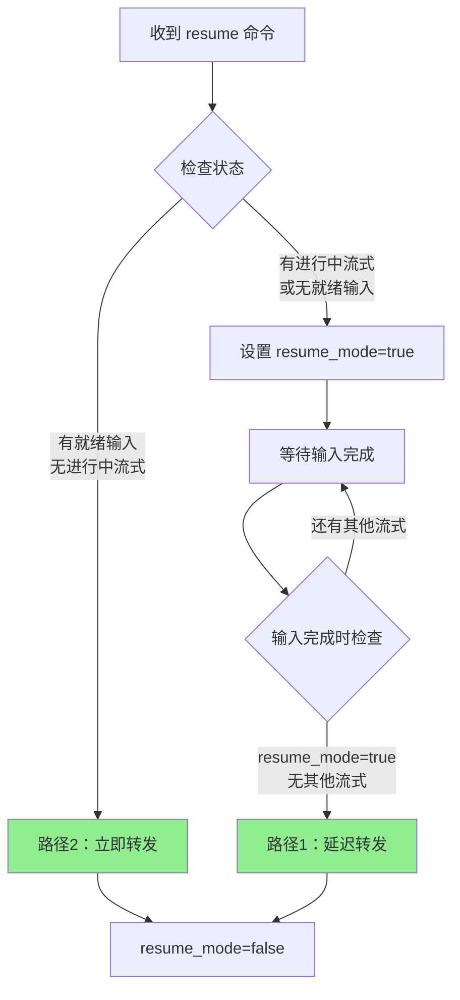

### 关键不变量

1. **resume_mode 只在成功转发后重置**：确保不会丢失转发机会
2. **转发前必须检查 any_streaming**：确保不会转发不完整的消息
3. **ready_inputs 非空才转发**：确保有内容可转发

### 事件队列配置

为防止控制消息在高频输入时被丢弃，需要增加队列大小：

```yaml
control:
  source: conference-controller/control_llm1
  queue_size: 10  # 默认值为1，容易导致消息丢失
```

---

## 节点规格说明

### 会议控制器 (Conference Controller)

#### 功能图示

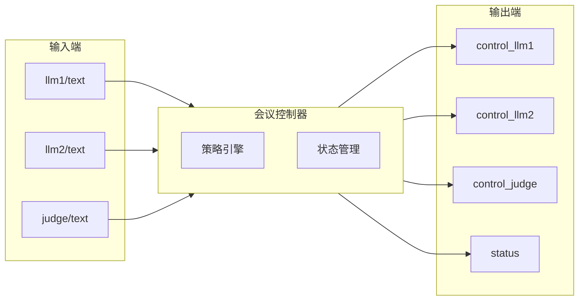

#### 基本信息

| 属性 | 值 |
|-----|---|
| **可执行文件** | `dora-conference-controller` |
| **开发语言** | Rust |
| **主要功能** | 根据策略决定发言顺序 |

#### 输入端口

| 端口名 | 来源 | 数据类型 | 描述 |
|-------|-----|---------|------|
| `llm1` | `llm1/text` | StringArray | 正方的文本输出 |
| `llm2` | `llm2/text` | StringArray | 反方的文本输出 |
| `judge` | `judge/text` | StringArray | 裁判的文本输出 |
| `control` | 外部 | StringArray | 控制命令（reset/stats） |

#### 输出端口

| 端口名 | 数据类型 | 描述 |
|-------|---------|------|
| `control_llm1` | StringArray | 发送给正方桥接器的恢复信号 |
| `control_llm2` | StringArray | 发送给反方桥接器的恢复信号 |
| `control_judge` | StringArray | 发送给裁判桥接器的恢复信号 |
| `status` | StringArray (JSON) | 策略统计信息 |

#### 环境变量

| 变量名 | 必填 | 描述 | 示例 |
|-------|-----|------|-----|
| `DORA_POLICY_PATTERN` | 是 | 发言顺序策略 | `[llm1 → llm2 → judge]` |
| `LOG_LEVEL` | 否 | 日志级别 | `INFO` |

#### 核心处理逻辑

```rust
fn process_next_speaker(&mut self, node: &mut DoraNode) -> Result<()> {
    // 1. 根据策略确定下一个发言者
    if let Some(next_speaker) = self.policy.determine_next_speaker() {

        // 2. 映射发言者到控制输出端口
        let control_output = match next_speaker.as_str() {
            "judge" => "control_judge",
            "llm2" => "control_llm2",
            "llm1" => "control_llm1",
            _ => return Ok(()),
        };

        // 3. 发送 resume 命令
        node.send_output(
            DataId::from(control_output.to_string()),
            Default::default(),
            StringArray::from(vec!["resume"]),
        )?;
    }
    Ok(())
}
```

### 会议桥接器 (Conference Bridge)

#### 功能图示

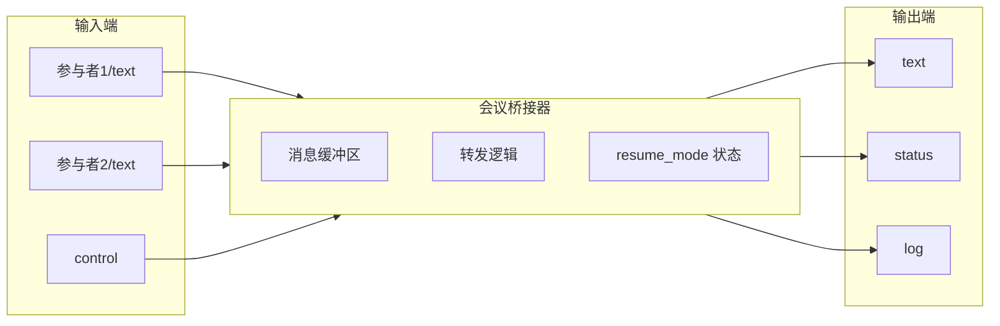

#### 基本信息

| 属性 | 值 |
|-----|---|
| **可执行文件** | `dora-conference-bridge` |
| **开发语言** | Rust |
| **主要功能** | 缓冲消息并根据命令转发 |

#### 输入端口

| 端口名 | 来源 | 数据类型 | 描述 |
|-------|-----|---------|------|
| `<参与者名>` | `<参与者>/text` | StringArray | 其他参与者的文本输出 |
| `control` | `controller/control_<目标>` | StringArray | 控制命令 |

#### 输出端口

| 端口名 | 数据类型 | 描述 |
|-------|---------|------|
| `text` | StringArray | 转发的消息包 |
| `status` | StringArray | 桥接器状态 |
| `log` | StringArray (JSON) | 调试日志 |

#### 环境变量

| 变量名 | 必填 | 描述 | 示例 |
|-------|-----|------|-----|
| `STREAMING_PORTS` | 是 | 流式输入端口列表 | `llm1,llm2,judge` |
| `LOG_LEVEL` | 否 | 日志级别 | `INFO` |
| `INC_QUESTION_ID` | 否 | 自增问题ID | `false` |

#### 控制命令

| 命令 | 功能 |
|-----|------|
| `resume` | 进入恢复模式，转发就绪输入 |
| `reset` | 清空所有缓冲区，重置状态 |

#### 内部状态

```rust
struct ConferenceBridge {
    inputs: HashMap<String, InputPort>,      // 输入端口状态
    streaming_ports: HashSet<String>,        // 流式端口配置
    expected_ports: HashSet<String>,         // 预期的输入端口
    arrival_queue: VecDeque<String>,         // 消息到达顺序
    resume_mode: bool,                       // 是否处于恢复模式
    // ...
}

struct InputPort {
    port_name: String,
    is_streaming: bool,
    message_state: Option<MessageState>,     // None / Streaming / Complete
    ready: bool,                             // 是否就绪可转发
    // ...
}
```

---

## 数据流配置

### 顺序辩论数据流完整配置

```yaml
# dataflow-debate-sequential.yml
# 会议辩论示例 - 顺序策略（三桥架构）
#
# 使用会议控制器和桥接器实现三人辩论
# 顺序策略：llm1 → llm2 → judge → 循环

nodes:
  # ============ LLM 参与者（MaaS 客户端）============
  - id: llm1
    path: ../../target/release/dora-maas-client
    inputs:
      text: bridge-to-llm1/text
    outputs:
      - text
      - status
      - log
    env:
      MAAS_CONFIG_PATH: debate_config_maas_llm1.toml
      LOG_LEVEL: INFO

  - id: llm2
    path: ../../target/release/dora-maas-client
    inputs:
      text: bridge-to-llm2/text
    outputs:
      - text
      - status
      - log
    env:
      MAAS_CONFIG_PATH: debate_config_maas_llm2.toml
      LOG_LEVEL: INFO

  - id: judge
    path: ../../target/release/dora-maas-client
    inputs:
      text: bridge-to-judge/text
    outputs:
      - text
      - status
      - log
    env:
      MAAS_CONFIG_PATH: debate_config_maas_judge.toml
      LOG_LEVEL: INFO

  # ============ 三个会议桥接器（交换机）============

  # 桥接器1：反方 + 裁判 → 正方
  - id: bridge-to-llm1
    path: ../../target/release/dora-conference-bridge
    env:
      LOG_LEVEL: INFO
      STREAMING_PORTS: llm1,judge,llm2
    inputs:
      llm2: llm2/text
      judge: judge/text
      control:
        source: conference-controller/control_llm1
        queue_size: 10  # 防止控制消息丢失
    outputs:
      - text
      - status
      - log

  # 桥接器2：正方 + 裁判 → 反方
  - id: bridge-to-llm2
    path: ../../target/release/dora-conference-bridge
    env:
      LOG_LEVEL: INFO
      STREAMING_PORTS: llm1,judge,llm2
    inputs:
      llm1: llm1/text
      judge: judge/text
      control:
        source: conference-controller/control_llm2
        queue_size: 10
    outputs:
      - text
      - status
      - log

  # 桥接器3：正方 + 反方 → 裁判
  - id: bridge-to-judge
    path: ../../target/release/dora-conference-bridge
    env:
      LOG_LEVEL: INFO
      STREAMING_PORTS: llm1,judge,llm2
    inputs:
      llm1: llm1/text
      llm2: llm2/text
      control:
        source: conference-controller/control_judge
        queue_size: 10
    outputs:
      - text
      - status
      - log

  # ============ 会议控制器（大脑）============
  - id: conference-controller
    path: ../../target/release/dora-conference-controller
    env:
      DORA_POLICY_PATTERN: "[llm1 → llm2 → judge]"
    inputs:
      llm1: llm1/text
      llm2: llm2/text
      judge: judge/text
    outputs:
      - control_judge
      - control_llm2
      - control_llm1
      - status

  # ============ 可选：监控组件 ============
  # - id: debate-monitor
  #   path: dynamic
  #   inputs:
  #     llm1_text: llm1/text
  #     llm2_text: llm2/text
  #     judge_text: judge/text
```

### 配置说明

#### queue_size 配置

```yaml
control:
  source: conference-controller/control_llm1
  queue_size: 10
```

**为什么需要增加 queue_size？**

Dora 的事件调度器默认每个输入端口的队列大小为 1。当队列满时，新事件会覆盖旧事件。在高频流式输入场景下，控制消息可能被丢弃。

#### STREAMING_PORTS 配置

```yaml
env:
  STREAMING_PORTS: llm1,judge,llm2
```

**作用**：告诉桥接器哪些输入端口是流式的，需要等待完成信号才算就绪。

---

## 开发挑战与解决方案

### 挑战1：分布式系统中的事件排序

#### 问题描述

Dora 的事件调度器使用 LRU（最近最少使用）公平性算法来交错处理来自不同输入的事件。这意味着：

- 来自不同输入的事件可能被重新排序
- 控制消息可能在数据消息之前或之后被处理
- 无法假设事件的到达顺序

#### 解决方案

1. **增加队列大小**：防止控制消息被覆盖
2. **双路径转发**：处理各种时序情况
3. **状态标志**：使用 `resume_mode` 跨事件维护状态

### 挑战2：流式消息的完成检测

#### 问题描述

LLM 的输出是流式的，每次只输出一小块文本。我们需要：

- 知道完整消息何时结束
- 正确累积所有分块
- 避免转发不完整的消息

#### 解决方案

1. **元数据信号**：使用 `session_status: "ended"` 或 `is_complete: true`
2. **状态机管理**：`None → Streaming → Complete`
3. **完成检查**：只有状态为 `Complete` 的消息才能被转发

### 挑战3：部分参与者可用性

#### 问题描述

在顺序辩论中，并非所有参与者每轮都发言。例如：

- 第一轮：只有裁判发言
- 正方桥接器配置了 `judge` 和 `llm2` 两个输入
- 但 `llm2` 还没有发言，不会有消息

#### 错误的实现

```rust
// 错误：等待所有预期输入都就绪
let all_complete = bridge.expected_ports.iter().all(|port| {
    bridge.inputs.get(port).map(|i| i.ready).unwrap_or(false)
});
if all_complete { forward(); }
```

这会导致永远无法转发，因为 `llm2` 永远不会就绪。

#### 正确的实现

```rust
// 正确：有任何就绪输入就可以转发
if !ready_inputs.is_empty() && !any_streaming {
    forward();
}
```

### 挑战4：同步事件循环的阻塞问题

#### 问题描述

桥接器使用同步的 `events.recv()` 等待事件。在处理一个事件时，其他事件在队列中等待。

```rust
while let Some(event) = events.recv() {  // 阻塞等待
    // 处理事件期间，其他事件排队
    process(event);
}
```

#### 影响

- 处理长流式输入时，控制消息被延迟
- 无法并行处理事件

#### 缓解措施

1. **保持处理器快速**：避免在事件处理中进行阻塞 I/O
2. **增加队列大小**：缓冲处理期间到达的事件
3. **优先处理控制事件**：在事件循环开始检查是否是控制消息

---

## 调试指南

### 关键调试日志点

```rust
// 事件接收（循环顶部）
println!("[BRIDGE-STDOUT] ⚡ EVENT RECEIVED: Input from '{}'", id);

// 控制命令处理
println!("[BRIDGE-STDOUT] 🎮 CONTROL PAYLOAD: '{}' (length: {})", trimmed, trimmed.len());

// resume 状态检查
println!("[BRIDGE-STDOUT] 🚀 RESUME: ready_inputs={:?}, any_streaming={}",
    ready_inputs, any_streaming);

// 输入完成（resume 模式下）
println!("[BRIDGE-STDOUT] 📥 INPUT COMPLETE in resume_mode: port={}, any_streaming={}",
    port_name, any_streaming);

// 转发执行
println!("[BRIDGE-STDOUT] 🚀 FORWARDING: {} ready inputs", ready_inputs.len());
```

### 常见问题排查

| 现象 | 可能原因 | 解决方案 |
|-----|---------|---------|
| resume 未收到 | 队列溢出 | 增加 `queue_size: 10` |
| resume 收到但不转发 | `all_complete` 检查 | 改用 `!ready_inputs.is_empty()` |
| 流式传输中转发 | 缺少 `any_streaming` 检查 | 添加 `&& !any_streaming` 条件 |
| 重复转发 | `resume_mode` 未重置 | 只在成功转发后重置 |
| 消息丢失 | 队列大小不足 | 增加 `queue_size` |

### 日志分析示例

**正常流程应显示**：
```
⚡ EVENT RECEIVED: Input from 'judge'
📝 TEXT INPUT PROCESSING: port=judge
📥 RAW INPUT RECEIVED from judge: '[Judge] 请大家保持静默...'
...（更多流式分块）...
⚡ EVENT RECEIVED: Input from 'judge'  # 完成信号
📥 RAW INPUT RECEIVED from judge: '' (0 chars)
⚡ EVENT RECEIVED: Input from 'control'
🎮 CONTROL PAYLOAD: 'resume' (length: 6)
🚀 RESUME: ready_inputs={"judge"}, any_streaming=false
🚀 RESUME: READY TO FORWARD - calling forward_bundle()
🚀 forward_bundle() called!
✅ forward_bundle() completed successfully
```

**异常：resume 未被处理**
```
⚡ EVENT RECEIVED: Input from 'judge'
📥 RAW INPUT RECEIVED from judge: '...'
# 没有看到 'EVENT RECEIVED: Input from control'
# 原因：控制消息被丢弃或未到达
```

**异常：resume 收到但不转发**
```
⚡ EVENT RECEIVED: Input from 'control'
🎮 CONTROL PAYLOAD: 'resume'
🚀 RESUME: ready_inputs={"judge"}, any_streaming=false, expected_ports={"judge", "llm2"}
🚀 RESUME: NOT ALL COMPLETE - staying in resume mode
# 原因：旧代码要求所有预期端口都就绪
```

### 调试工具

#### 启用详细日志

```yaml
env:
  LOG_LEVEL: DEBUG
```

#### 查看节点输出

```bash
# 运行数据流时观察特定节点的 stdout
dora start dataflow-debate-sequential.yml 2>&1 | grep "bridge-to-llm1"
```

---

## 音频管道架构

### 概述

音频数据流通过为导师的回复提供实时文本转语音（TTS）来增强学习模式。这创造了一种沉浸式学习体验，学生可以在阅读对话的同时听到导师的声音。

**音频管道流程**：
```
导师 LLM → 文本分段器 → PrimeSpeech TTS → 音频播放器 → 扬声器输出
```

**关键特性**：
- 导师回复的实时流式 TTS
- 智能文本分段，实现自然的语音节奏
- 音频反压控制，防止缓冲区溢出
- 大队列大小，防止 LLM 流式传输时文本丢失
- 说话人 ID 移除，实现干净的音频输出

### 架构图

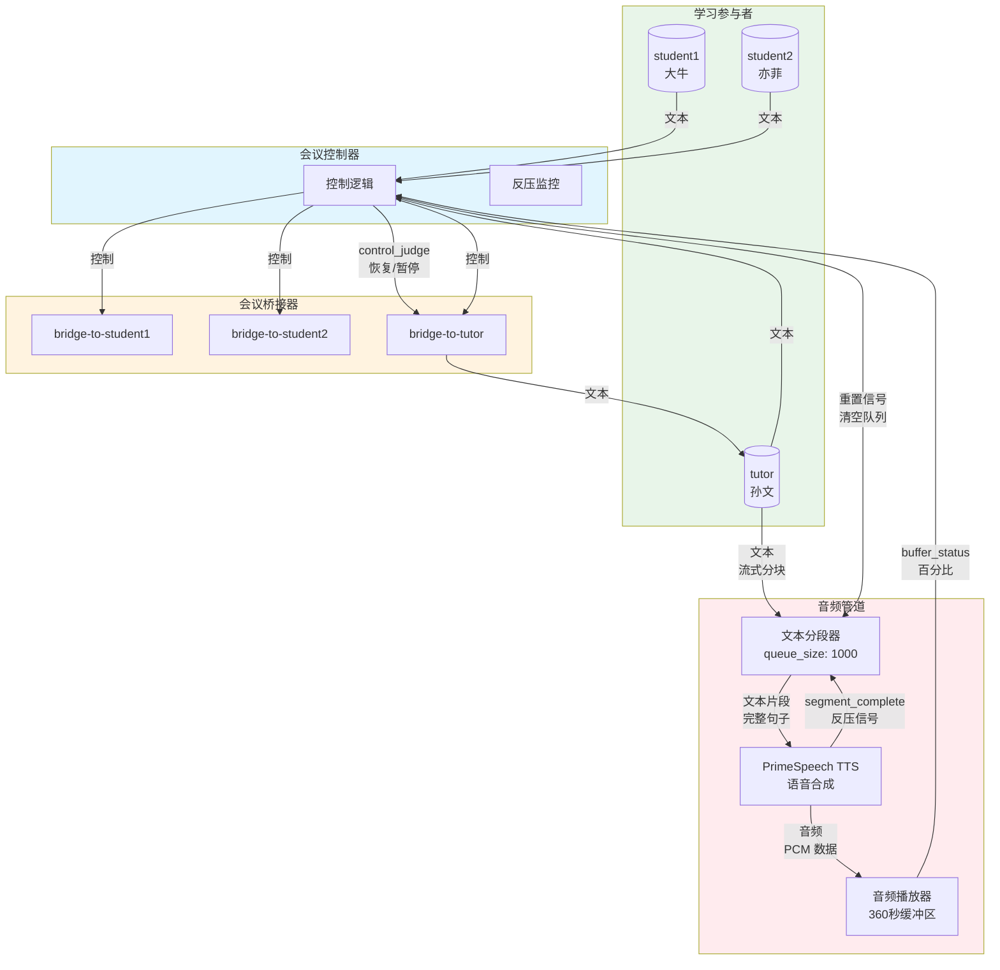

### 已解决的问题

#### 问题1：音频缓冲区溢出

**症状**：即使导师未发言，音频缓冲区也会持续填充到 100%+，导致音频延迟和糟糕的用户体验。

**根本原因**：音频管道和对话控制器之间没有流量控制机制。导师在音频缓冲区已满时继续发言。

**解决方案 - 音频反压控制**：

在会议控制器中实现反压机制：

```rust
// 在 conference-controller/src/main.rs 中
struct ConferenceController {
    audio_buffer_paused: bool,
    audio_buffer_threshold: f64,           // 30% - 暂停阈值
    audio_buffer_resume_threshold: f64,    // 10% - 恢复阈值
    pending_tutor_activation: Option<String>,
}

// 当缓冲区已满时延迟导师激活
if is_tutor && self.should_pause_tutor_output() {
    self.pending_tutor_activation = Some(control_output.to_string());
    send_log(node, LogLevel::Info, self.log_level,
        &format!("🎵 🛑 延迟桥接器 {}: 音频缓冲区反压（阈值: {:.1}%）",
            control_output, self.audio_buffer_threshold));
    return Ok(());
}

// 当缓冲区排空时重试延迟的激活
if buffer_percentage < self.audio_buffer_resume_threshold && self.audio_buffer_paused {
    if let Some(control_output) = &self.pending_tutor_activation {
        send_log(node, LogLevel::Info, log_level,
            &format!("🎵 ✅ 重试延迟的桥接器 {}: 发送恢复（缓冲区: {:.1}%）",
                control_output, buffer_percentage));
        node.send_output(DataId::from(control_output.clone()), metadata,
            StringArray::from(vec!["resume"]))?;
    }
}
```

**配置**：
```yaml
# dataflow-study-audio.yml
- id: conference-controller
  env:
    AUDIO_BUFFER_THRESHOLD: 30       # 缓冲区超过 30% 时暂停
    AUDIO_BUFFER_RESUME_THRESHOLD: 10  # 缓冲区低于 10% 时恢复
  inputs:
    buffer_status: audio-player/buffer_status
```

**结果**：流畅的音频播放，具有自动流量控制，防止缓冲区溢出，同时保持自然的对话节奏。

#### 问题2：队列溢出导致文本丢失

**症状**：TTS 输出中缺少文本片段。用户确认"LLM 生成了所有完整内容"，但分段器和 TTS 收到了不完整的文本。

缺失文本示例：`"又能编码的"非周期晶体""` 和 `"奠基者都承认受它启发"`

**根本原因**：默认 Dora 队列大小约为 10 条消息。当 LLM 快速流式传输 50 多个文本块时，输入队列溢出并丢弃消息。

**解决方案 - 所有流式输入使用大队列**：

```yaml
# 文本分段器 - 关键：大队列防止丢弃 LLM 块
- id: tutor-text-segmenter
  inputs:
    text:
      source: tutor/text
      queue_size: 1000  # ✅ 修复：之前缺失，默认为 ~10

# 会议控制器 - 接收来自所有 3 个 LLM 的快速流式传输
- id: conference-controller
  inputs:
    student1:
      source: student1/text
      queue_size: 1000  # ✅ 已修复
    student2:
      source: student2/text
      queue_size: 1000  # ✅ 已修复
    tutor:
      source: tutor/text
      queue_size: 1000  # ✅ 已修复

# 所有 3 个会议桥接器
- id: bridge-to-tutor
  inputs:
    student1:
      source: student1/text
      queue_size: 1000  # ✅ 已修复
    student2:
      source: student2/text
      queue_size: 1000  # ✅ 已修复

# 辩论监视器和查看器 - 所有流式输入
# ... 所有文本和日志输入现在都有 queue_size: 1000
```

**结果**：完整的文本传输，即使在快速 LLM 流式传输期间也零消息丢失。

#### 问题3：说话人 ID 移除

**症状**：TTS 输出包含说话人前缀，如 `[孙文]` 或 `[Tutor]`，使音频听起来不自然。

**解决方案 - 基于正则表达式的说话人 ID 移除**：

```python
# 在 dora-text-segmenter/queue_based_segmenter.py 中
def remove_speaker_id(text, node=None, log_level="INFO"):
    """移除方括号中的说话人名称，如 [Student1]、[Tutor]、[孙老师]"""
    # 模式：[任何文本] 仅在字符串开头
    pattern = r'^\[[^\]]+\]\s*'
    cleaned_text = re.sub(pattern, '', text)

    if node and cleaned_text != text:
        send_log(node, "DEBUG",
            f"移除说话人 ID: '{text}' → '{cleaned_text}'", log_level)

    return cleaned_text

# 配置
remove_speaker_id_enabled = os.getenv("REMOVE_SPEAKER_ID", "false").lower() in {"1", "true", "yes"}

# 在分段之前应用
if remove_speaker_id_enabled:
    text = remove_speaker_id(text, node, log_level)
```

**配置**：
```yaml
- id: tutor-text-segmenter
  env:
    REMOVE_SPEAKER_ID: "true"
```

**关键设计决策**：仅移除文本开头的方括号（`^\[...\]`），以保留其他位置的合法括号内容（例如 `[非周期晶体]`）。

#### 问题4：智能文本分段

**挑战**：在 TTS 响应性和自然语音节奏之间取得平衡。需要智能分段文本，同时在"resume"信号之间保留不完整的句子。

**解决方案 - 基于问题 ID 的缓冲区管理**：

```python
# 在 dora-text-segmenter/queue_based_segmenter.py 中

# 忽略"resume"命令 - 它们是给桥接器的，不是给分段器的
if command == "resume":
    send_log(node, "DEBUG", "忽略 reset 输入上的 'resume' 命令", log_level)
    continue

# 智能缓冲区清除：仅在 question_id 更改时清除
if current_question_id != incoming_question_id:
    buffer_was_cleared = len(text_buffer) > 0
    text_buffer = ""  # 为新问题清除缓冲区
    send_log(node, "INFO",
        f"🔄 问题 ID 已更改: {current_question_id} → {incoming_question_id}，已清除缓冲区",
        log_level)
else:
    send_log(node, "DEBUG",
        f"相同的 question_id（{current_question_id}），保留缓冲区: '{text_buffer}'",
        log_level)
```

**分段逻辑**：
```python
def segment_by_punctuation(text, min_length=5, max_length=15, punctuation=None):
    """
    按标点符号分段文本，遵守长度约束。
    - 累积文本直到达到标点符号 + 最小长度
    - 即使超过最大长度也不会在句子中间拆分
    - 返回（完整片段，不完整文本，保留不完整）
    """
    segments = []
    current_segment = ""

    for char in text:
        current_segment += char

        if char in punctuation and len(current_segment) >= min_length:
            segments.append(current_segment.strip())
            current_segment = ""

    # 返回不完整文本以供下一轮使用
    return segments, current_segment, True
```

**配置**：
```yaml
- id: tutor-text-segmenter
  env:
    ENABLE_BACKPRESSURE: "false"  # 最初不等待 - 立即发送第一个片段
    SEGMENT_MODE: "sentence"
    MIN_SEGMENT_LENGTH: "5"
    MAX_SEGMENT_LENGTH: "15"
    PUNCTUATION_MARKS: '。！？.!?，,、；：""''（）【】《》'  # 完整的中英文标点
```

**结果**：自然的语音节奏，完整的句子，对话轮次之间没有文本丢失。

#### 问题5：TTS 导入路径问题

**症状**：TTS 在尝试导入中文文本处理模块时失败，出现 `ModuleNotFoundError: No module named 'text'` 错误。

**根本原因**：包装器仅将父目录添加到 `sys.path`，而没有添加包含 `text` 模块的 `moyoyo_tts` 子目录。

**解决方案**：
```python
# 在 dora-primespeech/moyoyo_tts_wrapper_streaming_fix.py 中

# 关键：将 moyoyo_tts 子目录添加到 sys.path
moyoyo_tts_dir = local_moyoyo_path / "moyoyo_tts"
if moyoyo_tts_dir.exists() and str(moyoyo_tts_dir) not in sys.path:
    sys.path.insert(0, str(moyoyo_tts_dir))
    logger.debug(f"已将 moyoyo_tts 子目录添加到路径: {moyoyo_tts_dir}")
```

**结果**：TTS 成功导入所有必需的模块并合成语音。

#### 问题6：动态节点的音频缓冲区大小

**挑战**：将音频缓冲区从 60 秒增加到 360 秒，但动态 Python 节点无法读取环境变量。

**解决方案 - 动态节点使用命令行参数**：

```yaml
# 数据流配置
- id: audio-player
  path: dynamic
  args: --buffer-seconds 360  # ✅ 使用 args，不是 env
  inputs:
    audio:
      source: primespeech-tutor/audio
      queue_size: 1000
```

```python
# 在 audio_player.py 中
def main():
    # 从环境变量读取缓冲区大小，带回退
    default_buffer_seconds = int(os.getenv("BUFFER_SECONDS", "60"))

    parser = argparse.ArgumentParser(description="循环缓冲区音频播放器")
    parser.add_argument("--buffer-seconds", type=int, default=default_buffer_seconds,
                        help="缓冲区容量（秒）")
    args = parser.parse_args()

    # 在整个代码中使用 args.buffer_seconds
```

**结果**：6 分钟的音频缓冲区容量，防止在导师长时间回复期间溢出。

### 音频数据流配置

```yaml
# dataflow-study-audio.yml - 完整的音频管道配置

nodes:
  # ============ 导师 LLM ============
  - id: tutor
    path: ../../target/release/dora-maas-client
    inputs:
      text: bridge-to-tutor/text
      control: conference-controller/judge_prompt
    outputs:
      - text    # → 文本分段器 AND 控制器 AND 桥接器
      - status
      - log
    env:
      MAAS_CONFIG_PATH: study_config_maas_tutor.toml

  # ============ 音频管道 ============

  # 文本分段器 - 缓冲导师输出，一次发送一个片段
  - id: tutor-text-segmenter
    build: pip install -e ../../node-hub/dora-text-segmenter
    path: dora-text-segmenter
    inputs:
      text:
        source: tutor/text
        queue_size: 1000  # ✅ 大队列防止文本丢失
      tts_complete: primespeech-tutor/segment_complete
      reset: conference-controller/control_judge
    outputs:
      - text_segment
      - status
      - metrics
      - log
    env:
      ENABLE_BACKPRESSURE: "false"
      SEGMENT_MODE: "sentence"
      MIN_SEGMENT_LENGTH: "5"
      MAX_SEGMENT_LENGTH: "15"
      PUNCTUATION_MARKS: '。！？.!?，,、；：""''（）【】《》'
      REMOVE_SPEAKER_ID: "true"  # ✅ 移除 [Name] 前缀
      LOG_LEVEL: "DEBUG"

  # PrimeSpeech TTS - 从文本片段合成语音
  - id: primespeech-tutor
    build: pip install -e ../../node-hub/dora-primespeech
    path: dora-primespeech
    inputs:
      text: tutor-text-segmenter/text_segment
    outputs:
      - audio
      - status
      - segment_complete  # ✅ 向分段器发送反压信号
      - log
    env:
      VOICE_NAME: "Luo Xiang"
      TEXT_LANG: zh
      SPEED_FACTOR: 1.0
      USE_GPU: false
      ENABLE_INTERNAL_SEGMENTATION: "true"
      TTS_MAX_SEGMENT_LENGTH: "100"
      LOG_LEVEL: INFO

  # 音频播放器 - 使用循环缓冲区播放音频
  - id: audio-player
    path: dynamic
    args: --buffer-seconds 360  # ✅ 6 分钟缓冲区
    inputs:
      audio:
        source: primespeech-tutor/audio
        queue_size: 1000  # ✅ 大队列防止音频丢失
    outputs:
      - buffer_status  # ✅ 向控制器发送反压信号
      - status

  # ============ 带反压的会议控制器 ============
  - id: conference-controller
    path: ../../target/release/dora-conference-controller
    env:
      DORA_POLICY_PATTERN: "[(tutor, *), (student2, 2), (student1, 1)]"
      AUDIO_BUFFER_THRESHOLD: 30       # ✅ 在 30% 时暂停
      AUDIO_BUFFER_RESUME_THRESHOLD: 10  # ✅ 在 10% 时恢复
    inputs:
      student1:
        source: student1/text
        queue_size: 1000  # ✅ 大队列
      student2:
        source: student2/text
        queue_size: 1000  # ✅ 大队列
      tutor:
        source: tutor/text
        queue_size: 1000  # ✅ 大队列
      control: debate-monitor/control
      buffer_status: audio-player/buffer_status  # ✅ 反压输入
    outputs:
      - control_judge
      - control_llm2
      - control_llm1
      - llm_control
      - judge_prompt
      - status
      - log
```

### 性能影响

| 指标 | 之前 | 之后 | 改进 |
|-----|------|------|------|
| 文本丢失率 | ~5-10% | 0% | ✅ 完全消除 |
| 音频缓冲区溢出 | 频繁（100%+） | 从不 | ✅ 自动流量控制 |
| TTS 质量 | 包含说话人 ID | 干净自然语音 | ✅ 专业音频 |
| 缓冲区容量 | 60 秒 | 360 秒 | ✅ 6 倍增加 |
| 队列大小 | 默认（~10） | 1000 | ✅ 100 倍增加 |
| 对话流程 | 被缓冲区中断 | 流畅连续 | ✅ 自然节奏 |

---

## 附录

### 术语表

| 术语 | 英文 | 定义 |
|-----|------|------|
| 桥接器 | Bridge | 缓冲和转发消息的组件 |
| 控制器 | Controller | 决定发言顺序的组件 |
| 恢复模式 | Resume Mode | 桥接器准备转发的状态 |
| 流式传输 | Streaming | 消息分块逐步传输 |
| 完成信号 | Completion Signal | 标识消息结束的元数据 |
| 反压控制 | Backpressure Control | 流量控制机制，防止缓冲区溢出 |
| 文本分段器 | Text Segmenter | 将流式文本分成 TTS 友好的片段 |

### 相关文件

| 文件 | 描述 |
|-----|------|
| `node-hub/dora-conference-bridge/src/main.rs` | 桥接器源码 |
| `node-hub/dora-conference-controller/src/main.rs` | 控制器源码 |
| `examples/conference/dataflow-debate-sequential.yml` | 辩论模式数据流 |
| `examples/conference/dataflow-study-sequential.yml` | 学习模式数据流 |
| **`examples/conference/dataflow-study-audio.yml`** | **音频数据流（新增）** |
| `examples/conference/ARCHITECTURE.md` | 双语架构文档 |
| **`node-hub/dora-text-segmenter/dora_text_segmenter/queue_based_segmenter.py`** | **文本分段器源码** |
| **`node-hub/dora-primespeech/dora_primespeech/main.py`** | **PrimeSpeech TTS 源码** |
| **`examples/conference/audio_player.py`** | **音频播放器源码** |

### 版本历史

| 版本 | 日期 | 变更说明 |
|-----|------|---------|
| 1.0 | 2024-01 | 初始设计，单桥接器 |
| 2.0 | 2024-02 | 三桥架构 |
| 2.1 | 2024-03 | 双路径转发，处理竞态条件 |
| 2.2 | 2024-03 | 修复 `all_complete` 为 `!ready_inputs.is_empty()` |
| 2.3 | 2024-11 | 信号分类系统（重置/取消/错误处理）|
| 2.4 | 2024-11 | 重置状态恢复修复 - 检测 `session_status: "started"` |
| 2.5 | 2024-11 | 错误消息模板支持，用于参与者故障通知 |
| 2.6 | 2024-11 | 全局重置信号处理 - 任何重置信号清除所有桥接器状态 |
| 2.7 | 2024-11 | 增强 MaaS 客户端，集成 DeepSeek API |
| 2.8 | 2024-11 | 高级取消系统，RequestCancellationManager |
| 2.9 | 2024-11 | 增强工具调用，立即执行和 MCP 支持 |
| 3.0 | 2024-11 | 学习模式，锚点上下文支持 |
| 3.1 | 2024-11 | 日志清理 - 移除冗余 println，关键事件使用 send_log |

---

## 学习模式

### 概述

学习模式将会议系统从竞争性辩论转变为协作式学习研讨。三位参与者——两名学生和一位导师——使用基于锚点的上下文来讨论主题。

### 与辩论模式的区别

| 方面 | 辩论模式 | 学习模式 |
|-----|---------|---------|
| 参与者 | 正方、反方、裁判 | 学生1、学生2、导师 |
| 发言顺序 | `[llm1 → llm2 → judge]` | `[student2 → student1 → tutor]` |
| 互动风格 | 竞争性、对抗性 | 协作性、苏格拉底式 |
| 上下文 | 无外部上下文 | 基于锚点的 Markdown 上下文 |
| 环境变量 | `DORA_STUDY_MODE: false` | `DORA_STUDY_MODE: true` |

### 锚点上下文系统

锚点上下文系统允许参与者使用锚点标签 `[A0]`、`[A1]` 等引用学习文档的特定部分。

**配置：**
```toml
# 在 study_config_maas_*.toml 中
anchor_context = "study-context.md"
```

**上下文文件格式：**
```markdown
[A0] 导言：跨学科的必要性与核心问题
薛定谔在写作一开始就非常清醒：一个物理学家写生物学，按传统是"越界"...

[A1] 经典物理学家的入门视角：统计律
为什么从"原子为什么这么小"问起？他的解释是：这其实不是在问原子...
```

**参与者如何使用锚点：**
- **学生（大牛）**："根据 [A1]，统计律需要大量原子..."
- **学生（亦菲）**："我对 [A4] 和 [A5] 之间的关系感到困惑..."
- **导师（孙文）**："观察得很好！这与我们在 [A3] 讨论的内容有关..."

### 学习模式数据流架构

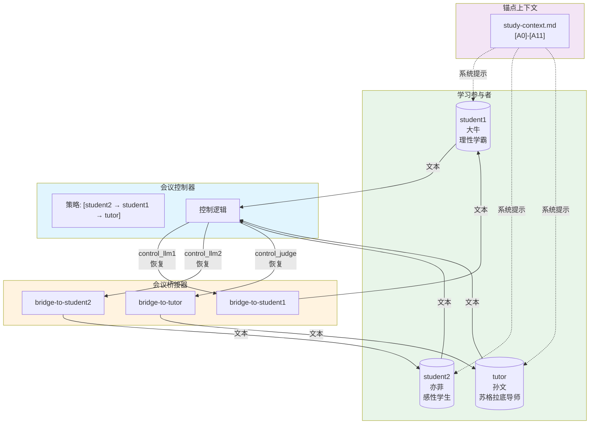

### 参与者个性配置

**学生1（大牛）- 理性学霸：**
```toml
system_prompt = """你是学生 Daniu，非常聪明理性，逻辑强，但不太懂人情世故、幽默感弱。
讨论时以锚点 [A0–A11] 为唯一依据：
- 先判断问题属于哪些锚点，再给出推理
- 发现不在锚点里的内容要直说"不在上下文里"
输出格式：每次只输出一段小组发言，前缀为 [Daniu]，≤200字。
"""
```

**学生2（亦菲）- 感性学生：**
```toml
system_prompt = """你是学生 Yifei，感性、好奇心强，经常提问。
讨论时同样以锚点 [A0–A11] 为依据，但更注重直觉理解...
输出格式：每次只输出一段小组发言，前缀为 [Yifei]，≤200字。
"""
```

**导师（孙文）- 苏格拉底导师：**
```toml
system_prompt = """你是小组讨论的引导者 Sunwen，一位中年男性物理老师，
幽默风趣，擅长苏格拉底式"接生婆"学习法。
你的目标：
- 用问题引导学生自己说出关键点
- 把发散话题温柔拉回锚点
- 总结时给出"核心一句话 + 下一步要读的锚点"
输出格式：每次只输出一段小组发言，前缀为 [Sunwen]，≤200字。
"""
```

### 环境变量配置

```yaml
# 桥接器环境变量（学习模式）
env:
  DORA_STUDY_MODE: "true"
  STREAMING_PORTS: student1,tutor,student2
  ERROR_MESSAGE_TEMPLATE: "[{participant} 遇到技术问题，暂时无法响应。]"

# 控制器环境变量
env:
  DORA_POLICY_PATTERN: "[student2 → student1 → tutor]"
```
