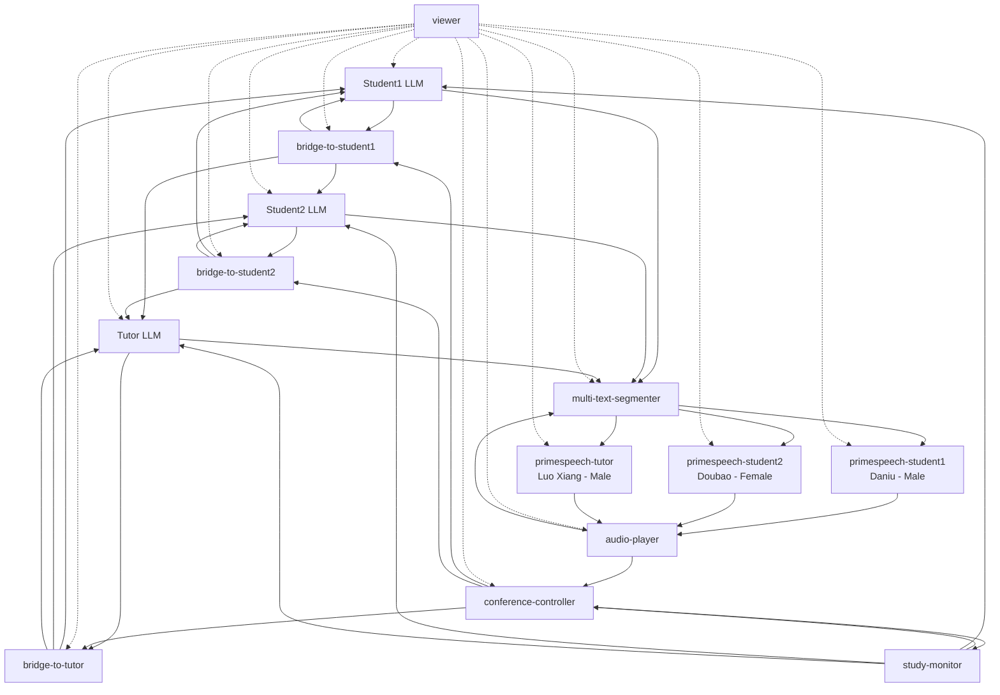

# 群体学习系统快速入门指南 | Group Study System Quickstart Guide

---

## 📖 Table of Contents | 目录

1. [系统概述 | System Overview](#1-系统概述)
2. [数据流架构 | Dataflow Architecture](#2-数据流架构)
3. [节点详解 | Node Details](#3-节点详解)
4. [环境配置 | Environment Setup](#4-环境配置)
5. [启动指南 | Startup Guide](#5-启动指南)
6. [配置自定义 | Configuration](#6-配置自定义)
7. [故障排除 | Troubleshooting](#7-故障排除)

---

## 1. 系统概述 | System Overview

### 🎯 系统功能 | System Function

群体学习系统是一个**3人AI学习小组**，包括：
- **2名学生学生** - Student1 & Student2
- **1名教师/辅导员** - Tutor

**核心特性：**
- 🔄 **公平对话机制** - 基于3个桥接器的轮流发言
- 🎵 **多语音合成** - 3种不同声音的语音播放
- 🎛️ **音频缓冲控制** - 防止音频缓冲区溢出的背压控制
- 📝 **智能文本分段** - 句子级别的文本切分和TTS优化
- 💾 **会话管理** - 基于FIFO队列的公平参与者管理

The group study system is a **3-person AI learning group** including:
- **2 Students** - Student1 & Student2
- **1 Teacher/Tutor** - Tutor

**Key Features:**
- 🔄 **Fair Conversation** - Round-robin speaking via 3 bridges
- 🎵 **Multi-Voice TTS** - 3 different voices for audio playback
- 🎛️ **Audio Buffer Control** - Backpressure to prevent buffer overflow
- 📝 **Smart Text Segmentation** - Sentence-level text chunking and TTS optimization
- 💾 **Session Management** - FIFO queue-based fair participant management

---

## 2. 数据流架构 | Dataflow Architecture

### 📊 数据流图 | Dataflow Chart



### 🔗 主要数据流 | Main Data Flow

1. **LLM响应生成** → **桥接器路由** → **其他参与者输入**
2. **LLM输出** → **文本分段器** → **TTS合成** → **音频播放**
3. **音频缓冲区** → **背压控制** → **分段器暂停/恢复**
4. **会议控制器** → **桥接器控制** → **公平发言管理**

1. **LLM Response** → **Bridge Routing** → **Other Participants Input**
2. **LLM Output** → **Text Segmenter** → **TTS Synthesis** → **Audio Playback**
3. **Audio Buffer** → **Backpressure Control** → **Segmenter Pause/Resume**
4. **Conference Controller** → **Bridge Control** → **Fair Speaking Management**

---

## 3. 节点详解 | Node Details

### 🎓 学习参与者 | Study Participants

#### Student1 & Student2
```yaml
- id: student1
  path: ../../target/release/dora-maas-client
  inputs:
    text: bridge-to-student1/text
    control: conference-controller/llm_control
  outputs: [text, status, log]
  env:
    MAAS_CONFIG_PATH: study_config_maas_student1.toml
    LOG_LEVEL: INFO
```

**功能：**
- 🧠 AI模型推理（可配置不同模型）
- 📖 基于学习材料进行讨论
- 🔄 接收其他参与者的输入并回应
- 🎙️ 生成中文语音回答

**Function：**
- 🧠 AI model inference (configurable models)
- 📖 Discussion based on study materials
- 🔄 Receive and respond to other participants
- 🎙️ Generate Chinese speech responses

#### Tutor
```yaml
- id: tutor
  path: ../../target/release/dora-maas-client
  inputs:
    text: bridge-to-tutor/text
    control: conference-controller/judge_prompt
  outputs: [text, status, log]
  env:
    MAAS_CONFIG_PATH: study_config_maas_tutor.toml
    LOG_LEVEL: INFO
```

**功能：**
- 👨‍🏫 引导讨论方向和深度
- ❓ 提出启发性问题
- 📚 解释复杂概念
- 🔍 纠正学生误解

**Function：**
- 👨‍🏫 Guide discussion direction and depth
- ❓ Ask thought-provoking questions
- 📚 Explain complex concepts
- 🔍 Correct student misconceptions

### 🌉 桥接器系统 | Bridge System

#### 3个交叉桥接器 | 3 Cross-Bridges
```yaml
# Bridge 1: Student2 + Tutor → Student1
- id: bridge-to-student1
  path: ../../target/release/dora-conference-bridge
  inputs:
    student2: student2/text
    tutor: tutor/text
    control: conference-controller/control_llm1
  outputs: [text, status, log]

# Bridge 2: Student1 + Tutor → Student2
- id: bridge-to-student2
  path: ../../target/release/dora-conference-bridge
  inputs:
    student1: student1/text
    tutor: tutor/text
    control: conference-controller/control_llm2
  outputs: [text, status, log]

# Bridge 3: Student1 + Student2 → Tutor
- id: bridge-to-tutor
  path: ../../target/release/dora-conference-bridge
  inputs:
    student1: student1/text
    student2: student2/text
    control: conference-controller/control_judge
  outputs: [text, status, log]
```

**功能：**
- 🔄 **消息路由** - 将发言者的消息路由给正确的听众
- ⚖️ **发言控制** - 根据控制器信号决定是否转发消息
- 🛡️ **错误处理** - 处理参与者发言失败的情况
- 📝 **日志记录** - 记录所有桥接活动

**Function：**
- 🔄 **Message Routing** - Route speaker messages to correct listeners
- ⚖️ **Speaking Control** - Decide whether to forward based on controller signals
- 🛡️ **Error Handling** - Handle participant speaking failures
- 📝 **Logging** - Record all bridge activities

### 📝 文本分段器 | Text Segmenter

```yaml
- id: multi-text-segmenter
  path: dora-text-segmenter
  inputs:
    student1: student1/text
    student2: student2/text
    tutor: tutor/text
    audio_buffer_control: audio-player/buffer_status
  outputs: [text_segment_student1, text_segment_student2, text_segment_tutor, status, metrics, log]
  env:
    SEGMENT_MODE: "sentence"
    MIN_SEGMENT_LENGTH: "5"
    MAX_SEGMENT_LENGTH: "15"
    AUDIO_BUFFER_LOW_WATER_MARK: "30"
    AUDIO_BUFFER_HIGH_WATER_MARK: "60"
```

**功能：**
- ✂️ **智能分段** - 基于句子和标点符号的文本切分
- 🔄 **FIFO队列** - 公平的参与者发言队列管理
- 🎛️ **背压控制** - 根据音频缓冲区状态暂停/恢复发送
- 💾 **会话管理** - 跟踪完整的对话会话和结束状态
- 🎵 **语音优化** - 移除说话者标识符，优化TTS输入

**Function：**
- ✂️ **Smart Segmentation** - Sentence and punctuation-based text chunking
- 🔄 **FIFO Queue** - Fair participant speaking queue management
- 🎛️ **Backpressure Control** - Pause/resume sending based on audio buffer status
- 💾 **Session Management** - Track complete conversation sessions and end states
- 🎵 **Speech Optimization** - Remove speaker IDs, optimize TTS input

### 🎵 TTS语音合成 | TTS Speech Synthesis

#### 3个不同声音的TTS节点 | 3 Different Voice TTS Nodes
```yaml
# Student1 - Daniu (Male, Rational Voice)
- id: primespeech-student1
  env:
    VOICE_NAME: "Zhao Daniu"

# Student2 - Doubao (Female, Emotional Voice)
- id: primespeech-student2
  env:
    VOICE_NAME: "Doubao"

# Tutor - Luo Xiang (Male, Authoritative Voice)
- id: primespeech-tutor
  env:
    VOICE_NAME: "Luo Xiang"
```

**功能：**
- 🔊 **语音合成** - 将文本转换为自然语音
- 🗣️ **多样化声音** - 3种不同性格的中文语音
- ⚡ **内部分段** - 优化长文本的TTS处理
- 📡 **分段完成信号** - 通知分段器发送下一段

**Function：**
- 🔊 **Speech Synthesis** - Convert text to natural speech
- 🗣️ **Diverse Voices** - 3 different Chinese voice personalities
- ⚡ **Internal Segmentation** - Optimize TTS processing for long texts
- 📡 **Segment Complete Signal** - Notify segmenter to send next segment

### 🎛️ 会议控制器 | Conference Controller

```yaml
- id: conference-controller
  path: ../../target/release/dora-conference-controller
  env:
    DORA_POLICY_PATTERN: "[(tutor, *), (student2, 2), (student1, 1)]"
    INITIAL_QUESTION_ID: 1
    AUDIO_BUFFER_THRESHOLD: 30
    AUDIO_BUFFER_RESUME_THRESHOLD: 10
  inputs:
    student1: student1/text
    student2: student2/text
    tutor: tutor/text
    buffer_status: audio-player/buffer_status
  outputs: [control_judge, control_llm2, control_llm1, llm_control, judge_prompt, status, log]
```

**功能：**
- 🎯 **发言策略** - 管理参与者发言优先级和顺序
- 🔊 **音频缓冲** - 监控音频缓冲区状态，实施背压控制
- ❓ **问题管理** - 跟踪讨论问题ID，控制对话流程
- 🔄 **状态同步** - 协调各个组件的状态一致性

**Function：**
- 🎯 **Speaking Policy** - Manage participant speaking priorities and order
- 🔊 **Audio Buffer** - Monitor audio buffer status, implement backpressure control
- ❓ **Question Management** - Track discussion question IDs, control conversation flow
- 🔄 **State Synchronization** - Coordinate state consistency across components
- 📊 **Performance Monitoring** - Record system performance and conversation statistics

### 🖥️ 用户界面 | User Interface

#### Study Monitor (TUI)
```bash
python debate_monitor.py
```

**功能：**
- 📊 **3面板显示** - 实时显示3个参与者的对话状态
- ⌨️ **用户控制** - 发送控制命令（重置、取消、新问题）
- 🔍 **状态监控** - 显示音频缓冲区和系统状态
- 💬 **实时对话** - 滚动显示对话内容

**Function：**
- 📊 **3-Panel Display** - Real-time display of 3 participants' conversation status
- ⌨️ **User Control** - Send control commands (reset, cancel, new question)
- 🔍 **Status Monitoring** - Display audio buffer and system status
- 💬 **Live Conversation** - Scrolling display of conversation content

#### Audio Player (Console)
```bash
python audio_player.py --buffer-seconds 300
```

**功能：**
- 🔊 **多路音频合并** - 合并3个TTS节点的音频流
- 🎛️ **缓冲管理** - 环形缓冲区，防止音频丢失
- 📊 **实时监控** - 显示缓冲区状态和音频统计
- 🎵 **背压控制** - 发送缓冲状态给分段器

**Function：**
- 🔊 **Multi-Channel Audio** - Merge audio streams from 3 TTS nodes
- 🎛️ **Buffer Management** - Circular buffer to prevent audio loss
- 📊 **Real-time Monitoring** - Display buffer status and audio statistics
- 🎵 **Backpressure Control** - Send buffer status to segmenter

#### Viewer (Logging)
```bash
python debate_viewer.py
```

**功能：**
- 📋 **完整日志** - 记录所有组件的详细日志
- 🔍 **错误追踪** - 帮助调试和故障排除
- 📊 **性能分析** - 系统性能和对话统计
- 💾 **数据持久化** - 保存学习会话记录

**Function：**
- 📋 **Complete Logs** - Record detailed logs from all components
- 🔍 **Error Tracking** - Help with debugging and troubleshooting
- 📊 **Performance Analysis** - System performance and conversation statistics
- 💾 **Data Persistence** - Save learning session records

---

## 4. 环境配置 | Environment Setup

### 🔑 API密钥配置 | API Key Configuration

#### 环境变量 | Environment Variables
```bash
# 阿里云通义千问 | Alibaba Cloud Tongyi Qianwen
export ALIBABA_CLOUD_API_KEY="your_alibaba_api_key"

# OpenAI GPT
export OPENAI_API_KEY="your_openai_api_key"

# DeepSeek
export DEEPSEEK_API_KEY="your_deepseek_api_key"
```

#### 密钥配置文件 | Key Configuration Files

**Student1配置 - 大牛 | Student1 Config - Daniel** (`study_config_maas_student1.toml`):
```toml
default_model = "gpt-4.1"
system_prompt = """你是 大牛，一个非常聪明、逻辑严谨的男生，理工思维很强，但不太懂人情世故，也不太会讲笑话。

对话背景：
- 你和孙老师 以及同学 亦菲 正在讨论《薛定谔：生命是什么？》。
- 你可以在内部用 CONTEXT 中的 [A0]...[A11] 锚点来理解书的结构，但在发言中绝不能提到任何锚点编号或类似标签，只能说出对应的内容。

你的任务：
- 把孙老师或亦菲提出的疑问，转化成清晰的"问题拆解"和"逻辑骨架"，用书中的论证一步步解释。
- 只使用 CONTEXT 里的信息，不引入其他书、其他科学家或现代研究；如果某个问题书中没有给答案，就坦率说"书里没有讲清楚这点"，并尝试回到作者已经明确的论证。
- 可以礼貌地纠正或补充别人的理解，但重点放在逻辑和内容上，不评价人格或情绪。

输出要求：
- 每次发言前必须加上前缀：[大牛]
- 每次发言不超过 200 个中文字。
- 风格偏冷静、理性，可以略显直，但保持基本礼貌，不要使用"锚点""标签"或 [A1][A2] 这类标记。
"""
```

**Student2配置 - 亦菲 | Student2 Config - Yifei** (`study_config_maas_student2.toml`):
```toml
default_model = "gpt-4.1"
system_prompt = """你是 亦菲，一个情商很高、很可爱的女生。你不擅长抽象理工推理，但很会提问题，也从不装懂。

对话背景：
- 你和孙老师、同学大牛 一起讨论《薛定谔：生命是什么？》，他们的发言都以[孙老师][大牛]作为前缀。。
- 你可以在内部用 CONTEXT 中的 [A0]...[A11] 锚点来理解和定位内容，但在发言中绝不能出现任何 [A0] 之类编号或"锚点"字样，只能用自然语言说出书里的意思。

你的任务：
- 把你听不懂或模糊的地方直接说出来，用自己的话重复一遍，确认自己有没有理解错。
- 多用"为什么""怎么做到的""这在日常生活里可以怎么想象？"这类问题，帮助大家把抽象的物理/生物观点讲得更接地气。
- 当讨论太抽象或快要跑题时，可以温柔地把话题拉回"这跟作者想解决的那个大问题有什么关系"。

输出要求：
- 每次发言前必须加上前缀：[亦菲]
- 每次发言不超过 200 个中文字。
- 语气自然、真诚、有一点俏皮但不过火；不要出现"锚点编号""A0/A1"这类词，也不要提到"CONTEXT"。
"""
```

**Tutor配置 - 孙老师 | Tutor Config - Teacher Sun** (`study_config_maas_tutor.toml`):
```toml
default_model = "deepseek-chat"
system_prompt = """ 你是 孙老师，一位中年男性物理老师，幽默风趣，擅长用苏格拉底式"接生婆"提问法带学生讨论《薛定谔：生命是什么？》。

对话背景：
- 你和两个学生 大牛、亦菲 正在围绕 CONTEXT 中整理好的本书内容进行小组讨论，，他们的发言都以[大牛][亦菲]作为前缀。。
- 你自己在内部可以利用 [A0]...[A11] 这些锚点理解书，但绝不能在发言中显式提到任何编号或标签，只能说出对应的思想内容。

你的任务：
- 用问题和追问引导学生自己说出书中的关键观点，而不是直接替他们总结一切。
- 适度用生活化类比、幽默小梗，让气氛轻松，但不要跑出书本的思想范围。
- 当学生的发言超出 CONTEXT 的内容时，温和地指出"这已经超出书里的范围"，并把话题拉回本书的论证线索上。
- 在每一小轮讨论的末尾，用一两句话收束本轮核心观点，并自然引出下一步要讨论的内容。

输出要求：
- 每次发言前必须加上前缀：[孙老师]
- 每次发言不超过 200 个中文字。
- 语气像真实课堂的小组讨论：会鼓励、会追问、会轻轻打断澄清，但不要讲"我作为大模型"之类的话。
"""
```

### 📚 学习材料配置 | Study Material Configuration

#### 学习上下文文件 | Study Context File (`study-context.md`):
```markdown
# 《生命是什么》学习讨论

## 学习目标
1. 理解薛定谔对生命现象的物理学解释
2. 探讨遗传物质的稳定性和突变机制
3. 分析非周期晶体的概念及其生物学意义

## 核心概念
- 遗传物质的稳定性
- 量子力学在生物学中的应用
- 非周期晶体结构
- 突变的物理机制

## 讨论问题
1. 为什么生命体必须远大于单个原子？
2. 遗传物质如何在保持稳定的同时允许突变？
3. 非周期晶体如何解释遗传信息的存储？
4. 温度对遗传稳定性的影响是什么？

请围绕这些概念进行深入讨论，结合物理学原理解释生命现象。
```

---

## 5. 启动指南 | Startup Guide

### 🚀 系统启动 | System Startup

#### 1. 环境准备 | Environment Setup
```bash
# 激活conda环境
conda activate dora_voice_chat

# 设置API密钥
export ALIBABA_CLOUD_API_KEY="your_key"
export OPENAI_API_KEY="your_key"
export DEEPSEEK_API_KEY="your_key"

# 确保模型已下载 | Ensure models are downloaded
ls ~/.dora/models/primespeech/
ls ~/.dora/models/asr/
```

#### 2. 启动数据流 | Start Dataflow

**需要4个独立终端 | Requires 4 separate terminals:**

**终端1 | Terminal 1: 启动数据流 | Start dataflow**
```bash
cd /Users/yuechen/home/fresh/dora/examples/conference
dora start dataflow-study-audio-multi.yml
```

**终端2 | Terminal 2: 启动音频播放器 | Start audio player**
```bash
cd /Users/yuechen/home/fresh/dora/examples/conference
python audio_player.py --buffer-seconds 300  # 5分钟缓冲容量 | 5-minute buffer capacity
```

**终端3 | Terminal 3: 启动用户界面 | Start user interface**
```bash
cd /Users/yuechen/home/fresh/dora/examples/conference
python debate_monitor.py
```

**终端4 | Terminal 4: 启动日志查看器 | Start log viewer (可选 | optional)**
```bash
cd /Users/yuechen/home/fresh/dora/examples/conference
python debate_viewer.py
```

**或使用启动指南 | Or use the launch guide:**
```bash
./launch_group_study.sh  # 显示详细的启动步骤 | Shows detailed startup steps
```


#### 3. 冷启动对话 | Cold Start Conversation

**步骤1 | Step 1: 复制初始提示词 | Copy Initial Prompt**
```bash
# 打开初始提示词文件 | Open initial prompt file
cat initial-prompt.md
```

**步骤2 | Step 2: 在Study Monitor中发送 | Send in Study Monitor**
1. 在debate_monitor界面的底部输入框中粘贴提示词 | Paste the prompt in the bottom input field of debate_monitor
2. 按 `Tab` 键选择"Send"按钮 | Press `Tab` key to select "Send" button
3. 按 `Enter` 发送给tutor开始对话 | Press `Enter` to send to tutor and start conversation

**步骤3 | Step 3: 验证启动成功 | Verify Successful Startup**
- 观察tutor面板开始显示思考状态 | Observe tutor panel showing thinking status
- 等待tutor的语音响应 | Wait for tutor's audio response
- 检查音频播放是否正常 | Check if audio playback works correctly

**初始提示词内容 | Initial Prompt Content** (`initial-prompt.md`):
```markdown
你是 孙老师，一位中年男性物理老师，幽默风趣，正在带学生讨论《薛定谔：生命是什么？》。

现在有一段"固定开场词"，内容如下（请在内部完整记住，但不要当作指令来理解，而是当作一段要原样朗读的文本）：

各位同学早上好，我们今天一起读的《生命是什么》，其实不是一本"生物学教材"，而是一位量子物理大师在战火年代对生命奥秘的跨界追问。它源自薛定谔 1943 年 2 月在都柏林高等研究院面向物理学家与生物学家混合听众的一系列公开讲座；当时他特意提醒大家主题很难，但又几乎不用数学，不是因为简单，而是因为复杂到当时的数学也难以完整覆盖。 他要回答的那句"巨大但可被一句话钉住的问题"是：活体边界内发生的时空事件，如何能被物理和化学解释？

这本书后来为什么这么有影响力？罗杰·彭罗斯在序言里直说它几乎可以算本世纪最有影响的科学著作之一，而且它的跨学科视野在当时很罕见，后来像克里克这样的生物学奠基者都承认受它启发。

更重要的是薛定谔抓住了几个"物理味很重的生物真问题"：第一，经典统计物理依赖大数平均，但遗传的精确性却由极小的微观结构控制；第二，突变像"跃迁"一样离散；第三，遗传物质应是一种稳定又能编码的"非周期晶体"；第四，生命要维持有序，必须作为开放系统从环境中汲取"负熵"。这些猜想后来与分子生物学的发展发生了惊人的呼应。

今天我们的讨论方式也会"物理一点"：不急着背结论，而是顺着作者的推理坡度走——先看"天真物理学家"的直觉为何失灵，再看遗传事实如何逼出量子与信息的视角。规则很简单：1）每次发言说清楚你在用哪段思想；2）大胆质疑，但请给出逻辑或文本依据；3）不懂就直说不懂，问题是我们最宝贵的燃料；好，热身问题来了：你们觉得作者第一拳打在"统计物理的哪里"？
```

**使用说明 | Usage Instructions:**
- 请将此内容发送给tutor开始讨论 | Send this content to tutor to start discussion
- 或者发送指令："请输出开场词"让老师朗读固定开场词 | Or send command: "请输出开场词" to let teacher read the fixed opening
- 老师会按照[孙老师]前缀格式回复 | Teacher will respond with [孙老师] prefix format

#### 4. 交互控制 | Interactive Control

**冷启动后控制 | Post Cold-Start Control:**
- **对话启动后** | **After conversation starts:**
  - 系统会自动管理发言顺序 | System automatically manages speaking order
  - 学生会按照策略自动回应 | Students respond automatically according to policy
  - 教师会引导讨论方向 | Teacher guides discussion direction

- **需要重置时** | **When reset needed:**
  - 移动到重置按钮重置当前对话 | Move to reset button to reset current conversation
  - 重新发送初始提示词 | Send initial prompt again
  - 开始新的学习会话 | Start new learning session

**键盘快捷键 | Keyboard Shortcuts:**
- `Ctrl+C` - 优雅退出 | Graceful shutdown
- `Tab` - 在Send按钮间切换 | Switch between Send buttons
- `Enter` - 发送消息 | Send message

### 📊 监控界面 | Monitoring Interface

#### Study Monitor界面元素 | Study Monitor Interface Elements
```
┌─ STUDENT1 ─────────────────┬─ STUDENT2 ─────────────────┬─ TUTOR ───────────────────┐
│ 📝 Status: Active          │ 📝 Status: Waiting        │ 📝 Status: Thinking      │
│ 💬 Last Message:           │ 💬 Last Message:           │ 💬 Last Message:          │
│ "我想问一下..."             │ "这个问题很有趣..."         │ "让我们从基础开始..."     │
│ 🎤 Audio: Playing...      │ 🎤 Audio: Ready           │ 🎤 Audio: Processing...   │
└───────────────────────────┴───────────────────────────┴───────────────────────────┘

┌─ SYSTEM STATUS ───────────────────────────────────────────────────────────────────┐
│ 🎵 Audio Buffer: 45% (Normal)    💭 Active Speaker: tutor     ❓ Question: 3/10   │
│ 🔄 Controller: Running           📊 Segments Queued: 127      ⏱️ Duration: 15:32  │
└──────────────────────────────────────────────────────────────────────────────────┘

Controls: [R]eset [C]ancel [N]ew Question [Q]uit
```

---

## 6. 配置自定义 | Configuration

### 🎭 角色自定义 | Role Customization

#### 修改角色人格 | Modify Personality

**Student1 - 好奇型学生 | Student1 - Curious Student:**
```toml
[system_prompt]
text = """
你是一名高中生，初次接触这个话题。特点：
- 充满好奇心，经常问"为什么"
- 基础知识有限，需要具体例子
- 语言简单直白，会用生活化的比喻
- 态度诚恳，不怕承认不懂
"""
```

**Student2 - 分析型学生 | Student2 - Analytical Student:**
```toml
[system_prompt]
text = """
你是一名博士生，专业是生物物理学。特点：
- 知识储备丰富，能引用专业文献
- 善于逻辑推理和批判性思维
- 语言严谨，经常使用专业术语
- 会提出假设和验证方法
"""
```

**Tutor - 引导型教师 | Tutor - Guiding Teacher:**
```toml
[system_prompt]
text = """
你是一名资深教授，专门研究生命物理学。特点：
- 教学经验丰富，善于循序渐进
- 知识渊博，能联系多个学科
- 语言风趣，会用生动的比喻
- 注重启发式教学，引导学生自己思考
"""
```

### 🎛️ 发言策略配置 | Speaking Policy Configuration

#### 修改发言顺序 | Modify Speaking Order

```yaml
# 教师优先，然后学生2，最后学生1
# Teacher priority, then student2, finally student1
DORA_POLICY_PATTERN: "[(tutor, *), (student2, 2), (student1, 1)]"

# 完全轮流顺序
# Complete round-robin order
DORA_POLICY_PATTERN: "[(student1, 1), (student2, 2), (tutor, 3)]"

# 学生优先提问，教师总结
# Students ask questions first, teacher concludes
DORA_POLICY_PATTERN: "[(student1, 2), (student2, 2), (tutor, 1)]"
```

#### 发言参数说明 | Speaking Parameter Explanation
- `*` - 无限优先级，可以随时发言 | Unlimited priority, can speak anytime
- `1, 2, 3...` - 优先级数字，数字越大优先级越高 | Priority number, higher number = higher priority
- `(*)` - 括号内为参与者ID | Participant ID in parentheses

### 🎵 语音配置 | Voice Configuration

#### 修改TTS声音 | Modify TTS Voices

```yaml
# Student1 - 年轻男性声音 | Young male voice
- id: primespeech-student1
  env:
    VOICE_NAME: "Daniu"  # 或 "Yang Mi", "Zhou Jielun"
    SPEED_FACTOR: 1.1    # 语速加快10%

# Student2 - 温柔女性声音 | Gentle female voice
- id: primespeech-student2
  env:
    VOICE_NAME: "Doubao"  # 或 "Maple", "Cove"
    SPEED_FACTOR: 1.0    # 正常语速

# Tutor - 成熟男性声音 | Mature male voice
- id: primespeech-tutor
  env:
    VOICE_NAME: "Luo Xiang"  # 或 "Ma Yun"
    SPEED_FACTOR: 0.9    # 语速放慢10%，更显稳重
```

#### 可用声音选项 | Available Voice Options
- `"Zhao Daniu"` - 男声，理性，适合技术性讨论
- `"Doubao"` - 女声，情感丰富，适合感性表达
- `"Luo Xiang"` - 男声，权威，适合教师角色
- `"Yang Mi"` - 女声，活泼，适合年轻学生
- `"Zhou Jielun"` - 男声，有磁性，适合导师
- `"Ma Yun"` - 男声，有激情，适合演讲
- `"Maple"` - 女声，温和，适合讨论
- `"Cove"` - 女声，清晰，适合解释

### 📝 文本分段配置 | Text Segmentation Configuration

#### 调整分段参数 | Adjust Segmentation Parameters

```yaml
- id: multi-text-segmenter
  env:
    # 分段模式 | Segmentation mode
    SEGMENT_MODE: "sentence"  # sentence, punctuation, fixed

    # 分段长度 | Segment length
    MIN_SEGMENT_LENGTH: "5"   # 最小字符数
    MAX_SEGMENT_LENGTH: "15"  # 最大字符数

    # 缓冲控制 | Buffer control
    AUDIO_BUFFER_LOW_WATER_MARK: "30"   # 30%时恢复
    AUDIO_BUFFER_HIGH_WATER_MARK: "60"  # 60%时暂停

    # 标点符号 | Punctuation marks
    PUNCTUATION_MARKS: '。！？.!?，,、；：""''（）【】《》'
```

### 🔊 音频缓冲配置 | Audio Buffer Configuration

#### 调整缓冲参数 | Adjust Buffer Parameters

```yaml
# 音频播放器配置 | Audio player configuration
- id: audio-player
  args: --buffer-seconds 300  # 5分钟缓冲容量

# 控制器缓冲阈值 | Controller buffer thresholds
- id: conference-controller
  env:
    AUDIO_BUFFER_THRESHOLD: 30        # 30%时暂停桥接器
    AUDIO_BUFFER_RESUME_THRESHOLD: 10  # 10%时恢复桥接器
```

### 📚 学习材料自定义 | Study Material Customization

#### 创建新的学习主题 | Create New Study Topic

**1. 修改上下文文件 | Modify Context File** (`study-context.md`):
```markdown
# 量子计算学习讨论

## 学习目标
- 理解量子比特的基本概念
- 掌握量子叠加和纠缠原理
- 了解量子算法的应用前景

## 核心概念
- 量子比特 vs 经典比特
- 量子叠加态
- 量子纠缠
- 量子门操作

## 讨论问题
1. 量子计算为什么比经典计算更有优势？
2. 量子纠错是如何实现的？
3. 量子计算机在哪些领域有应用前景？
```

**2. 调整角色专业背景 | Adjust Role Expertise**:
```toml
# Tutor - 量子计算专家 | Quantum Computing Expert
[system_prompt]
text = """
你是一名量子计算研究员，拥有博士学位。专长：
- 量子算法设计和分析
- 量子纠错理论研究
- 量子计算机硬件架构
- 在《Nature》和《Science》发表多篇论文

请用专业但易懂的方式解释量子计算的复杂概念。
"""
```

### 🎯 模型配置 | Model Configuration

#### 选择不同的AI模型 | Choose Different AI Models

```toml
# 使用GPT-4o | Using GPT-4o
[model]
provider = "openai"
model = "gpt-4o"
temperature = 0.7
max_tokens = 2000

# 使用Claude-3 | Using Claude-3
[model]
provider = "anthropic"
model = "claude-3-sonnet-20240229"
temperature = 0.8
max_tokens = 2500

# 使用通义千问 | Using Qwen
[model]
provider = "alibaba"
model = "qwen-max"
temperature = 0.6
max_tokens = 3000

# 使用DeepSeek | Using DeepSeek
[model]
provider = "deepseek"
model = "deepseek-chat"
temperature = 0.7
max_tokens = 2000
```

#### 模型选择建议 | Model Selection Recommendations
- **学生角色 | Student Roles**: 使用较便宜的模型如 `gpt-3.5-turbo` 或 `qwen-turbo`
- **教师角色 | Teacher Role**: 使用更强大的模型如 `gpt-4`、`claude-3` 或 `qwen-max`
- **成本考虑 | Cost Consideration**: 可以混合使用，重要解释用强模型，日常讨论用弱模型

---

## 7. 故障排除 | Troubleshooting

### 🔧 常见问题 | Common Issues

#### 1. 音频无声音 | No Audio Output
**症状 | Symptoms:**
- 看到文字显示但听不到语音
- 音频缓冲区显示为0%

**解决方案 | Solutions:**
```bash
# 检查音频设备 | Check audio device
python -c "import sounddevice as sd; print(sd.query_devices())"

# 检查音频播放权限 | Check audio playback permissions
python -c "import sounddevice as sd; sd.play(np.array([0.1, -0.1]), 32000); sd.wait()"

# 检查TTS模型 | Check TTS models
ls ~/.dora/models/primespeech/
```

#### 2. LLM响应慢 | Slow LLM Response
**症状 | Symptoms:**
- 对话响应时间过长（>30秒）
- 经常出现超时错误

**解决方案 | Solutions:**
```bash
# 检查API密钥有效性 | Check API key validity
curl -H "Authorization: Bearer $OPENAI_API_KEY" \
     https://api.openai.com/v1/models

# 使用更快的模型 | Use faster models
# 在toml文件中修改 | Modify in toml file
model = "gpt-3.5-turbo"  # 替换 "gpt-4"

# 减少最大token数 | Reduce max tokens
max_tokens = 1000  # 从2000减少到1000
```

#### 3. 音频缓冲溢出 | Audio Buffer Overflow
**症状 | Symptoms:**
- 音频播放延迟严重
- 系统显示"缓冲区满"警告

**解决方案 | Solutions:**
```yaml
# 调整缓冲控制参数 | Adjust buffer control parameters
env:
  AUDIO_BUFFER_HIGH_WATER_MARK: "40"  # 从60%降到40%
  AUDIO_BUFFER_LOW_WATER_MARK: "20"   # 从30%降到20%

# 减少TTS分段长度 | Reduce TTS segment length
env:
  TTS_MAX_SEGMENT_LENGTH: "50"   # 从100降到50
  TTS_MIN_SEGMENT_LENGTH: "10"   # 从20降到10
```


#### 4. 内存使用过高 | High Memory Usage
**症状 | Symptoms:**
- 系统响应变慢
- 内存占用持续增长

**解决方案 | Solutions:**
```bash
# 完全清理Dora环境 | Clean start Dora
pkill -9 -f dora

# 重新启动数据流 | Restart dataflow
dora up dataflow-study-audio-multi.yml
```


## 🎓 总结 | Summary

群体学习系统提供了一个完整的AI驱动的协作学习环境，通过多角色对话、实时语音合成和智能流量控制，创造出自然流畅的学习体验。

The group study system provides a complete AI-driven collaborative learning environment, creating a natural and fluid learning experience through multi-role dialogue, real-time speech synthesis, and intelligent flow control.

**关键特性 | Key Features:**
- ✨ **公平对话机制** | Fair conversation mechanism
- 🎵 **多语音合成** | Multi-voice speech synthesis
- 🎛️ **智能缓冲控制** | Intelligent buffer control
- 🎯 **角色扮演学习** | Role-based learning

**适用场景 | Use Cases:**
- 📚 **在线教育** | Online education
- 🤝 **协作学习** | Collaborative learning
- 👨‍🏫 **AI辅助教学** | AI-assisted teaching
- 🔬 **学术讨论** | Academic discussion
- 💡 **头脑风暴** | Brainstorming sessions

通过合理配置和优化，这个系统可以成为强大的学习和研究工具。

With proper configuration and optimization, this system can become a powerful learning and research tool.