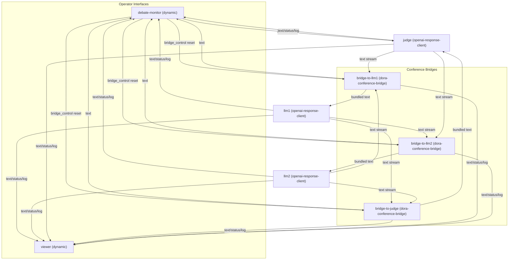
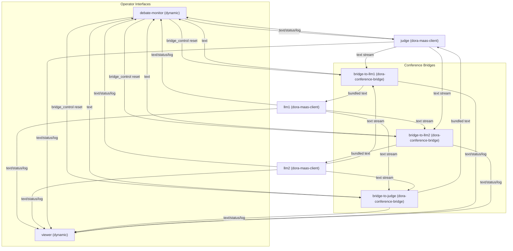

# LLM Debate Client Architecture

This directory hosts Dora dataflows that orchestrate structured debates between two large language model (LLM) agents and a moderating judge. A trio of conference bridge nodes enforce turn-taking, while dynamic Python frontends provide operator control and observability. Two variations are provided: one backed by the OpenAI-compatible `openai-response-client`, and another that delegates reasoning to Alibaba Cloud MaaS through `dora-maas-client`. This document outlines every component, how signals move across the graph, and the primary responsibilities of `dataflow-debate.yml` and `dataflow-maas-debate.yml`.

---

## 1. Node Layering

Each dataflow reuses the same topology; only the LLM binaries differ. Dynamic nodes (`debate-monitor`, `viewer`) must be launched manually in additional terminals.

| Layer | Node ID | Implementation | Key Inputs | Outputs | Notes |
|-------|---------|----------------|------------|---------|-------|
| Reasoning | `llm1` | OpenAI: `../../target/release/openai-response-client`<br>MaaS: `../../target/release/dora-maas-client` | `text` (from `bridge-to-llm1`) | `text`, `status`, `log` | Debater A. Streams markdown-formatted responses with metadata including `session_status`, `segment_index`, and `question_id`. Configured via `debate_config_llm1.toml` or `debate_config_maas_llm1.toml`. |
| Reasoning | `llm2` | OpenAI: `../../target/release/openai-response-client`<br>MaaS: `../../target/release/dora-maas-client` | `text` (from `bridge-to-llm2`) | `text`, `status`, `log` | Debater B. Same streaming contract as `llm1`, but uses the `debate_config_llm2*.toml` profiles. |
| Reasoning | `judge` | OpenAI: `../../target/release/openai-response-client`<br>MaaS: `../../target/release/dora-maas-client` | `text` (bundled by `bridge-to-judge`), `control` (from `debate-monitor`) | `text`, `status`, `log` | Moderator. Emits opening statements, round transitions, and final verdicts. Accepts JSON control commands (e.g., `{"prompt": "topic"}`). |
| Turn Management | `bridge-to-judge` | `../../target/release/dora-conference-bridge` | `llm1` text, `llm2` text, `bridge_control` | `text`, `status`, `log` | Waits for both debaters to finish (`COLD_START=false`, `STREAMING_PORTS="llm1,llm2"`) before relaying the combined transcript to the judge. |
| Turn Management | `bridge-to-llm2` | `../../target/release/dora-conference-bridge` | `llm1` text, `judge` text, `bridge_control` | `text`, `status`, `log` | Feeds Judge + Debater A content to Debater B. Keeps `COLD_START=false` so the judge's opening prompt is forwarded immediately while continuing to increment `question_id`. |
| Turn Management | `bridge-to-llm1` | `../../target/release/dora-conference-bridge` | `llm2` text, `judge` text, `bridge_control` | `text`, `status`, `log` | Sends Judge + Debater B output to Debater A. Uses `COLD_START=true` to push the judge's very first prompt without waiting for LLM2, then toggles rounds via `INC_QUESTION_ID=false`. |
| Operator UI | `debate-monitor` | `dynamic` (see `debate_monitor.py`) | `llm{1,2}` text/status, `bridge` text, `judge` text/status | `control`, `bridge_control` | Textual TUI that displays three panels, accepts topic prompts, and can issue `{"command": "reset"}` messages to clear bridge state. |
| Observability | `viewer` | `dynamic` (see `viewer.py`) | All node logs, statuses, and text streams | - | Streams structured logs and status changes with color coding for at-a-glance debugging. |

**Environment keys**

- OpenAI flow: requires `OPENAI_API_KEY` and per-node TOML (`debate_config_llm*.toml`, `debate_config_judge.toml`).
- MaaS flow: requires `ALIBABA_CLOUD_API_KEY` and MaaS configs (`debate_config_maas_*.toml`).

---

## 2. Dataflow Topologies

The debate mechanics follow a repeatable cycle: the monitor triggers the judge, bridges synchronize responses, and each agent listens on a dedicated text channel while emitting logs and status updates to UI nodes.



### 2.1 `dataflow-debate.yml` (OpenAI LLMs)

- All three reasoning nodes run `openai-response-client`, using the OpenAI-compatible configuration profiles in this directory.
- Streaming segments are merged by the bridges, which respect `STREAMING_PORTS` so partial chunks reach downstream consumers immediately.
- The monitor's prompt input drives the debate topic; `/reset` (or `reset`) issues a fresh `bridge_control` command that clears residual conversation state.

### 2.2 `dataflow-maas-debate.yml` (Alibaba Cloud MaaS)

- The topology is identical, but each reasoning node swaps in `dora-maas-client`, relying on Playwright-backed browser automation to call Alibaba Cloud Qwen Max.
- MaaS TOML profiles apply Mandarin speaker names (Daniu, Yifei) and judge instructions tailored to Chinese debates.
- Because MaaS responses can pause between segments, the monitor enforces a 2 s timeout: if no chunk arrives, it finalizes the visible message and displays the last buffered content.



---

## 3. Interfaces & Signals

The tables below summarise channel contracts shared by both dataflows.

### 3.1 Node inputs and outputs

| Node | Inputs | Outputs |
|------|--------|---------|
| `llm1` | `bridge-to-llm1/text` | `llm1/text`, `llm1/status`, `llm1/log` |
| `llm2` | `bridge-to-llm2/text` | `llm2/text`, `llm2/status`, `llm2/log` |
| `judge` | `bridge-to-judge/text`, `debate-monitor/control` | `judge/text`, `judge/status`, `judge/log` |
| `bridge-to-judge` | `llm1/text`, `llm2/text`, `debate-monitor/bridge_control` | `bridge-to-judge/text`, `bridge-to-judge/status`, `bridge-to-judge/log` |
| `bridge-to-llm2` | `llm1/text`, `judge/text`, `debate-monitor/bridge_control` | `bridge-to-llm2/text`, `bridge-to-llm2/status`, `bridge-to-llm2/log` |
| `bridge-to-llm1` | `llm2/text`, `judge/text`, `debate-monitor/bridge_control` | `bridge-to-llm1/text`, `bridge-to-llm1/status`, `bridge-to-llm1/log` |
| `debate-monitor` | `llm{1,2}` text/status, `bridge-to-{llm1,llm2,judge}` text, `judge` text/status | `debate-monitor/control`, `debate-monitor/bridge_control` |
| `viewer` | `llm{1,2}` log/text/status, `judge` log/text/status, `bridge-*` log/text/status | - |

### 3.2 Payload conventions

- **`text`** channels carry Arrow arrays of streaming markdown segments. Metadata includes:
  - `session_status`: `"started"`, `"ongoing"`, or `"ended"` to signal lifecycle.
  - `segment_index`: zero-based chunk counter for each round.
  - `question_id`: debate round identifier aligning all participants.
- **`status`** channels broadcast coarse execution states (e.g., `idle`, `receiving`, `processing`, `complete`) that the monitor converts into panel badges.
- **`control`** channel (monitor -> judge) contains JSON strings such as `{"prompt": "Today's debate topic is ..."}` to seed or override the current topic.
- **`bridge_control`** channel (monitor -> bridges) sends commands like `{"command": "reset"}` to clear any buffered inputs and restore cold-start behaviour.
- **`log`** channels emit structured dictionaries with `level`, `message`, and timestamps; the viewer aggregates them with colour-coded severity.

---

## 4. Major Functions

### 4.1 `dataflow-debate.yml`

1. **Topic priming** - The operator enters a topic in the monitor UI, which sends a `control` payload to the judge. The judge emits opening remarks immediately because `bridge-to-llm1` starts in cold-start mode.
2. **Turn bundling** - `bridge-to-judge` waits until both debaters complete `session_status="ended"`, then forwards their combined transcript so the judge can respond to both arguments simultaneously.
3. **Round advancement** - `bridge-to-llm1` and `bridge-to-llm2` increment `question_id` after each exchange, enforcing alternating turns and ensuring LLM context windows include the latest judge instruction plus the opposing argument.
4. **Live supervision** - `debate-monitor` streams partial chunks to its three panels, changes status chips based on `status` updates, and issues idle completions if a node stalls for more than two seconds.
5. **Observability** - `viewer` collates `log`, `status`, and `text` outputs for every node, enabling operators to audit latency, errors, and token-level progress without attaching debuggers.

### 4.2 `dataflow-maas-debate.yml`

1. **Cloud LLM orchestration** - `dora-maas-client` launches Playwright automation per node, authenticates using `ALIBABA_CLOUD_API_KEY`, and streams Qwen Max responses back over the same `text/status/log` channels.
2. **Localized personas** - MaaS TOML profiles set Mandarin system prompts (for example, Daniu as the pro position and Yifei as the con position) and scoring criteria so the judge can return culturally aligned feedback and final scores.
3. **Network-aware pacing** - Because MaaS responses may pause mid-stream, bridges rely on `streaming_metadata` to detect completion, while the monitor's timeout logic prevents the UI from freezing when Playwright waits on the remote browser.
4. **Bridge resets** - Operators can recover from stalled Playwright sessions by hitting the reset button in the monitor, which broadcasts `{"command": "reset"}` to all bridges and clears internal state without restarting Dora.
5. **Shared visualization** - Logs from the MaaS client (including HTTP retries and browser lifecycle events) appear in the viewer, giving immediate insight into remote-side delays or authentication issues.

---

## 5. Dataflow Definitions

Authoritative copies of the YAML graphs are included below for quick reference.

### 5.1 `dataflow-debate.yml`

```yaml
nodes:
  # LLM 1 - Debater A
  - id: llm1
    path: ../../target/release/openai-response-client
    inputs:
      text: bridge-to-llm1/text
    outputs:
      - text
      - status
      - log
    env:
      OPENAI_RESPONSE_CONFIG_PATH: debate_config_llm1.toml
      OPENAI_API_KEY: ${OPENAI_API_KEY:-}
      LOG_LEVEL: INFO

  # LLM 2 - Debater B
  - id: llm2
    path: ../../target/release/openai-response-client
    inputs:
      text: bridge-to-llm2/text
    outputs:
      - text
      - status
      - log
    env:
      OPENAI_RESPONSE_CONFIG_PATH: debate_config_llm2.toml
      OPENAI_API_KEY: ${OPENAI_API_KEY:-}
      LOG_LEVEL: INFO

  # Judge - Moderator
  - id: judge
    path: ../../target/release/openai-response-client
    inputs:
      text: bridge-to-judge/text
      control: debate-monitor/control
    outputs:
      - text
      - status
      - log
    env:
      OPENAI_RESPONSE_CONFIG_PATH: debate_config_judge.toml
      OPENAI_API_KEY: ${OPENAI_API_KEY:-}
      LOG_LEVEL: INFO

  # Bridge 1: LLM1 + LLM2 -> Judge
  # Waits for both LLM responses then forwards bundled message
  - id: bridge-to-judge
    path: ../../target/release/dora-conference-bridge
    inputs:
      llm1: llm1/text
      llm2: llm2/text
      control: debate-monitor/bridge_control
    outputs:
      - text
      - status
      - log
    env:
      STREAMING_PORTS: "llm1,llm2" # Both LLMs send streaming responses
      COLD_START: "false" # Wait for both inputs
      INC_QUESTION_ID: "true" # Don't increment question_id
      LOG_LEVEL: INFO
      DORA_NODE_NAME: Bridge LLM1+LLM2->Judge

  # Bridge 2: LLM1 + Judge -> LLM2
  # Uses cold start to forward judge's initial prompt immediately
  - id: bridge-to-llm2
    path: ../../target/release/dora-conference-bridge
    inputs:
      llm1: llm1/text
      judge: judge/text
      control: debate-monitor/bridge_control
    outputs:
      - text
      - status
      - log
    env:
      STREAMING_PORTS: "llm1,judge" # LLM1 and judge send streaming responses
      COLD_START: "false" # Forward judge's initial prompt immediately
      INC_QUESTION_ID: "false" # Increment question_id for next round
      LOG_LEVEL: INFO
      DORA_NODE_NAME: Bridge LLM1+Judge->LLM2

  # Bridge 3: LLM2 + Judge -> LLM1
  # Uses cold start to forward judge's initial prompt immediately
  - id: bridge-to-llm1
    path: ../../target/release/dora-conference-bridge
    inputs:
      llm2: llm2/text
      judge: judge/text
      control: debate-monitor/bridge_control
    outputs:
      - text
      - status
      - log
    env:
      STREAMING_PORTS: "llm2,judge" # LLM2 and judge send streaming responses
      COLD_START: "true" # Forward judge's initial prompt immediately
      INC_QUESTION_ID: "false" # Increment question_id for next round
      LOG_LEVEL: INFO
      DORA_NODE_NAME: Bridge LLM2+Judge->LLM1

  # Debate Monitor - Real-time 3-panel TUI
  - id: debate-monitor
    path: dynamic
    inputs:
      llm1_text: llm1/text
      llm1_status: llm1/status
      llm1_prompt: bridge-to-llm1/text
      llm2_text: llm2/text
      llm2_status: llm2/status
      llm2_prompt: bridge-to-llm2/text
      bundle_text: bridge-to-judge/text
      judge_text: judge/text
      judge_status: judge/status
    outputs:
      - control
      - bridge_control

  # Viewer - Log and event monitoring
  - id: viewer
    path: dynamic
    inputs:
      llm1_log: llm1/log
      llm1_status: llm1/status
      llm1_text: llm1/text
      llm2_log: llm2/log
      llm2_status: llm2/status
      llm2_text: llm2/text
      judge_log: judge/log
      judge_status: judge/status
      judge_text: judge/text
      bridge1_log: bridge-to-judge/log
      bridge1_status: bridge-to-judge/status
      bridge1_text: bridge-to-judge/text
      bridge2_log: bridge-to-llm2/log
      bridge2_status: bridge-to-llm2/status
      bridge2_text: bridge-to-llm2/text
      bridge3_log: bridge-to-llm1/log
      bridge3_status: bridge-to-llm1/status
      bridge3_text: bridge-to-llm1/text
```

### 5.2 `dataflow-maas-debate.yml`

```yaml
nodes:
  # LLM 1 - Debater A (Daniu - 正方)
  # Uses Alibaba Cloud Qwen-max via dora-maas-client
  - id: llm1
    path: ../../target/release/dora-maas-client
    inputs:
      text: bridge-to-llm1/text
    outputs:
      - text
      - status
      - log
    env:
      MAAS_CONFIG_PATH: debate_config_maas_llm1.toml
      ALIBABA_CLOUD_API_KEY: ${ALIBABA_CLOUD_API_KEY:-}
      LOG_LEVEL: INFO

  # LLM 2 - Debater B (Yifei - 反方)
  # Uses Alibaba Cloud Qwen-max via dora-maas-client
  - id: llm2
    path: ../../target/release/dora-maas-client
    inputs:
      text: bridge-to-llm2/text
    outputs:
      - text
      - status
      - log
    env:
      MAAS_CONFIG_PATH: debate_config_maas_llm2.toml
      ALIBABA_CLOUD_API_KEY: ${ALIBABA_CLOUD_API_KEY:-}
      LOG_LEVEL: INFO

  # Judge - Moderator (主持人)
  # Uses Alibaba Cloud Qwen-max via dora-maas-client
  - id: judge
    path: ../../target/release/dora-maas-client
    inputs:
      text: bridge-to-judge/text
      control: debate-monitor/control
    outputs:
      - text
      - status
      - log
    env:
      MAAS_CONFIG_PATH: debate_config_maas_judge.toml
      ALIBABA_CLOUD_API_KEY: ${ALIBABA_CLOUD_API_KEY:-}
      LOG_LEVEL: INFO

  # Bridge 1: LLM1 + LLM2 -> Judge
  # Waits for both LLM responses then forwards bundled message
  - id: bridge-to-judge
    path: ../../target/release/dora-conference-bridge
    inputs:
      llm1: llm1/text
      llm2: llm2/text
      control: debate-monitor/bridge_control
    outputs:
      - text
      - status
      - log
    env:
      STREAMING_PORTS: "llm1,llm2" # Both LLMs send streaming responses
      COLD_START: "false" # Wait for both inputs
      INC_QUESTION_ID: "true" # Don't increment question_id
      LOG_LEVEL: INFO
      DORA_NODE_NAME: Bridge LLM1+LLM2->Judge

  # Bridge 2: LLM1 + Judge -> LLM2
  # Uses cold start to forward judge's initial prompt immediately
  - id: bridge-to-llm2
    path: ../../target/release/dora-conference-bridge
    inputs:
      llm1: llm1/text
      judge: judge/text
      control: debate-monitor/bridge_control
    outputs:
      - text
      - status
      - log
    env:
      STREAMING_PORTS: "llm1,judge" # LLM1 and judge send streaming responses
      COLD_START: "false" # Forward judge's initial prompt immediately
      INC_QUESTION_ID: "false" # Increment question_id for next round
      LOG_LEVEL: INFO
      DORA_NODE_NAME: Bridge LLM1+Judge->LLM2

  # Bridge 3: LLM2 + Judge -> LLM1
  # Uses cold start to forward judge's initial prompt immediately
  - id: bridge-to-llm1
    path: ../../target/release/dora-conference-bridge
    inputs:
      llm2: llm2/text
      judge: judge/text
      control: debate-monitor/bridge_control
    outputs:
      - text
      - status
      - log
    env:
      STREAMING_PORTS: "llm2,judge" # LLM2 and judge send streaming responses
      COLD_START: "true" # Forward judge's initial prompt immediately
      INC_QUESTION_ID: "false" # Increment question_id for next round
      LOG_LEVEL: INFO
      DORA_NODE_NAME: Bridge LLM2+Judge->LLM1

  # Debate Monitor - Real-time 3-panel TUI
  - id: debate-monitor
    path: dynamic
    inputs:
      llm1_text: llm1/text
      llm1_status: llm1/status
      llm1_prompt: bridge-to-llm1/text
      llm2_text: llm2/text
      llm2_status: llm2/status
      llm2_prompt: bridge-to-llm2/text
      bundle_text: bridge-to-judge/text
      judge_text: judge/text
      judge_status: judge/status
    outputs:
      - control
      - bridge_control

  # Viewer - Log and event monitoring
  - id: viewer
    path: dynamic
    inputs:
      llm1_log: llm1/log
      llm1_status: llm1/status
      llm1_text: llm1/text
      llm2_log: llm2/log
      llm2_status: llm2/status
      llm2_text: llm2/text
      judge_log: judge/log
      judge_status: judge/status
      judge_text: judge/text
      bridge1_log: bridge-to-judge/log
      bridge1_status: bridge-to-judge/status
      bridge1_text: bridge-to-judge/text
      bridge2_log: bridge-to-llm2/log
      bridge2_status: bridge-to-llm2/status
      bridge2_text: bridge-to-llm2/text
      bridge3_log: bridge-to-llm1/log
      bridge3_status: bridge-to-llm1/status
      bridge3_text: bridge-to-llm1/text
```

---

## 6. Operational Notes

- Launch sequence: start the Dora graph (`dora start dataflow-*.yml`), then run `python debate_monitor.py` and `python viewer.py` in separate terminals to activate the dynamic nodes.
- Monitor commands:
  - Enter a topic to seed the judge prompt (`{"prompt": "<topic>"}`).
  - Type `reset` or `/reset` to flush bridge buffers (`{"command": "reset"}`) if any agent stalls.
- All `text` payloads arrive as Arrow arrays; downstream consumers should call `.as_py()` on each element to retrieve the string content.
- The judge and debaters inherit the `LOG_LEVEL=INFO` default but honour `LOG_LEVEL` overrides in their environment, which is helpful when diagnosing token pacing or MaaS browser issues.
- `dataflow-debate.yml` and `dataflow-maas-debate.yml` can share the same monitor/viewer processes simultaneously, but only one Dora instance should run each graph at a time to avoid clashing dynamic node bindings.

