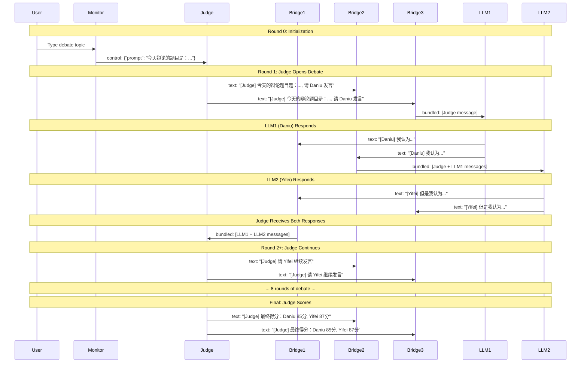

# Debate System Dataflow Architecture

This document visualizes the message flow in the debate system using both OpenAI and MaaS clients.

## Architecture Overview

The debate system consists of three LLM agents (Judge, LLM1/Daniu, LLM2/Yifei) coordinated by conference bridges and monitored by a real-time TUI.

## Dataflow Diagram

```mermaid
graph TB
    %% User Interface
    USER[👤 User Input]
    MONITOR[🖥️ Debate Monitor<br/>TUI Interface]
    VIEWER[📊 Viewer<br/>Log Monitor]

    %% LLM Nodes
    JUDGE[🎯 Judge<br/>Moderator<br/>qwen-max/gpt-4o]
    LLM1[💭 LLM1<br/>Daniu 正方<br/>qwen-max/gpt-4o]
    LLM2[💭 LLM2<br/>Yifei 反方<br/>qwen-max/gpt-4o]

    %% Bridge Nodes
    BRIDGE1[🌉 Bridge to Judge<br/>Combines LLM1+LLM2<br/>COLD_START=false]
    BRIDGE2[🌉 Bridge to LLM2<br/>Combines LLM1+Judge<br/>COLD_START=false]
    BRIDGE3[🌉 Bridge to LLM1<br/>Combines LLM2+Judge<br/>COLD_START=true]

    %% User to Monitor
    USER -->|Type debate topic| MONITOR

    %% Monitor Control Flow
    MONITOR -->|control<br/>JSON: {prompt: topic}| JUDGE
    MONITOR -->|bridge_control<br/>reset signal| BRIDGE1
    MONITOR -->|bridge_control<br/>reset signal| BRIDGE2
    MONITOR -->|bridge_control<br/>reset signal| BRIDGE3

    %% LLM to Bridge Flow
    LLM1 -->|text output<br/>streaming segments| BRIDGE1
    LLM1 -->|text output<br/>streaming segments| BRIDGE2
    LLM2 -->|text output<br/>streaming segments| BRIDGE1
    LLM2 -->|text output<br/>streaming segments| BRIDGE3
    JUDGE -->|text output<br/>streaming segments| BRIDGE2
    JUDGE -->|text output<br/>streaming segments| BRIDGE3

    %% Bridge to LLM Flow
    BRIDGE1 -->|bundled text<br/>LLM1+LLM2 responses| JUDGE
    BRIDGE2 -->|bundled text<br/>LLM1+Judge messages| LLM2
    BRIDGE3 -->|bundled text<br/>LLM2+Judge messages| LLM1

    %% Monitor Feedback
    LLM1 -->|text, status| MONITOR
    LLM2 -->|text, status| MONITOR
    JUDGE -->|text, status| MONITOR
    BRIDGE1 -->|text| MONITOR
    BRIDGE2 -->|text| MONITOR
    BRIDGE3 -->|text| MONITOR

    %% Viewer Monitoring
    LLM1 -->|log, text, status| VIEWER
    LLM2 -->|log, text, status| VIEWER
    JUDGE -->|log, text, status| VIEWER
    BRIDGE1 -->|log, text, status| VIEWER
    BRIDGE2 -->|log, text, status| VIEWER
    BRIDGE3 -->|log, text, status| VIEWER

    %% Styling
    classDef llmNode fill:#e1f5ff,stroke:#0288d1,stroke-width:3px
    classDef bridgeNode fill:#fff9c4,stroke:#f57f17,stroke-width:2px
    classDef uiNode fill:#f3e5f5,stroke:#7b1fa2,stroke-width:2px

    class JUDGE,LLM1,LLM2 llmNode
    class BRIDGE1,BRIDGE2,BRIDGE3 bridgeNode
    class MONITOR,VIEWER,USER uiNode
```

## Message Flow Sequence



## Node Configuration Details

### LLM Nodes (Judge, LLM1, LLM2)

**Inputs:**
- `text`: Bundled messages from conference bridge
- `control`: JSON control input (Judge only)

**Outputs:**
- `text`: Streaming response segments with metadata
- `status`: Processing status (processing, started, ongoing, complete)
- `log`: Debug and info logs

**Metadata in text output:**
- `session_status`: "started", "ongoing", "ended"
- `segment_index`: Sequential segment number
- `question_id`: Conversation round identifier

### Bridge Nodes

**Bridge-to-Judge** (Combines LLM1 + LLM2 → Judge):
- `COLD_START="false"`: Waits for both LLM inputs
- `INC_QUESTION_ID="true"`: Doesn't increment question_id
- `STREAMING_PORTS="llm1,llm2"`: Both inputs are streaming

**Bridge-to-LLM2** (Combines LLM1 + Judge → LLM2):
- `COLD_START="false"`: Waits for both inputs
- `INC_QUESTION_ID="false"`: Increments question_id for next round
- `STREAMING_PORTS="llm1,judge"`: Both inputs are streaming

**Bridge-to-LLM1** (Combines LLM2 + Judge → LLM1):
- `COLD_START="true"`: Forwards Judge's initial prompt immediately
- `INC_QUESTION_ID="false"`: Increments question_id for next round
- `STREAMING_PORTS="llm2,judge"`: Both inputs are streaming

### Debate Monitor (TUI)

**Inputs:**
- `llm1_text`, `llm1_status`, `llm1_prompt`: LLM1 activity
- `llm2_text`, `llm2_status`, `llm2_prompt`: LLM2 activity
- `judge_text`, `judge_status`: Judge activity
- `bundle_text`: Bridge-to-judge bundled messages

**Outputs:**
- `control`: JSON control commands to Judge
- `bridge_control`: Reset signals to bridges

**UI Layout:**
```
┌─────────────────────────────────────────────────────────┐
│                     Debate Monitor                       │
├──────────────┬───────────────┬─────────────────────────┤
│   LLM1       │     Judge     │         LLM2            │
│   Daniu      │   Moderator   │        Yifei            │
│   (正方)      │   (主持人)     │        (反方)            │
│              │               │                         │
│ [streaming   │ [streaming    │ [streaming              │
│  response]   │  response]    │  response]              │
│              │               │                         │
└──────────────┴───────────────┴─────────────────────────┘
│ Input: [Type debate topic...]        [Reset Bridges]   │
└─────────────────────────────────────────────────────────┘
```

## Completion Detection

Conference bridges detect message completion using metadata:
1. **session_status == "ended"**: Sent by LLM after streaming completes
2. **is_complete == true**: Alternative completion signal

When both LLM inputs to a bridge have completed:
1. Bridge bundles the messages
2. Bridge forwards to target LLM
3. Target LLM processes and responds
4. Cycle continues

## OpenAI vs MaaS Comparison

| Aspect | OpenAI Version | MaaS Version |
|--------|----------------|--------------|
| **Binary** | `openai-response-client` | `dora-maas-client` |
| **Dataflow** | `dataflow-debate.yml` | `dataflow-maas-debate.yml` |
| **Model** | gpt-4o | qwen-max |
| **Provider** | OpenAI | Alibaba Cloud |
| **API Key** | `OPENAI_API_KEY` | `ALIBABA_CLOUD_API_KEY` |
| **Wiring** | ✅ Identical | ✅ Identical |
| **Bridges** | ✅ Identical | ✅ Identical |
| **Control Flow** | ✅ Identical | ✅ Identical |

Both versions use **exactly the same** bridge configuration and message flow logic.

## Running the System

### OpenAI Version
```bash
cd examples/llm-client
export OPENAI_API_KEY="your-key"
dora start dataflow-debate.yml --attach --name debate-monitor
```

### MaaS Version
```bash
cd examples/llm-client
export ALIBABA_CLOUD_API_KEY="your-key"
dora start dataflow-maas-debate.yml --attach --name debate-monitor
```

Then type your debate topic in the input bar and press Enter.

## Debugging

To view detailed logs with the viewer:
```bash
# Terminal 1: Start with viewer
dora start dataflow-debate.yml --attach --name viewer

# Terminal 2: Monitor logs
dora logs <node-name>
```

Key log messages to watch for:
- `[INFO] Received control input: {"prompt": "..."}` - Control received
- `[INFO] Sending prompt from control to API: ...` - API call initiated
- `[DEBUG] Stream created successfully, starting event loop` - Streaming started
- `[INFO] Streaming complete: X chars across Y segments` - Response complete
