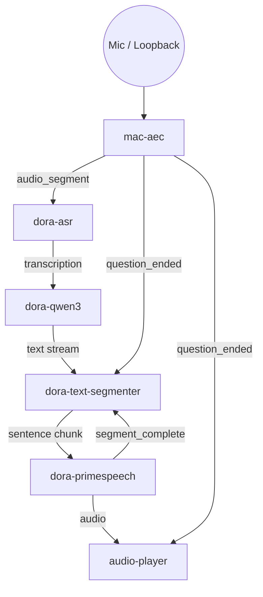
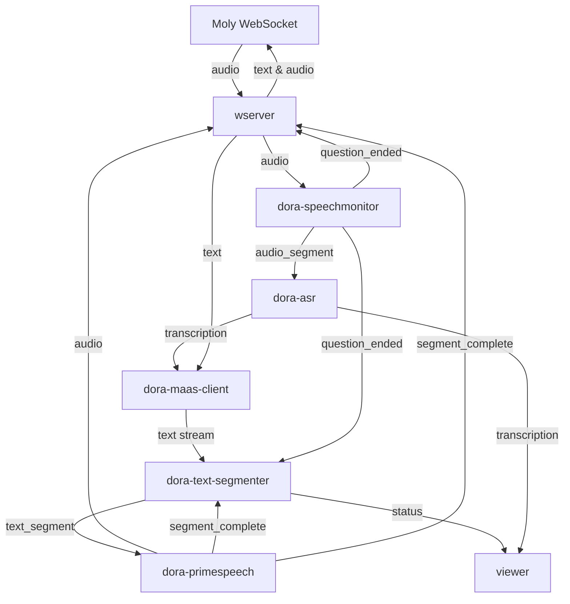
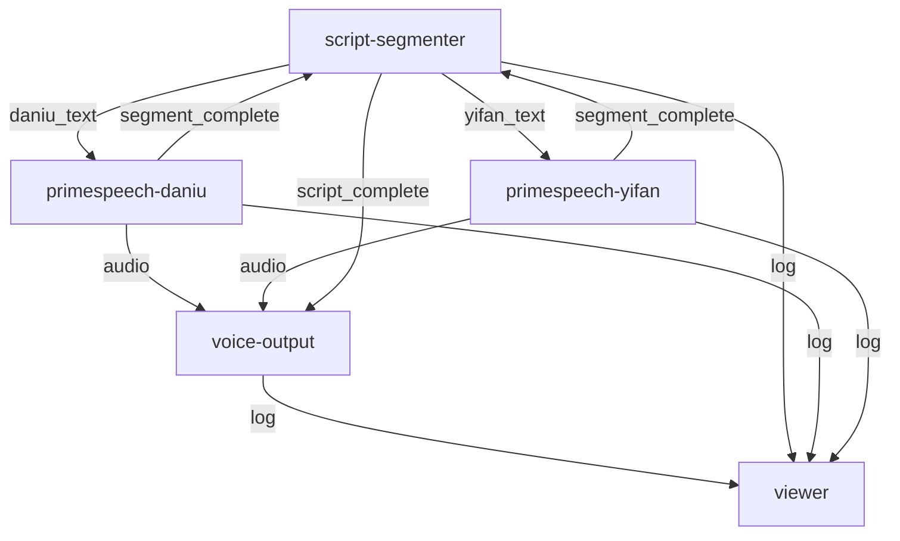

# Building Voice Agent App with DORA

Voice agents pair low-latency speech interfaces with continuous reasoning so people can converse as naturally as they would with another person. They combine real-time audio capture, streaming language models, and responsive synthesis to deliver multi-turn dialogue without noticeable pauses. The DORA examples focus on full-duplex operation—speaking and listening simultaneously—while remaining composable enough to mix local and cloud capabilities.

## **Key characteristics of production-grade voice agents**

- Real-time turn taking with end-to-end latency under a few hundred milliseconds.
- Interruptibility so user speech can pre-empt ongoing responses.
- Tool usage via LLM orchestration (e.g., retrieval, task runners, MCP tools).
- Personalized voice outputs and emotional prosody that match brand identity.
- Flexible deployment across on-device stacks (OminiX) and remote APIs.
- Observability hooks for safety, analytics, and continuous improvement.

## **Typical voice agent scenarios**

| Use case                   | Latency target                           | Interruptible?                          | Tool usage                                 | Personalization                           | Deployment                                       | Notes                                        |
| -------------------------- | ---------------------------------------- | --------------------------------------- | ------------------------------------------ | ----------------------------------------- | ------------------------------------------------ | -------------------------------------------- |
| Customer support kiosk     | < 300 ms for backchanneling              | Required to capture follow-up issues    | CRM + ticketing connectors                 | Brand voice with empathetic tone          | Hybrid: edge for ASR/TTS, cloud LLM              | Needs analytics and compliance logging       |
| In-vehicle assistant       | < 250 ms, consistent even offline        | Yes, must pause music/navigation        | Navigation, telephony, smart-home controls | Speaker adaptation and wake-word profiles | Primarily local for reliability                  | Must degrade gracefully with limited network |
| Personal assistant         | < 200 ms for wake-word handoff           | Crucial to override reminders or timers | Calendar, email, task managers             | User-specific voice and memory            | Hybrid with on-device cache plus cloud skills    | Privacy controls and continuous learning     |
| Retail concierge           | 300–400 ms acceptable with rich speech   | Important to switch between visitors    | Inventory, product catalog search          | Rotating personas, multilingual           | Cloud-heavy with localized caching               | Requires integration with PoS systems        |
| Wellness coach             | 400 ms tolerable for reflective dialogue | Useful but not critical                 | Workout planners, calendar                 | Highly personalized tone and pacing       | Cloud LLM with private data vault                | Needs emotional prosody and journaling       |
| Creative studio (podcasts) | Latency less critical; batch rendering   | Not applicable                          | Script generators, audio mastering tools   | Multiple cloned voices and styles         | Mix of local models for privacy, cloud for scale | Emphasizes quality, scene transitions        |

## **Implementation matrix for core requirements**

| Requirement                | Implementation considerations                                      | DORA support                                                                       |
| -------------------------- | ------------------------------------------------------------------ | ---------------------------------------------------------------------------------- |
| Low latency & full duplex  | Run ASR/TTS locally, stream LLM responses, minimize queue backlogs | `mac_aec_simple_segmentation`, `dora-asr`, `dora-qwen3` streaming, timeline QoS    |
| Interruptibility           | VAD-driven resets, queue truncation, playback cancellation         | `mac-aec` signals, `dora-speechmonitor`, queue utilities (`node-hub/utils/queue`)  |
| Tool usage & orchestration | LLM tool calling, MCP bridges, cloud API fallbacks                 | `dora-maas-client`, `mcp-host`, `mcp-server`, MaaS config layering                 |
| Personalization & emotion  | Swappable TTS personas, voice cloning, prompt conditioning         | `dora-primespeech`, `dora-kokoro-tts`, segmenter metadata, system prompts          |
| Deployment flexibility     | Compose local and cloud graphs, swap nodes without rewiring        | Dynamic nodes, multi-graph chaining (`dora build`, bridges, `dora start --detach`) |
| Observability & safety     | Structured logs, live viewers, replay traces for QA                | Dynamic `viewer`, node log outputs, `dora start --replay`, metrics nodes           |

## Why Python Agent Frameworks Fall Short for Realtime Voice

Agentic stacks such as LangChain/LangGraph, ag2 (AutoGen), and crewAI are brilliant at **task orchestration**—they take a full input, plan multi-step tool use, and synthesize a final answer. Realtime voice agents, however, are **stream-processing systems** with radically different constraints: continuous audio ingress, <200 ms response budgets, uninterrupted turn-taking, and the need to generate replies before the speaker finishes. When you map these frameworks onto a streaming workload, the friction becomes obvious:

- **LangChain / LangGraph:** The classic “chain” is sequential: input ➝ process ➝ output. Yet a voice loop must capture audio, run ASR, call an LLM, and stream TTS simultaneously. Developers end up orchestrating custom `asyncio` loops, background threads, and queues around LangChain, fighting the abstraction instead of benefiting from it. LangGraph’s state machines help with complex planning but still assume discrete node executions triggered by state changes, not millisecond-scale streaming.
- **ag2 (AutoGen):** Built for multi-agent collaboration, it inserts messaging overhead and expects agents to take turns speaking in complete paragraphs. Achieving incremental transcripts, interruptible playback, or partial responses requires bespoke cancellation tokens, thread-safe buffers, and queue bridges that the framework does not supply natively.
- **crewAI:** Embraces project-management metaphors—define a crew, assign tasks, choose a process (sequential, hierarchical). That model shines for document workflows, yet collapses when faced with a hot audio stream: developers still need to build separate audio IO, manage cross-thread signalling, and maintain backpressure, duplicating the very plumbing they hoped to avoid.
- **NotebookLLM (LlamaIndex):** The NotebookLLM demo is the perfect counterexample: it ingests notebooks/PDFs, orchestrates LLM steps, and outputs a podcast MP3. Latency is irrelevant, and inputs are static—exactly the sweet spot for agent frameworks. But transplanting that pipeline into realtime voice would require discarding synchronous callbacks, rewriting the execution model for streaming, and managing audio buffers manually.

### **NotebookLLM Workflow**

```mermaid
flowchart TD
    %% Main Flow
    Start([User Opens NotebookLLaMA]) --> Init[Initialize Application]

    %% Setup Phase
    Init --> EnvSetup[Load Environment Variables\n- OPENAI_API_KEY\n- ELEVENLABS_API_KEY\n- LLAMACLOUD_API_KEY]
    EnvSetup --> CreateAgent[Create LlamaExtract Agent\ncreate_llama_extract_agent.py]
    CreateAgent --> CreatePipeline[Create LlamaCloud Index Pipeline\ncreate_llama_cloud_index.py]
    CreatePipeline --> DockerServices[Launch Backend Services\n- PostgreSQL\n- Jaeger Tracing]
    DockerServices --> StartMCP[Start MCP Server\nserver.py]
    StartMCP --> StartStreamlit[Launch Streamlit UI\nHome.py on port 8501]

    %% Document Processing Flow
    StartStreamlit --> UserUpload{User Uploads\nPDF Document}
    UserUpload --> PDFProcess[PDF Processing\nvia LlamaCloud]

    %% Core Processing Pipeline
    PDFProcess --> Extract[Document Extraction\nLlamaExtract Agent]
    Extract --> Parse[Document Parsing\nLlamaParse API]
    Parse --> Index[Document Indexing\nVector Embeddings\ntext-embedding-3-small]

    %% Content Generation Branches
    Index --> GenBranch{Generate Content}

    GenBranch --> Summary[Generate Summary\nUsing LLM]
    GenBranch --> QA[Generate Q&A Pairs\nUsing LLM]
    GenBranch --> MindMap[Generate Mind Map\nVisual Representation]
    GenBranch --> Podcast[Generate Podcast]

    %% Podcast Generation Sub-flow
    Podcast --> PodStep1[Step 1: Text Preprocessing\nLlama-3.2-1B-Instruct\nClean & Format PDF Text]
    PodStep1 --> PodStep2[Step 2: Transcript Generation\nLlama-3.1-70B-Instruct\nCreate Podcast Script]
    PodStep2 --> PodStep3[Step 3: Dramatization\nLlama-3.1-8B-Instruct\nAdd Conversational Style]
    PodStep3 --> PodStep4[Step 4: Text-to-Speech\nElevenLabs API or\nParler-TTS/Bark Models]

    %% Output Consolidation
    Summary --> OutputGen[Generate Notebook Output]
    QA --> OutputGen
    MindMap --> OutputGen
    PodStep4 --> OutputGen

    OutputGen --> Display[Display in Streamlit UI\n- Interactive Notebook\n- Audio Player\n- Mind Map Viewer\n- Q&A Interface]

    %% Data Storage
    Display --> Store[Store Results\nPostgreSQL Database]
    Store --> End([User Downloads Results])

    %% MCP Server Integration
    StartMCP -.-> MCPTools[MCP Tools\n- Document Chat\n- Citation Finding\n- Content Search]
    MCPTools -.-> Display

    %% Regional Configuration
    EnvSetup --> Region{Regional Config}
    Region -->|North America| NARegion[Default LlamaCloud NA]
    Region -->|Europe| EURegion[LlamaCloud EU Region]
    NARegion --> CreateAgent
    EURegion --> CreateAgent

    %% Styling
    classDef setupClass fill:#e1f5fe,stroke:#01579b,stroke-width:2px
    classDef processClass fill:#f3e5f5,stroke:#4a148c,stroke-width:2px
    classDef genClass fill:#e8f5e9,stroke:#1b5e20,stroke-width:2px
    classDef podcastClass fill:#fff3e0,stroke:#e65100,stroke-width:2px
    classDef outputClass fill:#fce4ec,stroke:#880e4f,stroke-width:2px
    classDef storageClass fill:#e0f2f1,stroke:#004d40,stroke-width:2px

    class Init,EnvSetup,CreateAgent,CreatePipeline,DockerServices,StartMCP,StartStreamlit setupClass
    class PDFProcess,Extract,Parse,Index processClass
    class Summary,QA,MindMap,Podcast genClass
    class PodStep1,PodStep2,PodStep3,PodStep4 podcastClass
    class OutputGen,Display outputClass
    class Store storageClass
```



The pattern holds: these frameworks default to request-response or batch paradigms. Forcing them into a streaming domain dumps developers back into “complicated Python async code, multi-threading, and queue management,” because the underlying architecture was never designed for low-latency media loops.

### Python Concurrency Pain Points for Voice Pipelines

Even without heavyweight frameworks, orchestrating realtime audio in Python is notoriously tricky:

- **GIL constraints:** The Global Interpreter Lock prevents true parallel execution of Python bytecode. CPU-heavy DSP or codec work must move to native extensions or separate processes, adding IPC overhead.
- **`asyncio` pitfalls:** Mastering cancellation, exception propagation, and cooperative scheduling is hard. A single blocking call during ASR or TTS stalls the entire event loop, breaking the sub-200 ms latency budget.
- **Thread/process juggling:** Developers often blend threads (for blocking I/O) with `asyncio` (for WebSockets) and multiprocessing (for CPU-bound tasks). Keeping queues, locks, and state consistent across these boundaries accelerates complexity.
- **Backpressure handling:** Python lacks built-in, low-latency queue primitives tuned for audio. Without custom logic, buffer overflows or starvation appear when network jitter or user interruptions occur.
- **Testing & debugging:** Deterministic reproduction of race conditions or timing bugs is difficult; tools like `pytest` offer limited help for multi-loop, multi-threaded audio pipelines.

These realities explain why many teams prototype in Python but eventually migrate critical paths to Rust, Go, or C++—exactly the languages DORA embraces for production-grade nodes.

## **DORA features that simplify realtime voice development**

- **Dataflow-centric audio control:** Nodes publish and subscribe to named streams with zero-copy transport, so teams can tune buffering, backpressure, and segmentation precisely without manual socket plumbing.
- **Event-driven runtime:** Asynchronous, multi-threaded execution is abstracted behind the scheduler; developers work in straightforward Rust/Python code without mastering `asyncio`, locks, or queue plumbing.
- **Composable nodes for vibe coding:** Reusable building blocks (AEC, ASR, LLM, TTS, MCP tools) encourage fast iteration—each example dataflow was prototyped by mixing nodes in “vibe coding” fashion.
- **Stateless architecture:** Nodes exchange messages rather than shared state, making deployments cloud-native by default and letting teams swap local/cloud implementations without session stickiness.
- **Mixed-language performance:** Rust and Python nodes interoperate with minimal overhead. Critical paths (e.g., WebSocket servers, MaaS clients) leverage Rust for safety and throughput, while Python remains ideal for rapid prototyping before swapping in Rust equivalents.
- **Edge inference integrations:** Tight adapters for llama.cpp, MLX, OpenVINO, FunASR, PrimeSpeech, Kokoro, and other accelerators keep local inference fast and manageable on laptops, Apple Silicon, Intel GPUs, or embedded targets—all controllable from the same dataflow.
- **Moly front-end integration:** DORA pipelines plug directly into Moly, a Rust-based cross-platform client (Windows, macOS, Linux, Android, iOS, OpenHarmony) that supports local and cloud LLMs plus realtime WebSocket voice chat.
- **Flexible deployment footprint:** With Moly handling the UI, DORA voice agents run consistently on macOS, Windows WSL, cloud instances, or edge servers—choose the compute placement that best balances latency, privacy, and cost.

This tutorial targets building a full-duplex voice agent: the user speaks while the assistant listens, reasons, and replies without waiting for turn-based handoffs. The `mac-aec-chat` dataflows demonstrate how DORA composes reusable nodes to reach parity with OpenAI’s Realtime Voice API patterns while retaining local control.

## Reference Architectures Inspired by OpenAI Realtime Voice API

- **End-to-End (E2E) Pipeline:** Mirrors OpenAI’s low-latency path—audio capture, transcription, LLM, and TTS run inside a single graph. Latency is minimal because tokens stream directly from the LLM to the voice renderer. Trade-off: components are tightly coupled, so swapping ASR or TTS models requires rebuilding the dataflow and often restarting the whole stack.
  
  

- **Chained Pipeline:** Similar to OpenAI’s modular blueprint—capture/ASR, reasoning, and synthesis stages exchange messages across queues or bridges. Latency increases slightly because segments wait for acknowledgements, but every stage is replaceable (local vs. cloud LLMs, multiple personas, specialized TTS). This “lego-like” composition is DORA’s biggest strength: you can mix macOS AEC, FunASR, qwen3, PrimeSpeech, and Kokoro in different combinations without rewriting the orchestration code.
  
  

## Full-Duplex Chatbot with Interruption

The sections below use the `voice-chat-with-aec.yml` E2E flow as a concrete baseline and highlight where to introduce chaining when you need more flexibility.

### Dataflow Flowchart (mac-aec-chat)



```yaml
nodes:
  # MAC-AEC with VAD-based segmentation
  - id: mac-aec
    path: dynamic
    outputs:
      - audio
      - is_speaking
      - speech_started
      - speech_ended
      - audio_segment
      - question_ended
      - log

  # ASR transcription
  - id: asr
    build: pip install -e ../../node-hub/dora-asr
    path: dora-asr
    inputs:
      audio:
        source: mac-aec/audio_segment
        queue_size: 10
    outputs:
      - transcription
      - language_detected
      - processing_time
      - confidence
      - log
    env:
      ASR_ENGINE: funasr
      LANGUAGE: zh
      WHISPER_MODEL: large
      ENABLE_PUNCTUATION: true
      ENABLE_LANGUAGE_DETECTION: true
      ENABLE_CONFIDENCE_SCORE: false
      ASR_MODELS_DIR: $HOME/.dora/models/asr # Relative path (recommended)
      LOG_LEVEL: INFO

  # Direct connection: ASR -> LLM (with streaming for fast response)
  - id: qwen3-llm
    build: pip install -e ../../node-hub/dora-qwen3
    path: dora-qwen3
    inputs:
      text: asr/transcription  # Direct from ASR
    outputs:
      - text
      - status
      - log
    env:
      USE_MLX: auto
      MLX_MODEL: "Qwen/Qwen3-8B-MLX-4bit"
      MLX_MAX_TOKENS: 256
      MAX_TOKENS: 256
      TEMPERATURE: 0.7
      ENABLE_THINKING: false
      LLM_ENABLE_STREAMING: "true"
      HISTORY_STRATEGY: "token_based"
      MAX_HISTORY_EXCHANGES: "10"
      MAX_HISTORY_TOKENS: "3000"
      SYSTEM_PROMPT: "你是AI助手。请以自然流畅的中文口语化表达直接回答问题..."
      LOG_LEVEL: INFO

  # Text Segmenter - buffers LLM output and sends to TTS one segment at a time
  - id: text-segmenter
    build: pip install -e ../../node-hub/dora-text-segmenter
    path: dora-text-segmenter
    inputs:
      text: qwen3-llm/text  # From LLM
      tts_complete: primespeech/segment_complete  # TTS completion signal
      reset: mac-aec/question_ended  # Clear queue when new question detected
    outputs:
      - text_segment
      - status
      - metrics
      - log
    env:
      ENABLE_BACKPRESSURE: "false"  # Don't wait initially - send first segment immediately
      SEGMENT_MODE: "sentence"
      MIN_SEGMENT_LENGTH: "5"
      MAX_SEGMENT_LENGTH: "20"
      PUNCTUATION_MARKS: "。！？.!?，,"
      LOG_LEVEL: "DEBUG"

  # PrimeSpeech TTS
  - id: primespeech
    build: pip install -e ../../node-hub/dora-primespeech
    path: dora-primespeech
    inputs:
      text: text-segmenter/text_segment  # From text segmenter (not directly from LLM)
    outputs:
      - audio
      - segment_complete
      - log
    env:
      TRANSFORMERS_OFFLINE: "1"
      HF_HUB_OFFLINE: "1"
      VOICE_NAME: Doubao
      PRIMESPEECH_MODEL_DIR: $HOME/.dora/models/primespeech
      TEXT_LANG: zh
      PROMPT_LANG: zh
      TOP_K: 5
      TOP_P: 1.0
      TEMPERATURE: 1.0
      SPEED_FACTOR: 1.0
      USE_GPU: false
      NUM_THREADS: 4
      RETURN_FRAGMENT: "false"
      LOG_LEVEL: "INFO"
      ENABLE_INTERNAL_SEGMENTATION: "true"
      TTS_MAX_SEGMENT_LENGTH: "100"
      TTS_MIN_SEGMENT_LENGTH: "20"

  # Audio player
  - id: audio-player
    path: dynamic
    inputs:
      audio: primespeech/audio
      control: mac-aec/question_ended
    outputs:
      - buffer_status
      - status

  # Simple viewer to see the flow
  - id: viewer
    path: dynamic
    inputs:
      transcription: asr/transcription
      llm_output: qwen3-llm/text
      segment: text-segmenter/text_segment
      audio: primespeech/audio
      segment_complete: primespeech/segment_complete
      speech_started: mac-aec/speech_started
      speech_ended: mac-aec/speech_ended
      mac_aec_log: mac-aec/log
      asr_log: asr/log
      qwen3_log: qwen3-llm/log
      segmenter_log: text-segmenter/log
      primespeech_log: primespeech/log
```

### Signal Path: Input → Output

1. **Capture & Echo Cancellation:** `mac-aec` grabs microphone and loopback audio, runs hardware AEC, applies VAD, and emits clean `audio_segment` buffers plus state signals (`is_speaking`, `speech_started`, `question_ended`).
2. **Speech Recognition:** `asr` subscribes to `mac-aec/audio_segment`. The `queue_size: 10` buffer lets ASR lag slightly while speech is ongoing without dropping frames. FunASR handles Mandarin by default; Whisper can be toggled via env.
3. **Language Model:** `qwen3-llm` consumes `asr/transcription`. Streaming mode (`LLM_ENABLE_STREAMING: "true"`) means tokens are emitted as soon as they are generated, minimizing latency before TTS.
4. **Segmentation & Backpressure:** `text-segmenter` receives the stream, splits sentences, and listens to two control signals: `tts_complete` (acknowledges playback) and `reset` (`mac-aec/question_ended` clears the queue when a user interrupts). `ENABLE_BACKPRESSURE: "false"` sends the first chunk immediately while later chunks honor completion signals.
5. **Speech Synthesis:** `primespeech` takes `text-segmenter/text_segment`, produces audio, and sends `segment_complete` back to the segmenter to release the next chunk. Internal segmentation ensures long text is still digestible by the voice model.
6. **Playback & Monitoring:** `audio-player` streams the audio to output devices and uses `question_ended` to flush its buffer, guaranteeing that new speech cancels stale responses. The `viewer` node is optional but provides observability across the pipeline.

### Control & Queue Logic

- **VAD-driven Reset:** `mac-aec/question_ended` is injected into both the segmenter (`reset`) and audio player (`control`). Whenever VAD detects the user speaking again, the queue and playback drain immediately.
- **ASR Input Queue:** The `queue_size: 10` configured on `asr`'s audio input prevents overflow while allowing a small buffer to smooth capture jitter.
- **Segmenter Backpressure:** Though backpressure is disabled for the first segment, subsequent chunks wait for `primespeech/segment_complete`. This keeps TTS aligned with user perception without overwhelming the voice engine.
- **Segment Integrity:** The text segmenter post-processes LLM tokens so only complete sentences reach TTS and trims chunks that would exceed the `MAX_SEGMENT_LENGTH` limit configured in the environment.
- **Streaming Tokens:** The LLM’s streaming output ensures the segmenter sees partial sentences quickly; combined with short segment length (5–20 chars), the agent can start talking within a few hundred milliseconds.

### Swapping the Components

- Swap the LLM node for `dora-maas-client` and/or the TTS node for `dora-kokoro-tts` using the alternate dataflows (`voice-chat-with-aec-maas.yml`, `voice-chat-with-aec-maas-kokoro.yml`). Each component maintains the same `text`/`audio` interfaces while living in its own process or graph, mimicking the chained architecture.
- Introduce message brokers or `node-hub` bridges when you want to distribute stages across multiple machines. DORA queues preserve ordering and backpressure semantics regardless of topology.
- Insert `dora-speechmonitor` if hardware VAD is unavailable; route its events to the same `reset` and `control` ports to keep interruption behaviour intact.
- Use `dora build --graph --output graphs/mac-aec-chat.dot` to visualize the pipelines and validate that control links flow in the intended direction.

## OpenAI Real-Time WebSocket API Compatible Chatbot

The `chatbot-openai-0905` example demonstrates the chained architecture with a WebSocket front-end that speaks the OpenAI Realtime Voice API dialect. The YAML below shows how the Moly gateway (`wserver`) feeds audio into the graph and collects synthesized speech and transcripts for streaming back to clients.

### Dataflow Flowchart (chatbot-openai-0905)



```yaml
nodes:
  - id: wserver
    path: dynamic
    inputs:
      audio: primespeech/audio
      asr_transcription: asr/transcription
      asr_log: asr/log
      speech_log: speech-monitor/log
      speech_started: speech-monitor/speech_started
      speech_ended: speech-monitor/speech_ended
      question_ended: speech-monitor/question_ended
      segment_complete: primespeech/segment_complete
      tts_log: primespeech/log
    outputs:
      - audio
      - text

  - id: speech-monitor
    build: pip install -e ../../node-hub/dora-speechmonitor
    path: dora-speechmonitor
    inputs:
      audio:
        source: wserver/audio
        queue_size: 1000000
    outputs:
      - speech_started
      - speech_ended
      - question_ended
      - is_speaking
      - audio_segment
      - speech_probability
      - log
    env:
      MIN_AUDIO_AMPLITUDE: 0.005
      ACTIVE_FRAME_THRESHOLD_MS: 60
      USER_SILENCE_THRESHOLD_MS: 1200
      SILENCE_THRESHOLD_MS: 400
      QUESTION_END_SILENCE_MS: 1500
      AUDIO_FRAMES_THRESHOLD_MS: 10000
      VAD_THRESHOLD: 0.5
      VAD_ENABLED: true
      SAMPLE_RATE: 16000
      LOG_LEVEL: DEBUG

  - id: asr
    build: pip install -e ../../node-hub/dora-asr
    path: dora-asr
    inputs:
      audio:
        source: speech-monitor/audio_segment
        queue_size: 10
    outputs:
      - transcription
      - language_detected
      - processing_time
      - confidence
      - log
    env:
      ASR_ENGINE: funasr
      LANGUAGE: zh
      WHISPER_MODEL: large
      ENABLE_PUNCTUATION: true
      ENABLE_LANGUAGE_DETECTION: true
      ENABLE_CONFIDENCE_SCORE: false
      ASR_MODELS_DIR: $HOME/.dora/models/asr
      LOG_LEVEL: INFO

  - id: maas-client
    path: ../../target/release/dora-maas-client
    inputs:
      text: asr/transcription
      text_to_audio: wserver/text
    outputs:
      - text
      - status
      - log
    env:
      MAAS_CONFIG_PATH: maas_mcp_browser_config_zh.local.toml
      OPENAI_API_KEY: ${OPENAI_API_KEY:-}
      ALIBABA_CLOUD_API_KEY: ${ALIBABA_CLOUD_API_KEY:-}
      LOG_LEVEL: INFO

  - id: text-segmenter
    build: pip install -e ../../node-hub/dora-text-segmenter
    path: dora-text-segmenter
    inputs:
      text: maas-client/text
      tts_complete: primespeech/segment_complete
    outputs:
      - text_segment
      - status
      - metrics
    env:
      ENABLE_BACKPRESSURE: "false"
      SEGMENT_MODE: "sentence"
      MIN_SEGMENT_LENGTH: "5"
      MAX_SEGMENT_LENGTH: "20"
      PUNCTUATION_MARKS: "。！？.!?"
      LOG_LEVEL: "INFO"

  - id: primespeech
    build: pip install -e ../../node-hub/dora-primespeech
    path: dora-primespeech
    inputs:
      text: text-segmenter/text_segment
    outputs:
      - audio
      - status
      - segment_complete
    env:
      TRANSFORMERS_OFFLINE: "1"
      HF_HUB_OFFLINE: "1"
      VOICE_NAME: Doubao
      PRIMESPEECH_MODEL_DIR: $HOME/.dora/models/primespeech
      TEXT_LANG: zh
      PROMPT_LANG: zh
      TOP_K: 5
      TOP_P: 1.0
      TEMPERATURE: 1.0
      SPEED_FACTOR: 1.0
      USE_GPU: false
      NUM_THREADS: 4
      RETURN_FRAGMENT: "false"
      LOG_LEVEL: "INFO"
      ENABLE_INTERNAL_SEGMENTATION: "true"
      TTS_MAX_SEGMENT_LENGTH: "100"
      TTS_MIN_SEGMENT_LENGTH: "20"

  - id: viewer
    path: dynamic
    inputs:
      transcription: asr/transcription
      llm_output: maas-client/text
      segment: text-segmenter/text_segment
      speech_started: speech-monitor/speech_started
      speech_ended: speech-monitor/speech_ended
```

### WebSocket Gateway Dynamics

- **Websocket Server (`wserver`):** This dynamic node hosts a WebSocket server that accepts realtime voice sessions from the Moly client. It forwards microphone audio frames as `audio` output to the graph and relays TTS audio (`primespeech/audio`) plus transcripts back to connected clients. Because it fans-in/out multiple streams, the node exposes both audio and text outputs and subscribes to status/log ports for monitoring.
- **Large Input Queue:** `speech-monitor` attaches to `wserver/audio` with a very large `queue_size` (1,000,000 frames) so that network jitter or temporary disconnects do not drop audio. The monitor still enforces turn-taking via `USER_SILENCE_THRESHOLD_MS` and `QUESTION_END_SILENCE_MS`, issuing reset signals to downstream components when the Moly client resumes speaking.
- **Bidirectional Prompts:** `maas-client` receives transcripts from ASR and supplemental `text_to_audio` prompts from the WebSocket (for scripted greetings or UI-triggered messages). This mirrors the Realtime API pattern where client events can inject system messages mid-conversation.

### Signal Flow Highlights

1. **Capture:** Moly audio streams into `wserver`, which forwards packets to `speech-monitor`. That node produces cleaned `audio_segment` frames for ASR while exposing VAD state (`speech_started`, `question_ended`) to both the gateway and downstream nodes.
2. **Reasoning:** ASR transcripts feed `dora-maas-client`, which in turn invokes OpenAI-compatible models defined in `maas_config.local.toml`. Responses are streamed into the segmenter and simultaneously emitted to the WebSocket so the Moly UI can show live text.
3. **Synthesis:** `text-segmenter` and `primespeech` operate identically to the macOS pipeline, emitting audio plus `segment_complete` acknowledgements. The WebSocket node subscribes to these signals to push audio chunks back to Moly with proper pacing.
4. **Observability:** Logs from ASR, speech monitor, and TTS are routed back into `wserver`; enabling verbose logging helps trace user interruptions, queue flushes, and MaaS responses from the Moly client.

### Control & Backpressure Considerations

- `speech-monitor` acts as the interruption controller. Its `question_ended` output is consumed by the WebSocket node to stop playback immediately on the client side and by the segmenter to clear pending text.
- `primespeech/segment_complete` reaches both the segmenter and WebSocket, ensuring Moly only plays complete segments and preventing buffer overruns when network conditions are slow.
- Set `ENABLE_BACKPRESSURE` to `true` if the Moly connection cannot keep up with audio; DORA queues will then pause LLM output until the client acknowledges playback.

#### Swapping the Components

- **LLM Variants:** Update `maas_mcp_browser_config_zh.local.toml` to point `dora-maas-client` at Alibaba Cloud’s OpenAI-compatible suite. That endpoint exposes Qwen, GLM, DeepSeek, and other open-source models behind a single API, so you can demo different reasoning styles without touching the dataflow wiring.
- **Alternative TTS:** Replace `dora-primespeech` with the Minimax WebSocket TTS adapter used in `podcast-generator` by changing the node path and reconnecting `wserver` to the new audio output. This keeps the queue/backpressure logic intact while unlocking additional voices and languages.

## NotebookLLM Like Podcast Generator

The `podcast-generator` example illustrates a batched, chained layout where a script segmenter coordinates multiple PrimeSpeech voices to produce alternating dialogue segments.

### Dataflow Flowchart (podcast-generator)



```yaml
nodes:
  # Script segmenter (DYNAMIC - launched separately)
  - id: script-segmenter
    path: dynamic
    outputs:
      - daniu_text
      - yifan_text
      - script_complete
      - log
    inputs:
      daniu_segment_complete: primespeech-daniu/segment_complete
      yifan_segment_complete: primespeech-yifan/segment_complete

  # PrimeSpeech TTS for 大牛 (Luo Xiang voice)
  - id: primespeech-daniu
    build: pip install -e ../../node-hub/dora-primespeech
    path: dora-primespeech
    inputs:
      text: script-segmenter/daniu_text
    outputs:
      - audio
      - segment_complete
      - log
    env:
      VOICE_NAME: "Luo Xiang"
      TEXT_LANG: "zh"
      PRIMESPEECH_MODEL_DIR: "$HOME/.dora/models/primespeech"
      LOG_LEVEL: "INFO"

  # PrimeSpeech TTS for 一帆 (Doubao voice)
  - id: primespeech-yifan
    build: pip install -e ../../node-hub/dora-primespeech
    path: dora-primespeech
    inputs:
      text: script-segmenter/yifan_text
    outputs:
      - audio
      - segment_complete
      - log
    env:
      VOICE_NAME: "Doubao"
      TEXT_LANG: "zh"
      PRIMESPEECH_MODEL_DIR: "$HOME/.dora/models/primespeech"
      LOG_LEVEL: "INFO"

  # Voice output (DYNAMIC - launched separately)
  - id: voice-output
    path: dynamic
    outputs:
      - log
    inputs:
      daniu_audio: primespeech-daniu/audio
      yifan_audio: primespeech-yifan/audio
      daniu_segment_complete: primespeech-daniu/segment_complete
      yifan_segment_complete: primespeech-yifan/segment_complete
      script_complete: script-segmenter/script_complete

  # Viewer (DYNAMIC - launched separately, optional)
  - id: viewer
    path: dynamic
    inputs:
      segmenter_log: script-segmenter/log
      daniu_log: primespeech-daniu/log
      yifan_log: primespeech-yifan/log
      output_log: voice-output/log
      daniu_text: script-segmenter/daniu_text
      yifan_text: script-segmenter/yifan_text
      script_complete: script-segmenter/script_complete
```

### Dual-Voice Orchestration

- **Segment Coordination:** The dynamic `script-segmenter` assigns alternating dialogue lines to the 大牛 (`primespeech-daniu`) and 一帆 (`primespeech-yifan`) voices while monitoring their `segment_complete` acknowledgements.
- **Synchronized Playback:** `voice-output` merges incoming audio streams and waits for `script_complete` before finalizing each episode segment, keeping both voices in lockstep.
- **Observability:** The optional `viewer` node surfaces logs and intermediate text so editors can audit generated scripts and timing.

### Flow Highlights

1. **Script Generation:** Upstream planning nodes (run separately) feed the script segmenter, which queues lines per speaker.
2. **Voice Rendering:** Each PrimeSpeech instance consumes its assigned text, producing audio snippets and emitting completion signals back to the segmenter.
3. **Mixdown:** The `voice-output` dynamic node receives both audio channels, performs any required sequencing or ducking, and emits logs for monitoring dashboards.

### Synchronization Considerations

- `segment_complete` feedback keeps the segmenter from dispatching new lines until the current audio finishes, preventing overlap between voices.
- `script_complete` notifies `voice-output` and the viewer when an episode or scene wraps, allowing downstream automation (e.g., file export) to trigger reliably.

### Swapping the Components

- **Alternative TTS:** Swap the PrimeSpeech nodes for the Minimax WebSocket TTS engine (see the `podcast-generator` WebSocket variant) by updating the node path and reconnecting the `script-segmenter` outputs to the Minimax text inputs. The backpressure and completion signals remain the same, so `voice-output` continues to drive synchronized playback without modification.
- **Voice Library Expansion:** Adjust the `VOICE_NAME` or equivalent parameters in each TTS node to showcase different personas—e.g., plug in Kokoro voices for bilingual narration while keeping the segmenter logic intact.

## Lessons Learned: Strengthening DORA for Voice Agents

1. **Unified logging:** Every tutorial replicated level-based logging helpers so each node could emit JSON lines or human-readable traces. A built-in logging facade that spans Rust, Python, and C/C++ would make it trivial to collect structured telemetry from MAC AEC, ASR, LLM, and TTS nodes into one timeline for analysis, alerting, or Grafana dashboards.
2. **Type validation:** Many AI-assisted edits failed because downstream nodes expected `AudioFrame<f32>` while upstream emitted raw bytes, or text payloads carried unexpected metadata. Performing content-type and schema checks during `dora build`—and rejecting incompatible connections before runtime—would prevent hours of debugging on simple wiring mistakes.
3. **Media-aware streams:** Voice agents juggle 24 kHz microphone input, 32 kHz TTS output, and 48 kHz device playback. High-level audio/video/image/text stream primitives with automatic resampling (FFmpeg/Sox under the hood) would eliminate redundant conversion code and avoid stutters caused by mismatched sample rates or channel layouts.
4. **In-band signalling:** Session IDs, segment IDs, and fragment markers are currently hand-rolled to reset queues when users interrupt or to correlate responses across transports (WebSocket vs. RTP). Making signalling headers a first-class part of the dataflow—similar to VoIP or RTP metadata—would enable reliable retries, error correction, and cross-protocol interoperability (WebSocket, WebRTC, QUIC) out of the box.
5. **Queue diversity:** Real-time media often benefits from circular buffers, dropout-tolerant queues, or high-watermark drains. Providing configurable queue types (lossy, lossless, bounded, sliding-window) would let developers tune latency vs. fidelity without reimplementing queue semantics in each project.
6. **State coordination:** Stateless nodes scale well, but some scenarios require durable context—e.g., a WebSocket server spinning up dataflows per session, or swapping TTS voices mid-conversation for personalization. Offering patterns or primitives for state propagation (in-band state messages) or integration hooks for external stores (Redis, etcd) would improve fault tolerance and multi-tenant deployments.
7. **Agentic developer tooling:** DORA already exposes a strong CLI; extending it with an AI coding assistant that surfaces `dora build` type mismatches, `dora run` logs, queue depth, and node health would create a fast feedback loop for coding, unit/system testing, and troubleshooting, closing the gap between “vibe coding” and production-readiness.
8. **Python dependency management:** Agent apps often juggle dozens of Python packages per node. Introducing a unified dependency manifest, validation step, and standardized Conda environments would prevent version conflicts and make deployment predictable across examples.
