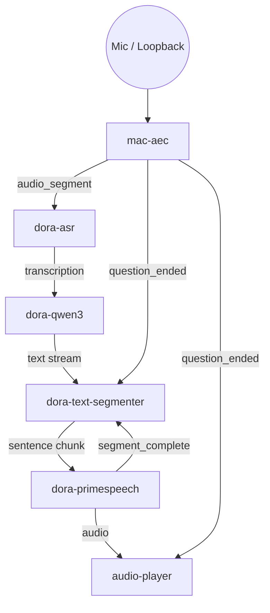
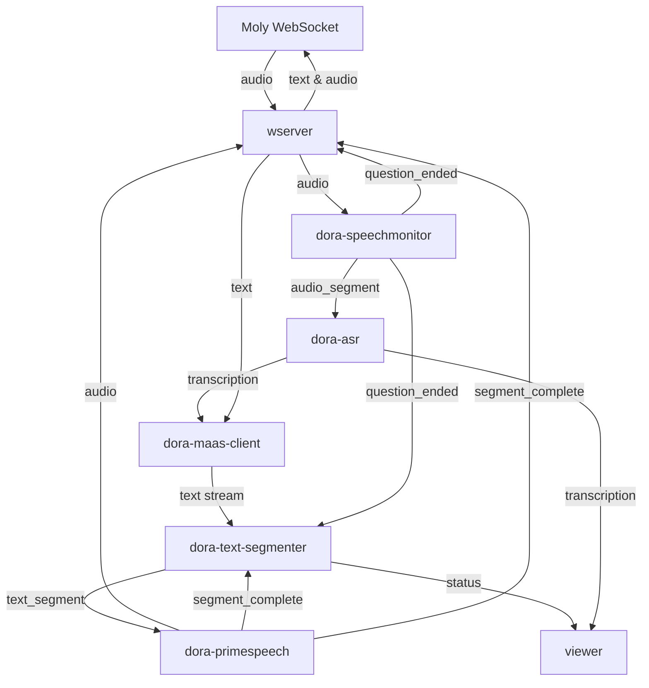
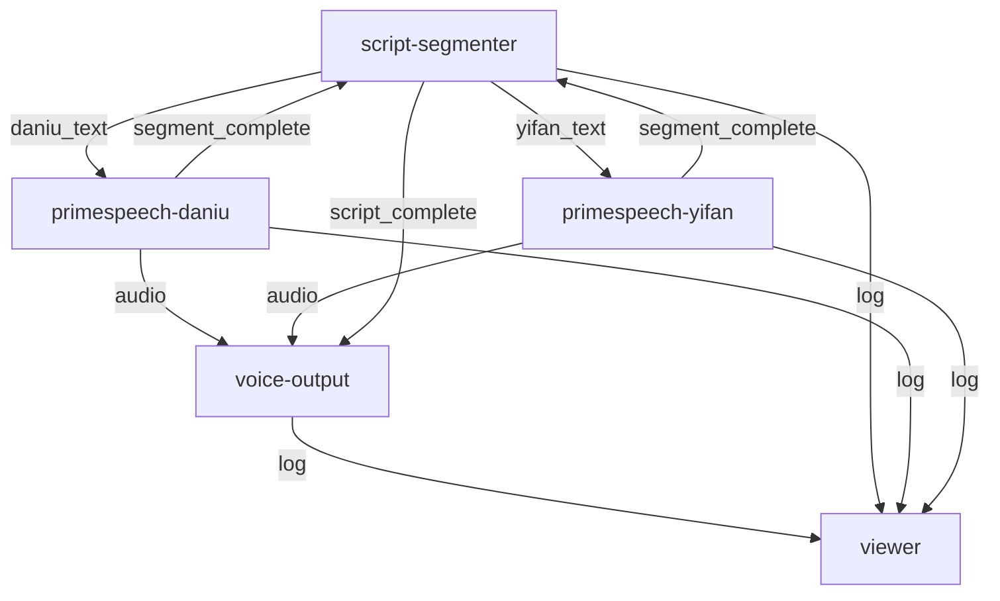

# 使用 DORA 构建语音代理应用

语音代理将低时延语音交互与持续推理结合，让人与系统对话时几乎如同与真人交流。它们汇聚实时音频采集、流式语言模型以及响应式合成，以无感延迟实现多轮对话。DORA 提供的示例聚焦于全双工体验——边听边说——同时保持足够的可组合性，便于混合本地与云端能力。

## **面向生产级语音代理的关键特性**

- 端到端延迟控制在数百毫秒以内，实现实时抢话。
- 支持打断，用户说话即可即时中止正在播放的回复。
- 通过 LLM 编排调用外部工具（检索、任务执行、MCP 工具等）。
- 输出个性化声音与情感语调，贴合品牌形象。
- 灵活部署于本地 OminiX 堆栈或远程 API。
- 内建可观测性，用于安全监控、指标分析与持续改进。

## **典型语音代理场景**

| Use case                   | Latency target                           | Interruptible?                          | Tool usage                                 | Personalization                           | Deployment                                       | Notes                                        |
| -------------------------- | ---------------------------------------- | --------------------------------------- | ------------------------------------------ | ----------------------------------------- | ------------------------------------------------ | -------------------------------------------- |
| Customer support kiosk     | < 300 ms for backchanneling              | Required to capture follow-up issues    | CRM + ticketing connectors                 | Brand voice with empathetic tone          | Hybrid: edge for ASR/TTS, cloud LLM              | Needs analytics and compliance logging       |
| In-vehicle assistant       | < 250 ms, consistent even offline        | Yes, must pause music/navigation        | Navigation, telephony, smart-home controls | Speaker adaptation and wake-word profiles | Primarily local for reliability                  | Must degrade gracefully with limited network |
| Personal assistant         | < 200 ms for wake-word handoff           | Crucial to override reminders or timers | Calendar, email, task managers             | User-specific voice and memory            | Hybrid with on-device cache plus cloud skills    | Privacy controls and continuous learning     |
| Retail concierge           | 300–400 ms acceptable with rich speech   | Important to switch between visitors    | Inventory, product catalog search          | Rotating personas, multilingual           | Cloud-heavy with localized caching               | Requires integration with PoS systems        |
| Wellness coach             | 400 ms tolerable for reflective dialogue | Useful but not critical                 | Workout planners, calendar                 | Highly personalized tone and pacing       | Cloud LLM with private data vault                | Needs emotional prosody and journaling       |
| Creative studio (podcasts) | Latency less critical; batch rendering   | Not applicable                          | Script generators, audio mastering tools   | Multiple cloned voices and styles         | Mix of local models for privacy, cloud for scale | Emphasizes quality, scene transitions        |

## **核心需求与实现矩阵**

| Requirement                | Implementation considerations                                      | DORA support                                                                       |
| -------------------------- | ------------------------------------------------------------------ | ---------------------------------------------------------------------------------- |
| Low latency & full duplex  | Run ASR/TTS locally, stream LLM responses, minimize queue backlogs | `mac_aec_simple_segmentation`, `dora-asr`, `dora-qwen3` streaming, timeline QoS    |
| Interruptibility           | VAD-driven resets, queue truncation, playback cancellation         | `mac-aec` signals, `dora-speechmonitor`, queue utilities (`node-hub/utils/queue`)  |
| Tool usage & orchestration | LLM tool calling, MCP bridges, cloud API fallbacks                 | `dora-maas-client`, `mcp-host`, `mcp-server`, MaaS config layering                 |
| Personalization & emotion  | Swappable TTS personas, voice cloning, prompt conditioning         | `dora-primespeech`, `dora-kokoro-tts`, segmenter metadata, system prompts          |
| Deployment flexibility     | Compose local and cloud graphs, swap nodes without rewiring        | Dynamic nodes, multi-graph chaining (`dora build`, bridges, `dora start --detach`) |
| Observability & safety     | Structured logs, live viewers, replay traces for QA                | Dynamic `viewer`, node log outputs, `dora start --replay`, metrics nodes           |

## 为什么 Python Agent 框架不适合实时语音

LangChain/LangGraph、ag2 (AutoGen) 与 crewAI 等高层 Agent 框架擅长 **任务编排**：先获取完整请求，再规划工具使用，最后输出结果。实时语音代理则属于 **流式处理系统**——需要持续接收音频、将端到端延迟压到 200 毫秒量级、随时处理用户打断。这两种模型天然存在错位：

- **LangChain / LangGraph：** 顺序 Chain 或图节点默认处理离散步骤。语音交互必须同时负责音频采集、ASR、LLM 流式输出与 TTS 播放，意味着开发者要自行管理 `asyncio` 任务、后台线程与队列。Python 的 GIL 和调度开销让 <300 ms 的指标变得脆弱，而 LangGraph 的状态机抽象又无法真正解决流式问题。
- **ag2 (AutoGen)：** 为多 Agent 协作而生，内部采用轮流发送完整消息的模式。语音代理需要增量转写与片段式回复；想要接入 ag2，就得自建打断逻辑、线程安全缓冲区与取消机制，这些能力框架并未直接提供。
- **crewAI：** 强调任务拆解与流程控制，适合文档处理等场景，却难以胜任毫秒级音频循环。开发者仍需自行构建音频管线、跨线程信号与背压控制，等于重复造轮子。
- **NotebookLLM (LlamaIndex)：** NotebookLLM 演示堪称反面教材：它读取 Notebook/PDF，串联多步 LLM 操作并输出播客 MP3。延迟几乎无关紧要，输入也是一次性静态数据——完全落在 Agent 框架擅长的离线批处理范围。但若想把这套流程搬进实时语音，就必须抛弃同步回调、改写执行模型以支持流式处理，同时手动管理音频缓冲。

**NotebookLLM Workflow**

```mermaid
flowchart TD
    %% Main Flow
    Start([User Opens NotebookLLaMA]) --> Init[Initialize Application]

    %% Setup Phase
    Init --> EnvSetup[Load Environment Variables\n- OPENAI_API_KEY\n- ELEVENLABS_API_KEY\n- LLAMACLOUD_API_KEY]
    EnvSetup --> CreateAgent[Create LlamaExtract Agent\ncreate_llama_extract_agent.py]
    CreateAgent --> CreatePipeline[Create LlamaCloud Index Pipeline\ncreate_llama_cloud_index.py]
    CreatePipeline --> DockerServices[Launch Backend Services\n- PostgreSQL\n- Jaeger Tracing]
    DockerServices --> StartMCP[Start MCP Server\nserver.py]
    StartMCP --> StartStreamlit[Launch Streamlit UI\nHome.py on port 8501]

    %% Document Processing Flow
    StartStreamlit --> UserUpload{User Uploads\nPDF Document}
    UserUpload --> PDFProcess[PDF Processing\nvia LlamaCloud]

    %% Core Processing Pipeline
    PDFProcess --> Extract[Document Extraction\nLlamaExtract Agent]
    Extract --> Parse[Document Parsing\nLlamaParse API]
    Parse --> Index[Document Indexing\nVector Embeddings\ntext-embedding-3-small]

    %% Content Generation Branches
    Index --> GenBranch{Generate Content}

    GenBranch --> Summary[Generate Summary\nUsing LLM]
    GenBranch --> QA[Generate Q&A Pairs\nUsing LLM]
    GenBranch --> MindMap[Generate Mind Map\nVisual Representation]
    GenBranch --> Podcast[Generate Podcast]

    %% Podcast Generation Sub-flow
    Podcast --> PodStep1[Step 1: Text Preprocessing\nLlama-3.2-1B-Instruct\nClean & Format PDF Text]
    PodStep1 --> PodStep2[Step 2: Transcript Generation\nLlama-3.1-70B-Instruct\nCreate Podcast Script]
    PodStep2 --> PodStep3[Step 3: Dramatization\nLlama-3.1-8B-Instruct\nAdd Conversational Style]
    PodStep3 --> PodStep4[Step 4: Text-to-Speech\nElevenLabs API or\nParler-TTS/Bark Models]

    %% Output Consolidation
    Summary --> OutputGen[Generate Notebook Output]
    QA --> OutputGen
    MindMap --> OutputGen
    PodStep4 --> OutputGen

    OutputGen --> Display[Display in Streamlit UI\n- Interactive Notebook\n- Audio Player\n- Mind Map Viewer\n- Q&A Interface]

    %% Data Storage
    Display --> Store[Store Results\nPostgreSQL Database]
    Store --> End([User Downloads Results])

    %% MCP Server Integration
    StartMCP -.-> MCPTools[MCP Tools\n- Document Chat\n- Citation Finding\n- Content Search]
    MCPTools -.-> Display

    %% Regional Configuration
    EnvSetup --> Region{Regional Config}
    Region -->|North America| NARegion[Default LlamaCloud NA]
    Region -->|Europe| EURegion[LlamaCloud EU Region]
    NARegion --> CreateAgent
    EURegion --> CreateAgent

    %% Styling
    classDef setupClass fill:#e1f5fe,stroke:#01579b,stroke-width:2px
    classDef processClass fill:#f3e5f5,stroke:#4a148c,stroke-width:2px
    classDef genClass fill:#e8f5e9,stroke:#1b5e20,stroke-width:2px
    classDef podcastClass fill:#fff3e0,stroke:#e65100,stroke-width:2px
    classDef outputClass fill:#fce4ec,stroke:#880e4f,stroke-width:2px
    classDef storageClass fill:#e0f2f1,stroke:#004d40,stroke-width:2px

    class Init,EnvSetup,CreateAgent,CreatePipeline,DockerServices,StartMCP,StartStreamlit setupClass
    class PDFProcess,Extract,Parse,Index processClass
    class Summary,QA,MindMap,Podcast genClass
    class PodStep1,PodStep2,PodStep3,PodStep4 podcastClass
    class OutputGen,Display outputClass
    class Store storageClass
```



这些框架不约而同地假设“请求-响应”或批处理范式。若强行应用于流式语音场景，团队很快就会重新陷入“复杂的 Python 异步、多线程与队列管理”泥潭，因为它们的底层架构压根没有为低延迟媒体循环设计。

## Python 在语音并发管线中的痛点

即使不依赖重量级框架，要在 Python 中编排实时音频也颇为棘手：

- **GIL 限制：** Global Interpreter Lock 阻止 Python 字节码真正并行。任何重度 DSP 或编解码逻辑都必须移到原生扩展或独立进程，带来额外的进程间通信开销。
- **`asyncio` 陷阱：** 取消、异常传播与协作式调度都需要深厚经验。一旦 ASR 或 TTS 中出现阻塞调用，整个事件循环就被拖慢，200 ms 以内的延迟指标立刻失守。
- **线程/进程混用：** 常见模式是线程处理阻塞 I/O，`asyncio` 管理 WebSocket，multiprocessing 负责 CPU 密集任务。要保持这些边界上的队列、锁与状态一致，复杂度陡增。
- **背压处理：** Python 标准库缺少专为音频优化的低时延队列。没有自定义逻辑，网络抖动或用户打断时就会出现缓冲溢出或“饿死”现象。
- **测试与调试：** 很难确定性地复现竞态或时序 Bug；`pytest` 等工具对多循环、多线程音频管线的支持极为有限。

这也是为何许多团队会在 Python 中完成原型后，把关键路径迁移到 Rust、Go 或 C++——也正是 DORA 面向生产级节点所首选的语言。

## **DORA 在实时语音中的优势**

- **数据流式音频控制：** 节点以发布/订阅方式交换命名流，底层零拷贝传输，便于精细调节缓冲、背压与分段，无需手写 Socket 管道。
- **事件驱动运行时：** 调度器封装异步与多线程细节，开发者可用常规的 Rust/Python 函数式代码完成节点逻辑，无需精通 `asyncio`、锁或队列编程。
- **可组合节点助推 Vibe Coding：** AEC、ASR、LLM、TTS、MCP 工具等组件都可像积木一样自由组合，示例数据流正是靠这种“随手拼装”快速迭代。
- **无状态架构：** 节点之间只传递消息不共享内存，天然适配云原生部署，也便于在本地与云端实现热插拔。
- **混合语言性能：** Rust 与 Python 节点互操作开销极低。关键路径（如 WebSocket Server、MaaS Client）可用 Rust 保证安全与吞吐，原型阶段则可先用 Python，随后再替换为 Rust 实现。
- **边缘推理适配：** 提供 llama.cpp、MLX、OpenVINO、FunASR、PrimeSpeech、Kokoro 等推理后端的紧密集成，无论是笔记本、Apple Silicon、Intel GPU 还是嵌入式平台都能轻松落地。
- **Moly 前端无缝集成：** DORA 数据流可直接对接 Rust 编写的跨平台 Moly 客户端（Windows、macOS、Linux、Android、iOS、OpenHarmony），覆盖本地与云端 LLM，原生支持 WebSocket 语音对话。
- **灵活部署版图：** 有了 Moly 前端，DORA 语音代理可以部署在 macOS、Windows WSL、云实例或边缘服务器，开发者可按延迟、隐私与成本自由组合
- 

### Reference Architectures Inspired by OpenAI Realtime Voice API

- **End-to-End (E2E) Pipeline:** Mirrors OpenAI’s low-latency path—audio capture, transcription, LLM, and TTS run inside a single graph. Latency is minimal because tokens stream directly from the LLM to the voice renderer. Trade-off: components are tightly coupled, so swapping ASR or TTS models requires rebuilding the dataflow and often restarting the whole stack.
  
  

- **Chained Pipeline:** Similar to OpenAI’s modular blueprint—capture/ASR, reasoning, and synthesis stages exchange messages across queues or bridges. Latency increases slightly because segments wait for acknowledgements, but every stage is replaceable (local vs. cloud LLMs, multiple personas, specialized TTS). This “lego-like” composition is DORA’s biggest strength: you can mix macOS AEC, FunASR, qwen3, PrimeSpeech, and Kokoro in different combinations without rewriting the orchestration code.
  
  

## Full-Duplex Chatbot with Interruption

The sections below use the `voice-chat-with-aec.yml` E2E flow as a concrete baseline and highlight where to introduce chaining when you need more flexibility.

### Dataflow Flowchart (mac-aec-chat)



```yaml
nodes:
  # MAC-AEC with VAD-based segmentation
  - id: mac-aec
    path: dynamic
    outputs:
      - audio
      - is_speaking
      - speech_started
      - speech_ended
      - audio_segment
      - question_ended
      - log

  # ASR transcription
  - id: asr
    build: pip install -e ../../node-hub/dora-asr
    path: dora-asr
    inputs:
      audio:
        source: mac-aec/audio_segment
        queue_size: 10
    outputs:
      - transcription
      - language_detected
      - processing_time
      - confidence
      - log
    env:
      ASR_ENGINE: funasr
      LANGUAGE: zh
      WHISPER_MODEL: large
      ENABLE_PUNCTUATION: true
      ENABLE_LANGUAGE_DETECTION: true
      ENABLE_CONFIDENCE_SCORE: false
      ASR_MODELS_DIR: $HOME/.dora/models/asr # Relative path (recommended)
      LOG_LEVEL: INFO

  # Direct connection: ASR -> LLM (with streaming for fast response)
  - id: qwen3-llm
    build: pip install -e ../../node-hub/dora-qwen3
    path: dora-qwen3
    inputs:
      text: asr/transcription  # Direct from ASR
    outputs:
      - text
      - status
      - log
    env:
      USE_MLX: auto
      MLX_MODEL: "Qwen/Qwen3-8B-MLX-4bit"
      MLX_MAX_TOKENS: 256
      MAX_TOKENS: 256
      TEMPERATURE: 0.7
      ENABLE_THINKING: false
      LLM_ENABLE_STREAMING: "true"
      HISTORY_STRATEGY: "token_based"
      MAX_HISTORY_EXCHANGES: "10"
      MAX_HISTORY_TOKENS: "3000"
      SYSTEM_PROMPT: "你是AI助手。请以自然流畅的中文口语化表达直接回答问题..."
      LOG_LEVEL: INFO

  # Text Segmenter - buffers LLM output and sends to TTS one segment at a time
  - id: text-segmenter
    build: pip install -e ../../node-hub/dora-text-segmenter
    path: dora-text-segmenter
    inputs:
      text: qwen3-llm/text  # From LLM
      tts_complete: primespeech/segment_complete  # TTS completion signal
      reset: mac-aec/question_ended  # Clear queue when new question detected
    outputs:
      - text_segment
      - status
      - metrics
      - log
    env:
      ENABLE_BACKPRESSURE: "false"  # Don't wait initially - send first segment immediately
      SEGMENT_MODE: "sentence"  # sentence, punctuation, or fixed
      MIN_SEGMENT_LENGTH: "5"
      MAX_SEGMENT_LENGTH: "20"
      PUNCTUATION_MARKS: "。！？.!?，,"
      LOG_LEVEL: "DEBUG"

  # PrimeSpeech TTS
  - id: primespeech
    build: pip install -e ../../node-hub/dora-primespeech
    path: dora-primespeech
    inputs:
      text: text-segmenter/text_segment  # From text segmenter (not directly from LLM)
    outputs:
      - audio
      - segment_complete
      - log
    env:
      # Allow transformers to load models (temporary workaround for CVE-2025-32434)
      TRANSFORMERS_OFFLINE: "1"
      HF_HUB_OFFLINE: "1"

      # Voice selection
      VOICE_NAME: Doubao  # Available: Doubao, Luo Xiang, Yang Mi, Zhou Jielun, Ma Yun, Maple, Cove
      PRIMESPEECH_MODEL_DIR: $HOME/.dora/models/primespeech
      # Language settings
      TEXT_LANG: zh  # zh for Chinese, en for English, auto for detection
      PROMPT_LANG: zh  # Language of the reference prompt

      # Inference parameters
      TOP_K: 5
      TOP_P: 1.0
      TEMPERATURE: 1.0
      SPEED_FACTOR: 1.0  # Speech speed multiplier

      # Performance
      USE_GPU: false
      NUM_THREADS: 4

      RETURN_FRAGMENT: "false"  # Disable streaming TTS for now
      LOG_LEVEL: "INFO"
      # Internal text segmentation for faster TTS
      ENABLE_INTERNAL_SEGMENTATION: "true"  # Split long text internally
      TTS_MAX_SEGMENT_LENGTH: "100"  # Max chars per TTS segment
      TTS_MIN_SEGMENT_LENGTH: "20"   # Min chars per TTS segment

      # Logging
      LOG_LEVEL: INFO  # DEBUG, INFO, WARNING, ERROR

  # Audio player
  - id: audio-player
    path: dynamic
    inputs:
      audio: primespeech/audio
      control: mac-aec/question_ended  # Reset buffer when new question detected
    outputs:
      - buffer_status
      - status

  # Simple viewer to see the flow
  - id: viewer
    path: dynamic
    inputs:
      transcription: asr/transcription
      llm_output: qwen3-llm/text
      segment: text-segmenter/text_segment
      audio: primespeech/audio
      segment_complete: primespeech/segment_complete
      speech_started: mac-aec/speech_started
      speech_ended: mac-aec/speech_ended
      # Log outputs from all nodes
      mac_aec_log: mac-aec/log
      asr_log: asr/log
      qwen3_log: qwen3-llm/log
      segmenter_log: text-segmenter/log
      primespeech_log: primespeech/log
```

### 信号链：从输入到输出

1. **捕获与回声消除：** `mac-aec` 提供干净的 `audio_segment`，同时输出 `is_speaking`、`speech_started` 与 `question_ended` 等状态信号。
2. **语音识别：** `asr` 在音频输入设置了 `queue_size: 10` 的缓冲，允许识别与说话同步进行而不丢帧，FunASR/Whisper 可按语言自动切换。
3. **语言模型：** `qwen3-llm` 直接消费转写结果并启用流式输出，让 TTS 更快拿到回复片段。
4. **分段与背压：** `text-segmenter` 将 LLM 连续文本按句分割，并监听 `tts_complete` 与 `question_ended` 信号，以保持队列干净。
5. **语音合成：** `primespeech` 处理每段文本并在完成后发出 `segment_complete`，驱动下一个片段继续播放。
6. **播放与监控：** `audio-player` 负责输出到系统回放设备，同时 Moly viewer 展示所有节点的日志与状态。

### 控制与队列策略

- **基于 VAD 的重置：** `question_ended` 同时连接到分段器与播放器，用户一开口就立刻清空旧响应。
- **ASR 输入缓冲：** 适度的 `queue_size` 抵御抖动又不会引入明显延迟。
- **分段背压：** 虽然首个片段不等待确认，但后续片段会依赖 `segment_complete`，避免 TTS 挤压。
- **流式 Token：** LLM 的连续输出与 5–20 字符的分段策略确保几百毫秒内即可听到回复。

### 从全局链到分段链

- 用 `dora-maas-client` 替换 LLM，即可连接 OpenAI 或阿里云等 MaaS。
- 调换 TTS 为 `dora-kokoro-tts`，获得中英双语的低延迟合成。
- 借助 `dora build --graph` 生成 DOT 图，快速审查拓扑。

## OpenAI Real-Time WebSocket API Compatible Chatbot

The `chatbot-openai-0905` example demonstrates the chained architecture with a WebSocket front-end that speaks the OpenAI Realtime Voice API dialect. The YAML below shows how the Moly gateway (`wserver`) feeds audio into the graph and collects synthesized speech and transcripts for streaming back to clients.

### Dataflow Flowchart (chatbot-openai-0905)



```yaml
nodes:
  - id: wserver
    path: dynamic
    inputs:
      audio: primespeech/audio
      asr_transcription: asr/transcription
      asr_log: asr/log
      speech_log: speech-monitor/log
      speech_started: speech-monitor/speech_started
      speech_ended: speech-monitor/speech_ended
      question_ended: speech-monitor/question_ended
      segment_complete: primespeech/segment_complete
      tts_log: primespeech/log
    outputs:
      - audio
      - text

  - id: speech-monitor
    build: pip install -e ../../node-hub/dora-speechmonitor
    path: dora-speechmonitor
    inputs:
      audio:
        source: wserver/audio
        queue_size: 1000000
    outputs:
      - speech_started
      - speech_ended
      - question_ended
      - is_speaking
      - audio_segment
      - speech_probability
      - log
    env:
      MIN_AUDIO_AMPLITUDE: 0.005
      ACTIVE_FRAME_THRESHOLD_MS: 60
      USER_SILENCE_THRESHOLD_MS: 1200
      SILENCE_THRESHOLD_MS: 400
      QUESTION_END_SILENCE_MS: 1500
      AUDIO_FRAMES_THRESHOLD_MS: 10000
      VAD_THRESHOLD: 0.5
      VAD_ENABLED: true
      SAMPLE_RATE: 16000
      LOG_LEVEL: DEBUG

  - id: asr
    build: pip install -e ../../node-hub/dora-asr
    path: dora-asr
    inputs:
      audio:
        source: speech-monitor/audio_segment
        queue_size: 10
    outputs:
      - transcription
      - language_detected
      - processing_time
      - confidence
      - log
    env:
      ASR_ENGINE: funasr
      LANGUAGE: zh
      WHISPER_MODEL: large
      ENABLE_PUNCTUATION: true
      ENABLE_LANGUAGE_DETECTION: true
      ENABLE_CONFIDENCE_SCORE: false
      ASR_MODELS_DIR: $HOME/.dora/models/asr
      LOG_LEVEL: INFO

  - id: maas-client
    path: ../../target/release/dora-maas-client
    inputs:
      text: asr/transcription
      text_to_audio: wserver/text
    outputs:
      - text
      - status
      - log
    env:
      MAAS_CONFIG_PATH: maas_mcp_browser_config_zh.local.toml
      OPENAI_API_KEY: ${OPENAI_API_KEY:-}
      ALIBABA_CLOUD_API_KEY: ${ALIBABA_CLOUD_API_KEY:-}
      LOG_LEVEL: INFO

  - id: text-segmenter
    build: pip install -e ../../node-hub/dora-text-segmenter
    path: dora-text-segmenter
    inputs:
      text: maas-client/text
      tts_complete: primespeech/segment_complete
    outputs:
      - text_segment
      - status
      - metrics
    env:
      ENABLE_BACKPRESSURE: "false"
      SEGMENT_MODE: "sentence"
      MIN_SEGMENT_LENGTH: "5"
      MAX_SEGMENT_LENGTH: "20"
      PUNCTUATION_MARKS: "。！？.!?"
      LOG_LEVEL: "EOF
      LOG_LEVEL: "INFO"

  - id: primespeech
    build: pip install -e ../../node-hub/dora-primespeech
    path: dora-primespeech
    inputs:
      text: text-segmenter/text_segment
    outputs:
      - audio
      - status
      - segment_complete
    env:
      TRANSFORMERS_OFFLINE: "1"
      HF_HUB_OFFLINE: "1"
      VOICE_NAME: Doubao
      PRIMESPEECH_MODEL_DIR: $HOME/.dora/models/primespeech
      TEXT_LANG: zh
      PROMPT_LANG: zh
      TOP_K: 5
      TOP_P: 1.0
      TEMPERATURE: 1.0
      SPEED_FACTOR: 1.0
      USE_GPU: false
      NUM_THREADS: 4
      RETURN_FRAGMENT: "false"
      LOG_LEVEL: "INFO"
      ENABLE_INTERNAL_SEGMENTATION: "true"
      TTS_MAX_SEGMENT_LENGTH: "100"
      TTS_MIN_SEGMENT_LENGTH: "20"

  - id: audio-player
    path: dynamic
    inputs:
      audio: primespeech/audio
      control: mac-aec/question_ended
    outputs:
      - buffer_status
      - status

  - id: viewer
    path: dynamic
    inputs:
      transcription: asr/transcription
      llm_output: maas-client/text
      segment: text-segmenter/text_segment
      speech_started: speech-monitor/speech_started
      speech_ended: speech-monitor/speech_ended
```

### WebSocket 网关运行机制

- **WebSocket Server (`wserver`)：** 由 Rust 编写的动态节点，负责与 Moly 客户端建立实时语音会话。它把麦克风音频发布到数据流中，并将 TTS 音频与转写文本推送回前端，同时订阅各节点日志用于监控。
- **大容量输入队列：** `speech-monitor` 连接到 `wserver/audio`，设置百万级 `queue_size` 以容忍网络抖动或短时断线，同时继续依赖 `USER_SILENCE_THRESHOLD_MS` 与 `QUESTION_END_SILENCE_MS` 检测轮到谁发言。
- **双向文本通道：** `maas-client` 既接收 ASR 结果，也处理来自 WebSocket 的 `text_to_audio`（如欢迎语或 UI 触发的消息），与 OpenAI/阿里云/Minimax 等兼容 API 对接。

### 信号流要点

1. **采集：** Moly 将音频流发送给 `wserver`，再转交给 `speech-monitor` 做 VAD 与分段。
2. **推理：** ASR 转写进入 `dora-maas-client`，该节点调用云端或自建 LLM，并将流式文本同时回传给前端与分段器。
3. **合成：** `text-segmenter` 与 `primespeech` 配合输出音频，`segment_complete` 令 WebSocket 与分段器保持节拍一致。
4. **可观测性：** ASR、VAD、TTS 等日志统一回传 `wserver`，便于排查中断、队列溢出或 MaaS 错误。

### 控制与背压

- `speech-monitor` 输出的 `question_ended` 既用于前端停止播放，也通知分段器清理队列。
- `primespeech/segment_complete` 同时给分段器与 WebSocket，确保前端只播放完整段落，避免缓冲过载。
- 若网络跟不上，可把 `ENABLE_BACKPRESSURE` 设为 `true`，DORA 队列会自动暂停上游。

## NotebookLLM Like Podcast Generator

The `podcast-generator` example illustrates a batched, chained layout where a script segmenter coordinates multiple PrimeSpeech voices to produce alternating dialogue segments.

### Dataflow Flowchart (podcast-generator)



```yaml
nodes:
  # Script segmenter (DYNAMIC - launched separately)
  - id: script-segmenter
    path: dynamic
    outputs:
      - daniu_text
      - yifan_text
      - script_complete
      - log
    inputs:
      daniu_segment_complete: primespeech-daniu/segment_complete
      yifan_segment_complete: primespeech-yifan/segment_complete

  # PrimeSpeech TTS for 大牛 (Luo Xiang voice)
  - id: primespeech-daniu
    build: pip install -e ../../node-hub/dora-primespeech
    path: dora-primespeech
    inputs:
      text: script-segmenter/daniu_text
    outputs:
      - audio
      - segment_complete
      - log
    env:
      VOICE_NAME: "Luo Xiang"
      TEXT_LANG: "zh"
      PRIMESPEECH_MODEL_DIR: "$HOME/.dora/models/primespeech"
      LOG_LEVEL: "INFO"

  # PrimeSpeech TTS for 一帆 (Doubao voice)
  - id: primespeech-yifan
    build: pip install -e ../../node-hub/dora-primespeech
    path: dora-primespeech
    inputs:
      text: script-segmenter/yifan_text
    outputs:
      - audio
      - segment_complete
      - log
    env:
      VOICE_NAME: "Doubao"
      TEXT_LANG: "zh"
      PRIMESPEECH_MODEL_DIR: "$HOME/.dora/models/primespeech"
      LOG_LEVEL: "INFO"

  # Voice output (DYNAMIC - launched separately)
  - id: voice-output
    path: dynamic
    outputs:
      - log
    inputs:
      daniu_audio: primespeech-daniu/audio
      yifan_audio: primespeech-yifan/audio
      daniu_segment_complete: primespeech-daniu/segment_complete
      yifan_segment_complete: primespeech-yifan/segment_complete
      script_complete: script-segmenter/script_complete

  # Viewer (DYNAMIC - launched separately, optional)
  - id: viewer
    path: dynamic
    inputs:
      segmenter_log: script-segmenter/log
      daniu_log: primespeech-daniu/log
      yifan_log: primespeech-yifan/log
      output_log: voice-output/log
      daniu_text: script-segmenter/daniu_text
      yifan_text: script-segmenter/yifan_text
      script_complete: script-segmenter/script_complete
```

### 双声部编排

- **分配台词：** `script-segmenter` 根据角色把台词分别推送给 `primespeech-daniu` 与 `primespeech-yifan`，并等到 `segment_complete` 确认后再发送下一段。
- **同步播放：** `voice-output` 接收两路音频进行混合或串联，等所有片段完成后触发 `script_complete`，保障时序一致。
- **可视化：** 可选的 `viewer` 展示脚本、日志与完成标记，便于后期编辑与 QA。

### 流程要点

1. **脚本生成：** 上游 LLM 先生成完整剧本，再由分段器按角色拆分。
2. **语音合成：** 两个 PrimeSpeech 实例平行运行，及时产出音频并反馈完成状态。
3. **混音导出：** `voice-output` 可串接到音频后处理或直接保存成播客文件。

### 同步策略

- `segment_complete` 使分段器不会提前发送下一句，避免声部重叠。
- `script_complete` 供 `voice-output` 与 `viewer` 判断一集/一幕是否结束，方便触发导出或后续流程。

### 组件替换

- **TTS 替换：** 依照 WebSocket 版本数据流，把 PrimeSpeech 换成 Minimax WebSocket TTS，即可支持更多声音风格。
- **语音库扩展：** 调整各节点的 `VOICE_NAME` 或加载 Kokoro 等其他 TTS 模型以扩充角色阵容。

## Lessons Learned: Strengthening DORA for Voice Agents

1. **统一日志：** 各示例都手动封装日志函数以汇总节点输出。若 DORA 提供覆盖 Rust/Python/C++ 的统一日志接口，可直接将 MAC AEC、ASR、LLM、TTS 的结构化日志汇聚到同一时间线，支持告警与仪表盘。
2. **类型校验：** AI Coding 经常因输入/输出类型不符而失败，例如下游期望 `AudioFrame<f32>` 却收到字节流，或文本载荷包含额外元数据。若 `dora build` 阶段引入内容类型与 Schema 校验，可在运行前阻止此类连线错误。
3. **媒体感知流：** 语音链路常见 24 kHz 麦克风、32 kHz TTS、48 kHz 播放器的采样率差异。若提供音频/视频/图像/文本的高阶流抽象，并内置 FFmpeg/Sox 等重采样能力，可避免重复写转换代码与采样率不匹配导致的卡顿。
4. **带内信令：** 目前 Session ID、Segment ID、Fragment ID 等需要手写，以便用户打断时重置队列或跨协议追踪响应。若能像 VoIP/RTP 那样把信令头作为数据流一等公民，可在 WebSocket、WebRTC、QUIC 等不同传输之间可靠地实现重试、纠错与互通。
5. **队列多样性：** 实时媒体常需要环形缓冲区、容错丢包队列或高水位清空策略。若 DORA 提供可配置的队列类型（有损/无损/滑窗），开发者便能在延迟与音质之间灵活取舍。
6. **状态协调：** 虽然无状态节点便于扩展，但部分场景需要持久上下文，例如 WebSocket Server 按会话动态启动数据流，或在对话中途切换个性化 TTS。若能提供带内状态同步模式或挂接 Redis、etcd 等外部状态管理，将提升容错与多租户能力。
7. **Agent 化开发工具：** DORA 已有强大的 CLI，若进一步引入面向 DORA 的编码助手，能``在编码、单测/系统测试、Troubleshooting 阶段即时反馈 `dora build` 的类型错误、`dora run` 的日志、队列深度与节点健康状况，从而闭环 “vibe coding” 与生产质量之间的差距。
8. **Python 依赖管理：** Agent 应用往往每个节点都要引入一堆 Python 包。若能提供统一的依赖清单、验证流程，并推荐标准化的 Conda 虚拟环境，就能避免版本冲突，让示例部署更加可预期。
